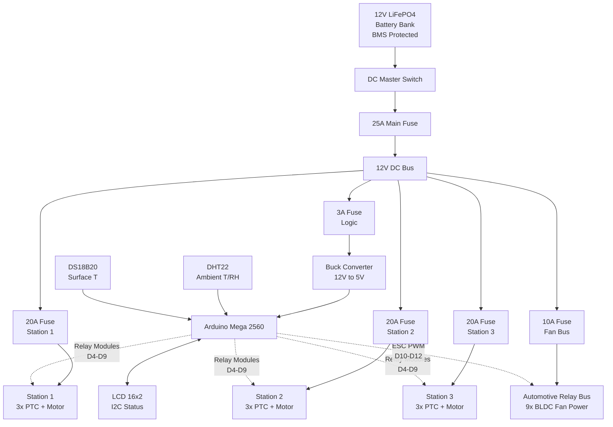
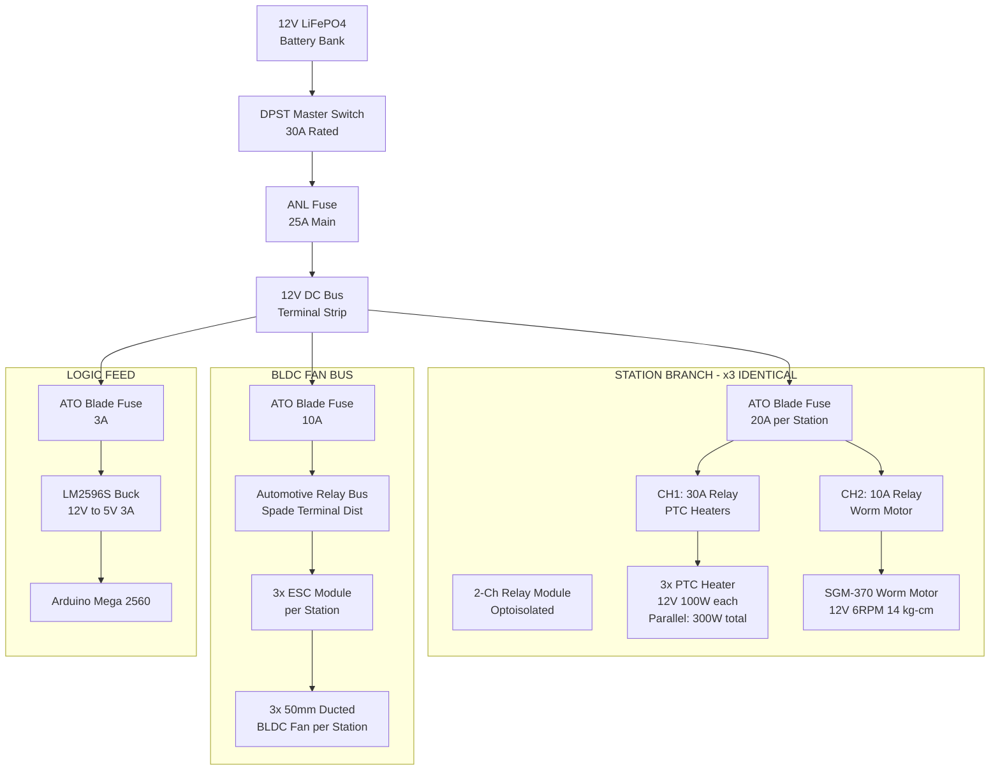
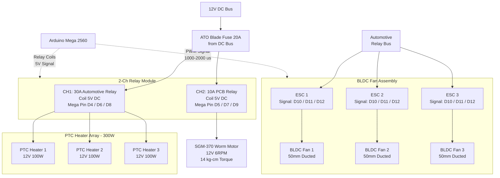
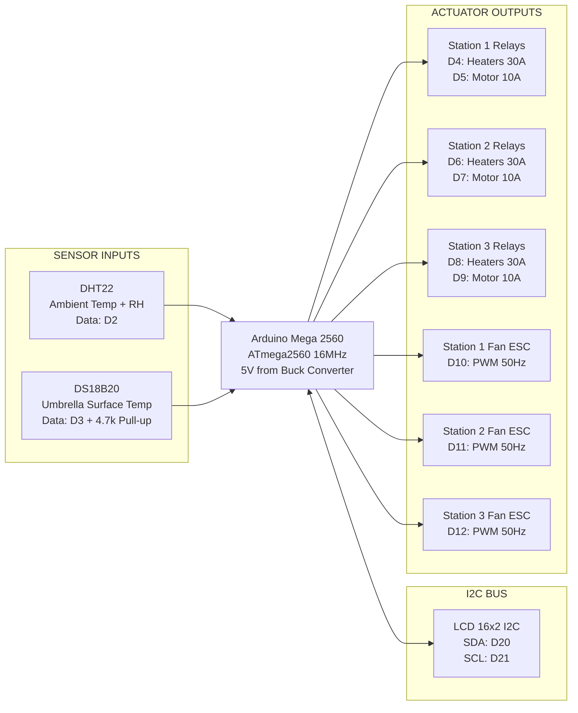

# Electrical Block Diagram — 12V DC Umbrella Dryer

> **Pure 12V DC system.** No mains voltage. No inverter. No RCD/GFCI.
> All heating, motor, and fan loads run from a 12 V LiFePO4 battery bank
> through fused DC distribution. Arduino Mega 2560 provides closed-loop
> temperature and humidity control with relay-switched heaters/motors
> and ESC-driven BLDC fans.

---

## 1. System Overview

---

## 2. Power Distribution Tree

Detailed power path from battery through fuses to individual loads.
Three identical station branches share the DC bus. The fan bus is a
separate fused branch feeding all BLDC ESCs through an automotive-grade
relay bus (spade terminals, blade fuses, high-current bus bar).

---

## 3. Per-Station Architecture

One drying station in full detail. All three stations are electrically
identical. The relay module switches heater and motor loads; the ESCs
modulate fan speed from Mega PWM signals.

---

## 4. Controller I/O Map — Arduino Mega 2560

All digital pin assignments. The Mega runs at 5V from the buck converter.
No pins source or sink more than 40 mA. Relay coils draw ~70 mA each
(driven by the optoisolated relay module, not directly by the Mega).

---

## 5. Fuse and Wire Schedule

| Path | Fuse Rating | Fuse Type | Wire Gauge | Notes |
|------|-------------|-----------|------------|-------|
| Battery to DC Bus | 25 A | ANL | 10 AWG | Main system protection |
| Station 1 branch | 20 A | ATO blade | 12 AWG | 3x PTC + motor + ESCs |
| Station 2 branch | 20 A | ATO blade | 12 AWG | 3x PTC + motor + ESCs |
| Station 3 branch | 20 A | ATO blade | 12 AWG | 3x PTC + motor + ESCs |
| BLDC fan bus | 10 A | ATO blade | 14 AWG | All 9 ESCs in parallel |
| Logic feed | 3 A | ATO blade | 18 AWG | Buck converter input |
| Buck to Mega | 3 A | PCB trace | 22 AWG | 5V regulated rail |
| PTC heater branch | 30 A | Automotive relay | 12 AWG | Per relay CH1 output |
| Worm motor branch | 10 A | PCB relay | 16 AWG | Per relay CH2 output |
| ESC power input | 2 A per ESC | Bus bar | 18 AWG | From automotive relay bus |
| ESC signal wire | Logic level | Shielded | 22 AWG | PWM from Mega |

## 6. Relay and Pin Assignment

| Mega Pin | Function | Relay / Load | Current | Wire |
|----------|----------|-------------|---------|------|
| D2 | Sensor data | DHT22 | Logic | 22 AWG |
| D3 | Sensor data | DS18B20 + 4.7k | Logic | 22 AWG |
| D4 | Relay coil | Station 1 PTC heaters (30A) | ~70 mA | 22 AWG |
| D5 | Relay coil | Station 1 worm motor (10A) | ~70 mA | 22 AWG |
| D6 | Relay coil | Station 2 PTC heaters (30A) | ~70 mA | 22 AWG |
| D7 | Relay coil | Station 2 worm motor (10A) | ~70 mA | 22 AWG |
| D8 | Relay coil | Station 3 PTC heaters (30A) | ~70 mA | 22 AWG |
| D9 | Relay coil | Station 3 worm motor (10A) | ~70 mA | 22 AWG |
| D10 | PWM output | Station 1 fan ESCs x3 | Logic | 22 AWG |
| D11 | PWM output | Station 2 fan ESCs x3 | Logic | 22 AWG |
| D12 | PWM output | Station 3 fan ESCs x3 | Logic | 22 AWG |
| D20 (SDA) | I2C data | LCD 16x2 | Logic | 22 AWG |
| D21 (SCL) | I2C clock | LCD 16x2 | Logic | 22 AWG |

## 7. Design Notes

1. **Single-station operation recommended.** One station's 3x PTC heaters draw up to 25A at 12V (300W), which equals the main fuse rating. Run one station at a time, or reduce heater count when operating multiple stations simultaneously.
2. **PTC self-limiting.** Positive temperature coefficient heaters reduce current draw as they reach operating temperature. Inrush is brief; steady-state current per station is typically 15-20A.
3. **No mains voltage anywhere.** This system is entirely 12V DC. No inverter, no RCD/GFCI, no AC wiring. All user-accessible voltages are 12V DC or below.
4. **Relay module ratings.** Heater relay channels (CH1) must be 30A+ automotive-grade relays (not standard 10A PCB relays). Motor channels (CH2) can use standard 10A relays.
5. **Optoisolated relay modules.** The relay coil drive circuits are optoisolated from the Mega, providing galvanic isolation between the 5V logic and 12V power domains.
6. **ESC PWM protocol.** Standard 1-2 ms pulse width at 50 Hz. 1000 us = fans off; 2000 us = full speed. The Mega drives all three ESCs per station from a single PWM pin (parallel signal wiring).
7. **Automotive relay bus.** A high-current distribution bus using automotive blade fuses and spade terminals. All BLDC fan ESCs draw power from this bus, fused at 10A total.
8. **Wire gauge rationale.** 10 AWG for the main battery lead (25A with <3% drop over short runs). 12 AWG for station branches (20A). 14 AWG for fan bus (10A). 18 AWG for logic feed. 22 AWG for all signal/relay coil wires.
9. **LiFePO4 battery bank.** 12.8V nominal, BMS with over-voltage, under-voltage, over-current, and short-circuit protection. Recommended minimum 100Ah capacity for multi-station runtime.
10. **Condensate management.** Passive drainage — sloped chamber floor leads to collection tray. No pump required.
