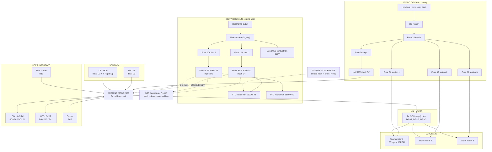

# Electrical Block Diagram (Rev 5: mains heat + 12V stations)

Canonical wiring map. Same content as `wiring/README.md`, printable sheet. Three separate domains: **220V AC heat**, **12V DC stations**, **5V logic**. The Mega never touches mains or battery power.

## Wiring rules

1. **Three domains, three protections:** RCD + 10A branches (AC) · 25A main + 3A stations (12V) · 3A + buck (5V).
2. **Two kill switches, clearly labeled:** mains rocker and DC rocker.
3. **Mega inputs only:** SSR DC inputs (3–32V) and optocoupler LEDs (2–5 mA) — no power flows through the board.
4. **SSR heatsinks mandatory:** ~7–10 W dissipated per SSR at 6.8 A load; closed grounded metal box.
5. **Slow duty cycling (2–5 s)** on the SSRs; fast PWM is out.
6. **Wire gauge:** 2.0 mm² mains · 16 AWG battery main + logic feed · 18 AWG station branches · 22 AWG logic.
7. **Earthing:** electrical box, chamber frame, appliance chassis — all earthed; RCD is the life-safety layer.
8. The exhaust fan has no Mega channel — it runs on the mains rocker (stage 1 airflow).
