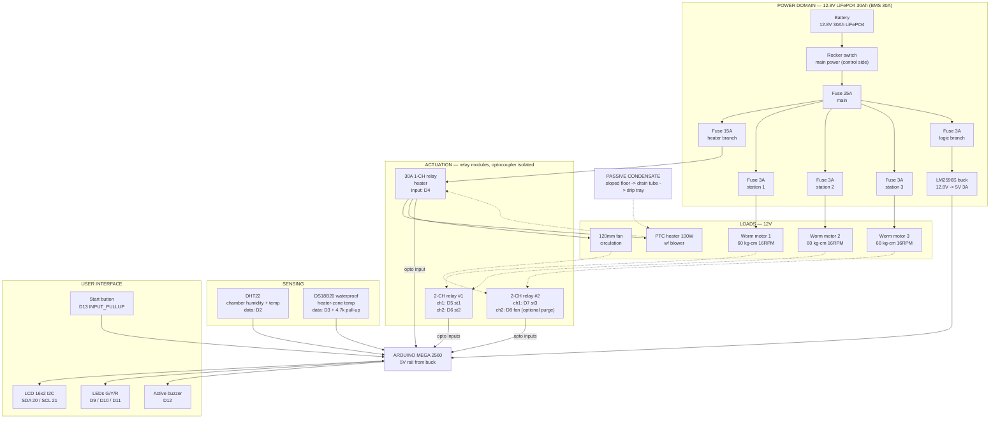

# Electrical Block Diagram (Rev 4)

Canonical wiring map. Same content as `docs/BOM.md` §11, kept as a standalone printable sheet. All loads are 12V DC (extra-low voltage); all logic is 5V.

## Wiring rules

1. **Relay coils** hang off the buck's 5V rail — never from Mega pins. Mega drives only the optocoupler LEDs (~2–5 mA).
2. **Wire gauge:** 16 AWG main + heater branch (incl. blower fan) · 18 AWG station branches · 22 AWG logic + chamber fan.
3. **Common ground:** battery −, buck −, all relay boards, sensors, Mega GND tied at the barrier block.
4. **Contacts are 30VDC-rated** — mains AC is prohibited by design.
5. **Slow duty cycling only** (2–5 s period) on the heater relay; fast PWM destroys mechanical contacts.
6. **Blower rides the heater branch:** the PTC's blower and the chamber fan are wired behind the same 15 A fuse as the heater — air always moves whenever heat is on. The D8 fan relay only adds post-cycle purge control (optional).
