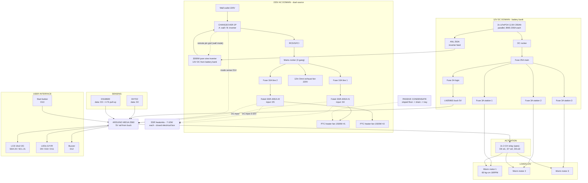

# Electrical Block Diagram (Rev 6: dual source + mains heat + 12V stations)

Canonical wiring map. Same content as `wiring/README.md`, printable sheet. Domains: **220V AC heat (wall outlet OR inverter via changeover)**, **12V DC stations + inverter feed**, **5V logic**. The Mega never touches mains or battery power.

## Wiring rules

1. **Four domains, protections at every level:** RCD + 10A branches (AC, either source) · 250A ANL (inverter feed) · 25A main + 3A stations (12V) · 3A + buck (5V).
2. **Two kill switches, clearly labeled:** mains rocker and DC rocker.
3. **The changeover is the only point where wall power and inverter output meet — and they never meet electrically.** In wall mode the inverter remote pin is grounded (inverter OFF).
4. **Mega inputs only:** SSR DC inputs (3–32V), D14 mode sense, and optocoupler LEDs (2–5 mA) — no power flows through the board.
5. **SSR heatsinks mandatory:** ~7–10 W dissipated per SSR at 6.8 A load; closed grounded metal box.
6. **Slow duty cycling (2–5 s)** on the SSRs; fast PWM is out.
7. **Wire gauge:** 2.0 mm² mains · **1/0 AWG inverter feed (≤ 1 m, 250A ANL at the battery end)** · 4 AWG battery links · 16 AWG battery main + logic feed · 18 AWG station branches · 22 AWG logic.
8. **Earthing:** electrical box, chamber frame, appliance chassis, inverter chassis — all earthed; RCD is the life-safety layer.
9. The exhaust fan has no Mega channel — it runs on the mains rocker (stage 1 airflow) on either source.
