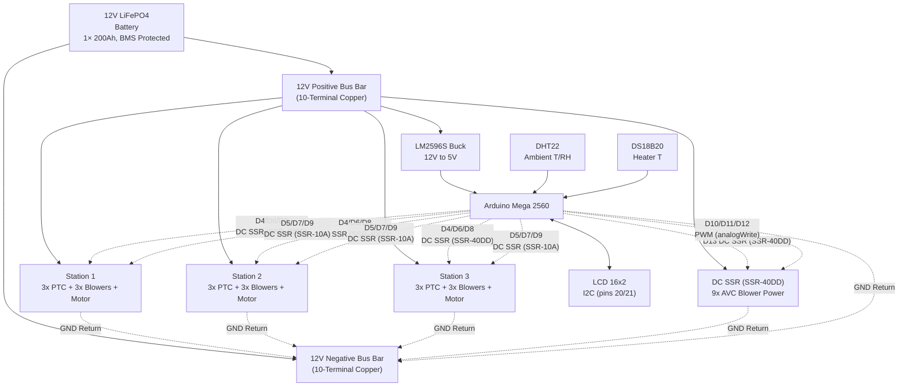
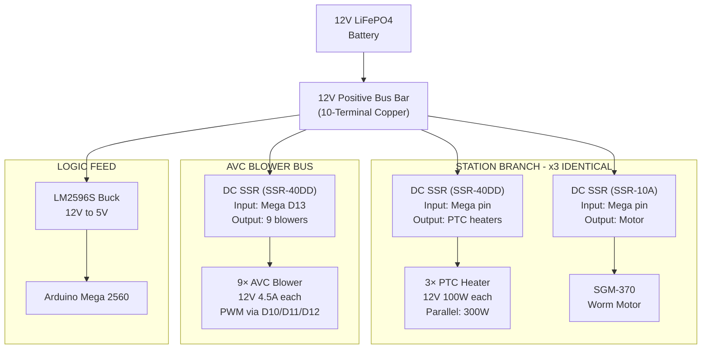
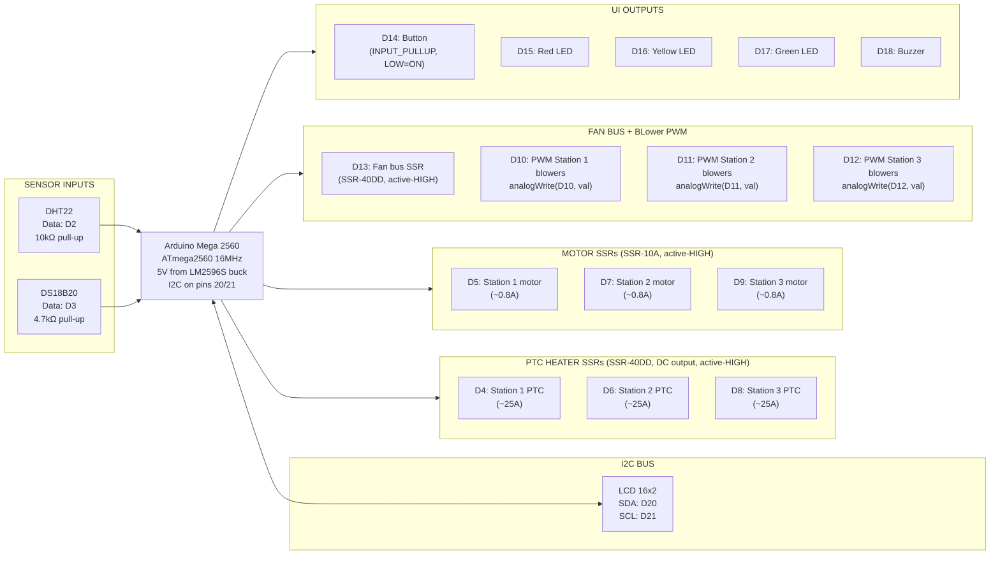

# Electrical Block Diagram — 12V DC Umbrella Dryer

> **Pure 12V DC system.** No mains voltage. No inverter. No RCD/GFCI.
> All heating, motor, and fan loads run from a 12V LiFePO4 battery
> through direct DC distribution. Arduino Mega 2560 provides closed-loop
> control with LCTC DC-DC SSRs (40A for PTC/fan, 10A for motors),
> and Mega PWM for AVC blowers.
>
> staged operation mandatory; LCD I2C on Mega pins 20/21.

---

## 1. System Overview



---

## 2. Power Distribution Tree



---

## 3. Per-Station Architecture

One drying station in full detail. All three stations are electrically identical.

```mermaid
flowchart TB
    SSR_PTC["DC SSR (SSR-40DD)<br/>Input +: Mega D4/D6/D8<br/>Input −: GND<br/>Output: from 12V bus"]

    subgraph HEATERS["PTC Heater Array - 300W"]
        H1["PTC 1<br/>12V 100W"]
        H2["PTC 2<br/>12V 100W"]
        H3["PTC 3<br/>12V 100W"]
    end

    SSR_PTC --> H1 & H2 & H3

    SSR_MOT["DC SSR (SSR-10A)<br/>Input: Mega D5/D7/D9<br/>Input −: GND<br/>Output: to motor +"]

    MOTOR["SGM-370<br/>12V 6RPM<br/>Motor − to GND"]

    subgraph BLOWERS["AVC Blowers ×3 (parallel)"]
        BLOW_SIG["PWM signal<br/>from Mega D10/D11/D12"]
        BLOW_PWR["12V power<br/>from fan bus SSR"]
        BLOW_FAN["80mm AVC<br/>12V 4.5A blowers"]
    end

    SSR_MOT --> MOTOR
    MOTOR -. "− lead" .-> GND["Common GND"]

    BLOWERS
    BLOW_PWR -->|\"from D13 fan SSR\"| BLOW_SIG --> BLOW_FAN
```

---

## 4. Controller I/O Map — Arduino Mega 2560



---

## 5. Wire Schedule

| Path | Wire Gauge | Notes |
|------|------------|-------|
| Battery to bus | 8 AWG | Direct connection |
| Station 1 PTC branch | 10 AWG | 3× PTC heaters via SSR |
| Station 2 PTC branch | 10 AWG | 3× PTC heaters via SSR |
| Station 3 PTC branch | 10 AWG | 3× PTC heaters via SSR |
| Station 1 Motor branch | 18 AWG | SGM-370 via SSR-10A |
| Station 2 Motor branch | 18 AWG | SGM-370 via SSR-10A |
| Station 3 Motor branch | 18 AWG | SGM-370 via SSR-10A |
| AVC blower bus | 10 AWG | 9 blowers, 18 AWG pigtails |
| Logic feed | 20 AWG | Buck converter input |
| Buck to Mega | 20 AWG | 5V regulated rail |
| BLOWER signal wires | 22 AWG | PWM from Mega (D10–D12) |

## 6. Wire Gauge Rationale

| Run | Gauge | Rationale |
|---|---|---|
| Battery main + main links | 8 AWG | 200A BMS peak, <3% drop |
| Station PTC + blower branches | 10 AWG | 40A, short runs |
| Motor branches | 18 AWG | <1A |
| Logic feed | 20 AWG | <0.5A |
| Signal / LED / buzzer jumpers | 22 AWG | Logic-level only |

## 7. Design Notes

1. **Staged operation is mandatory.** One station draws ~38.8A (3 PTC + 3 blowers + motor); two stations ≈ 77.6A. The BMS is rated 200A, so this is not a fuse limitation — staged operation preserves battery/BMS current budget and follows the study's energy-efficient control strategy. Firmware enforces one station at a time with 30s rotation.
2. **PTC self-limiting.** PTC elements reduce current as temperature rises. Inrush is brief; steady-state per station ~15–20A.
3. **No mains voltage anywhere.** Entire system is 12V DC SELV.
4. **PTC heaters and fan bus are switched by SSR-40DD solid-state relays** (input 3–32VDC, DC output, 40A rated). Driven directly from Mega digital pins — no NPN transistors, no base resistors, no flyback diodes needed. Active HIGH = ON; no input current = OFF (boot-safe).
5. **Motor SSRs are LCTC DC-DC SSR-10A** (DC output, active-HIGH). Direct drive from Mega pins — no optocoupler module needed. Active HIGH = ON; floating pin = OFF at boot.
6. **AVC blowers are PWM-controlled directly from Mega** (D10/D11/D12) using `analogWrite()`. No ESC needed. 5V logic compatible.
7. **No thermal fuses.** Over-temperature protection relies on PTC self-regulation and DS18B20 firmware 65 °C cutoff. Over-current protection relies on BMS 200A cutoff and PTC self-regulation. There is no hardware fuse backstop.
8. **Fan bus SSR (D13)** must be ON for blowers to receive 12V power. The PWM signal (D10/D11/D12) controls speed independently.
9. **LCD I2C is on Mega pins 20/21** (hardware I2C) — NOT A4/A5 (which are ADC on the Mega).