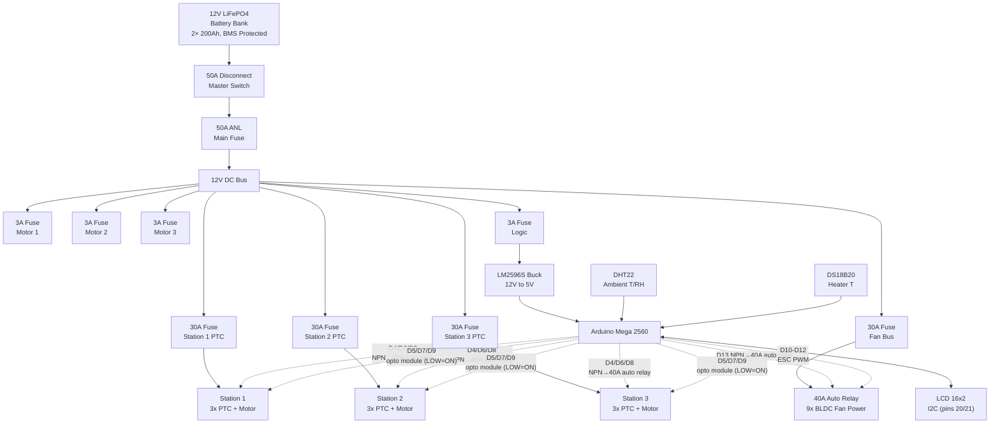
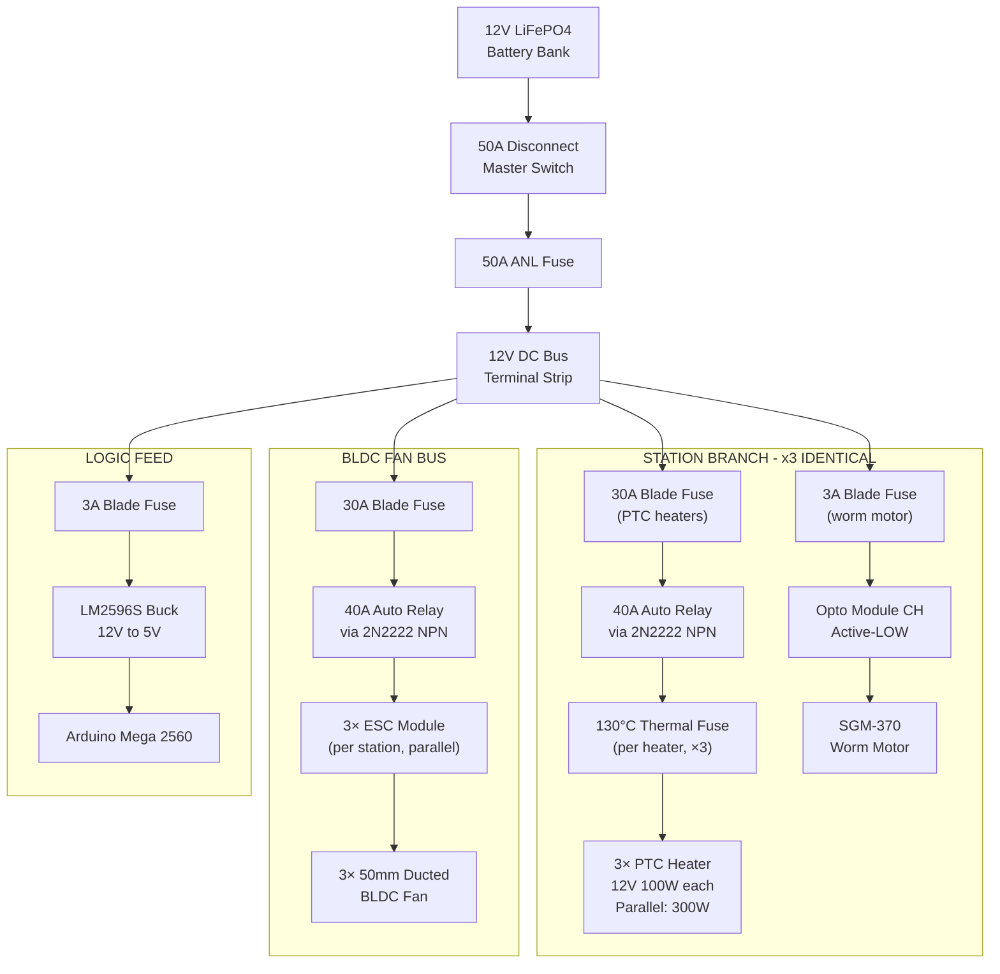
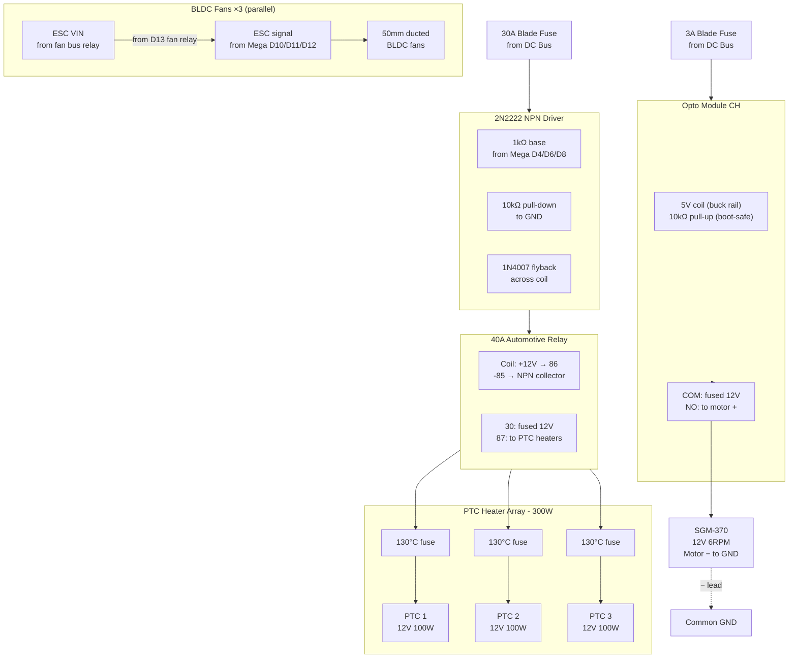
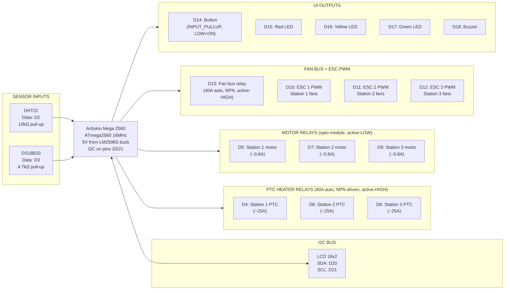

# Electrical Block Diagram — 12V DC Umbrella Dryer

> **Pure 12V DC system.** No mains voltage. No inverter. No RCD/GFCI.
> All heating, motor, and fan loads run from a 12V LiFePO4 battery bank
> through fused DC distribution. Arduino Mega 2560 provides closed-loop
> control with NPN-driven 40A automotive relays for PTC heaters,
> optocoupler relays for worm motors, and ESC PWM for BLDC fans.
>
> **Rev 8:** Main fuse 50A ANL; PTC relays 40A automotive; per-heater 130°C thermal fuse;
> staged operation mandatory; LCD I2C on Mega pins 20/21.

---

## 1. System Overview

---

## 2. Power Distribution Tree

---

## 3. Per-Station Architecture

One drying station in full detail. All three stations are electrically identical.

---

## 4. Controller I/O Map — Arduino Mega 2560

---

## 5. Fuse and Wire Schedule

| Path | Fuse Rating | Fuse Type | Wire Gauge | Notes |
|------|-------------|-----------|------------|-------|
| Battery to disconnect | — | 50A switch | 8 AWG | Manual kill |
| Disconnect to main fuse | 50A | ANL | 8 AWG | Primary protection |
| Station 1 PTC branch | 30A | ATO blade | 10 AWG | 3× PTC heaters |
| Station 2 PTC branch | 30A | ATO blade | 10 AWG | 3× PTC heaters |
| Station 3 PTC branch | 30A | ATO blade | 10 AWG | 3× PTC heaters |
| Motor 1 | 3A | ATO blade | 18 AWG | SGM-370 |
| Motor 2 | 3A | ATO blade | 18 AWG | SGM-370 |
| Motor 3 | 3A | ATO blade | 18 AWG | SGM-370 |
| BLDC fan bus | 30A | ATO blade | 10 AWG | 9 ESCs, 18 AWG pigtails |
| Logic feed | 3A | ATO blade | 20 AWG | Buck converter input |
| Buck to Mega | — | PCB trace | 20 AWG | 5V regulated rail |
| PTC heater branch | 40A | Automotive relay | 10 AWG | Per relay COM→NO |
| Motor branch | 10A | Opto module | 18 AWG | Per module COM→NO |
| ESC power input | 3A per ESC | Bus bar | 18 AWG | From auto relay bus |
| ESC signal wire | Logic level | Jumper | 22 AWG | PWM from Mega |

## 6. Wire Gauge Rationale

| Run | Gauge | Rationale |
|---|---|---|
| Battery main + parallel links | 8 AWG | 50A main, <3% drop |
| Station PTC + fan branches | 10 AWG | 30A, short runs |
| Motor branches | 18 AWG | <1A |
| Logic feed | 20 AWG | <0.5A |
| Signal / LED / buzzer jumpers | 22 AWG | Logic-level only |

## 7. Design Notes

1. **Staged operation is mandatory.** One station draws ~36A; two stations ≈ 72A exceeds the 50A main fuse. Firmware enforces one station at a time with 30s rotation.
2. **PTC self-limiting.** PTC elements reduce current as temperature rises. Inrush is brief; steady-state per station ~15–20A.
3. **No mains voltage anywhere.** Entire system is 12V DC SELV.
4. **PTC relays are 40A automotive-grade** (not 10A PCB relays). Driven by 2N2222 NPN transistors with 10kΩ base pull-downs for boot-safety.
5. **Motor relays use a 4-CH optocoupler module** (10A channels — more than adequate for 0.8A motors).
6. **130°C thermal fuse per heater (9×).** Mounted in the + lead of each individual PTC heater. Rated 10A — safe for single-heater current (~8.3A).
7. **ESC PWM protocol.** 1000–2000 µs at 50 Hz. Fan bus relay (D13) must be ON for ESCs to receive power.
8. **LCD I2C is on Mega pins 20/21** (hardware I2C) — NOT A4/A5 (which are ADC on the Mega).
