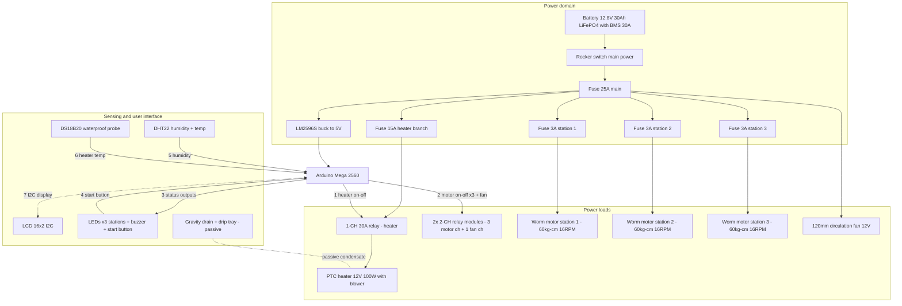

# Smart Umbrella Dryer — Component & Material Validation (Rev 4)

**Revision 4 — design changes from Rev 2:** Fotek SSR-25DD + BTS7960 **replaced by optocoupler relay modules** (heater and motors only need on/off switching — saves ~₱1,900) · water pump and MOSFET **removed** (gravity drain) · **MLX90614 IR sensor removed from the design** · **single-motor carousel replaced by 3 independent worm-gear-motor stations (one motor per umbrella)** · system re-verified for **3 umbrellas simultaneously**.

## Study Overview

**Title:** Smart Umbrella Dryer: Design and Development of a Multi-Umbrella Drying System with Energy Efficient Control

**Key Requirements:**
1. Dry **3 umbrellas** simultaneously (any 1–3 mix per cycle)
2. Energy-efficient operation (battery backup support)
3. Smart/automated control via sensors
4. Safe operating temperatures for umbrella materials

---

## 0. Change Summary (v2 → v4)

| Change | Rev 2 | Rev 4 | Reason |
|---|---|---|---|
| Heater switching | Fotek SSR-25DD (₱1,800) | **1-CH 30A relay module w/ optocoupler (₱113)** | On/off + slow duty cycling only — a relay contact does the job |
| Motor driver | BTS7960 43A (₱305) | **2× 2-CH relay modules w/ optocoupler (₱178)** | 16 RPM fixed is the design speed — no PWM needed |
| Rotation | 1 worm motor driving a shared carousel | **3× worm gear motors — one per umbrella station** | Independent stations: any 1–3 umbrellas, per-station control, no imbalance across a crossbar |
| Water pump | REMOVED | REMOVED — gravity drain + drip tray | Pump was the only flood-failure component |
| MLX90614 IR sensor | Optional (kept) | **REMOVED from the design** | Non-essential; DHT22 + DS18B20 fully cover the control loop |
| Main fuse | 20A | **25A** | 3-motor stall worst case exceeds 20A headroom at battery sag |
| Motor-branch fuses | 5A (shared) | **3A per station (×3)** | One jammed station cannot take down the others |
| Capacity target | 3 umbrellas (shared carousel) | 3 umbrellas — **independent stations** | Study requirement |

---

## 1. Microcontroller — Arduino Mega 2560 ✅ UNCHANGED

| Parameter | Value |
|---|---|
| Processor | ATmega2560 |
| Digital I/O | 54 (15 PWM) |
| Analog pins | 16 |
| Flash / SRAM | 256 KB / 8 KB |
| Clock | 16 MHz |
| I2C | SDA=20, SCL=21 |

**v4 pin audit:** heater relay (1) + 3 motor relays (3) + 3 station status LEDs (3) + buzzer + start button + LCD I2C + 2 sensors ≈ **11 digital + 2 I2C** — far inside the Mega's capacity. ✅ COMPATIBLE

**Powering the Mega:** Makerlab's Mega listing explicitly warns *"do not supply with 12V on DC jack"*. Feed the Mega from the **LM2596S 5V output → Mega 5V pin** (or USB), not the DC jack from battery voltage.

Listing: `makerlab.ph/products/mega-2560-r3-with-usb-cable-compatible-with-arduino-do-not-supply-with-12v-on-dc-jack` — ₱1,199

---

## 2. Power Supply — LiFePO4 12.8V 30Ah w/ BMS (PowMr) — REPLACED ExpertPower 35Ah

ExpertPower 35Ah (the paper's original pick) is not stocked on Lazada PH; the PowMr 12.8V 30Ah is the verified local equivalent: **384 Wh, BMS with 30A max continuous discharge** (per PowMr's published spec sheet), overcharge/over-discharge/short/over-temp protection.

**Worst-case draw check:** heater 8.3A + 3 motors at stall 10.5A + fan 0.25A + logic ~0.2A ≈ **13.1A peak** → BMS 30A = **2.3× margin**. ✅ (Stall is transient — seconds per start.)

**Fuse plan (v4):**

| Branch | Load | Fuse |
|---|---|---|
| Main battery line | 13.1A worst case | **25A** |
| Heater branch (through 30A relay) | 8.3A | 15A |
| Motor branch ×3 (one per station) | 1.2A rated / 3.5A stall each | **3A each** |
| Logic branch (LM2596S) | ~0.5A | 3A |

Wire gauge: **16 AWG** main + heater (8.3A), **18 AWG** motor branches (stall 3.5A), **22 AWG** sensors/logic.

---

## 3. Heating — PTC 12V 100W Air Heater Fan — switched by 30A relay module

Self-regulating ceramic PTC (auto-limits at Curie point), integrated blower, **8.3A @ 12V** (100W). Air at 40–60°C dries umbrella fabric (nylon/polyester) safely. Lazada's max 12V variant is 100W (no 120W exists — cycle runs ~20% longer than the Rev 2 math; see §9b). See §9 for 3-umbrella thermal verification.

**1-CH 30A relay module integration details**

| Parameter | Value | Design check |
|---|---|---|
| Contact rating | 30A @ 30VDC | 3.6× the 8.3A heater ✅ |
| Coil | 5V, ~70mA, driven from LM2596S rail | NOT from a Mega pin ✅ |
| Input | optocoupler LED, low-level trigger, ~2–5mA | direct Mega pin (≤20mA source) ✅ |
| Flyback | built-in diode on coil + opto isolation | no transient paths to logic ✅ |

**Duty-cycle strategy:** **slow time-proportional control** (2–5s period) on a plain digital pin. Mechanical relays tolerate slow cycling; do NOT use fast PWM (490Hz+) — contact arcing and wear will destroy the relay.

---

## 4. Sensors — DHT22 + DS18B20 ✅ (MLX90614 REMOVED)

| Sensor | Role | Interface | Status |
|---|---|---|---|
| **DHT22 (AM2302)** | Chamber humidity — core feedback for duty cycling + auto-shutoff | 1-wire digital, D2 | Required — ₱69 (FU-LABS module) |
| **DS18B20 waterproof** | Heater-zone air temp — redundant over-temp cutoff | 1-Wire, D3 + 4.7kΩ pull-up | Required — ₱105 (Circuitrocks) |
| ~~MLX90614~~ | ~~Non-contact umbrella surface temp~~ | ~~I2C~~ | **REMOVED from the design** — surface temp is inferable from chamber air temp + cycle model; frees an I2C address and ~₱1,349 |

The I2C bus now carries only the LCD (0x27/0x3F). ✅ No conflicts.

---

## 5. Motor & Drive — 3× worm gear motors, one per station (Rev 4 core change)

### 5a. Motors: 3× DC Worm Gear Motor SGM-A58SW31ZY, 12V, 16RPM (makerlab.ph, ₱1,249 each)

| Parameter | Value |
|---|---|
| Voltage range / rated | 6–12V / 12V |
| No-load speed / current | 16 RPM / 240mA |
| **Rated load** | 11 RPM @ **1.2A**, **60 kg·cm torque** |
| Stall torque / stall current | **70 kg·cm** / 3.5A |
| Shaft | **8mm diameter × 15mm** |
| Body | 115×40×35.7mm, 357g |

Why one motor per umbrella (vs Rev 2/3's single shared-carousel motor):
- **Independent stations** — any 1–3 umbrellas can be dried per run; per-station start/stop as each umbrella dries.
- **Load per motor drops to ≤3 kg·cm** (one umbrella + holder, worst case) → **≥20× torque margin** (Rev 3 shared-carousel math needed 8–10 kg·cm against one 60 kg·cm motor).
- **Fault isolation** — a jammed umbrella stalls one motor only; the other stations keep running, each protected by its own 3A fuse.
- **No crossbar imbalance** — each station carries only its own umbrella; mounting positions no longer affect torque.
- **Self-locking** — the worm cannot be back-driven, so each station holds position when off.
- 16 RPM direct = gentle rotation (no centrifugal water loss); no external reduction.

Variant notes: 80RPM variant (₱1,299) available; dual-shaft +₱50. Recommended: **Single Shaft 16RPM (₱1,249) ×3 — order all three from makerlab.ph in one order.** The Lazada JGY370 (~25 kg·cm, different shaft) is NOT an acceptable substitute.

Listing: `makerlab.ph/products/dc-worm-gear-motor-sgm-a58sw31zys-12v-16rpm-80rpm-sgm-370-12v-40rpm-160rpm-dc-motor`

### 5b. Drivers: 2× 2-CH relay modules w/ optocoupler (₱89 each) — REPLACED BTS7960

- 3 of the 4 channels drive the motors (1.2A rated / 3.5A stall vs 10A@30VDC contacts → **2.9× margin at stall** per channel). ✅
- 4th channel drives the 120mm circulation fan (0.25A). ✅
- Relay coils from the LM2596S 5V rail; Mega drives only the optocoupler LEDs (~2–5mA per channel). ✅
- Each motor channel sits in its own 3A-fused station branch — a stalled motor pops only its own fuse. ✅
- Lost vs BTS7960: PWM speed control (not needed — 16 RPM is the design speed) and current-sense telemetry (replaced by per-station fuse + relay-state logic: a drawn 3A fuse with the relay commanded on = jam indication at the UI).

### 5c. Mechanical transmission — 3 independent stations

| Component | v4 spec | Note |
|---|---|---|
| Steel shaft | **3× 8mm × 300mm** (304 SS, ground) | one per station; 8mm system-wide matches motor shaft & KP08 bore |
| Pillow block bearing | **6× KP08** (2 per station) | radial rating ≫ single-umbrella load; >30× margin |
| Shaft coupling | **3× 8×8 rigid** (2 sets cover it + spare) | motor 8mm shaft × station 8mm shaft |
| Umbrella holder | **3× holders, one per station shaft** | aluminum plate fabrication |

---

## 6. Voltage Regulation — LM2596S ✅ UNCHANGED

12.8V → 5V @ 3A. v4 logic load: Mega (~0.2A) + DHT22 + DS18B20 + LCD (~0.04A) + LEDs + buzzer + **4 relay coils (~70mA each = 0.28A)** ≈ **0.7–0.8A** — still only ~27% of the 3A rating. Power the Mega via its **5V pin**, not the DC jack. ✅ (Rev 3 estimate was 0.45A; the added relay coils are the difference — still comfortable.)

---

## 7. Water Management — PASSIVE (pump removed) ✅ UNCHANGED

1. **Chamber floor sloped ~3–5°** toward one corner.
2. **Slotted drain hole + silicone drain tube** exiting the chamber wall.
3. **Removable drip tray** outside the chamber base — emptied per use (3 umbrellas shed roughly 100–300mL per cycle; a 500mL tray covers it).
4. Optional: hydrophobic mesh liner on the floor so drips funnel to the drain.

Trade-off accepted: condensate removal is manual (empty the tray) in exchange for a simpler, cheaper, fault-free chamber. The humidity-based auto-shutoff logic is unaffected. ✅ COMPATIBLE

---

## 8. User Interface ✅ UNCHANGED (minus MLX90614)

- **LCD 16×2 I2C** (₱165, addr 0x27/0x3F) — sole I2C device now.
- **LEDs:** green = ready/complete, yellow = drying, red = error/over-temp (station status ×3 + system).
- **Piezo buzzer:** cycle-complete alert, direct from a Mega pin.
- **Momentary push button** (INPUT_PULLUP): start/reset cycle.
- **Rocker switch:** hardware main power battery→fuse — also the manual kill for a fail-short heater relay.

---

## 9. THREE-UMBRELLA CAPACITY VERIFICATION ⭐ (Rev 4: three stations)

### 9a. Mechanical — per-station torque ✅ PASS

| Quantity | Value | Check |
|---|---|---|
| Rotating mass per station | 1 umbrella (0.4–0.7kg) + holder ≈ **1.2–1.7kg** | KP08 dynamic load ≈ 160kgf → >90× margin ✅ |
| Bearing friction torque per station | ≈ μ·F·r ≈ 0.003 × 15N × 0.01m ≈ **0.05 kg·cm** | — |
| Design allowance per station (imbalance, seal drag, wet fabric, startup) | ≈ **≤3 kg·cm** | — |
| Motor rated torque (each station) | **60 kg·cm** | **≥20× margin** ✅ |
| Stall torque | 70 kg·cm | tolerates a jammed umbrella ✅ |
| Rotation speed | 16 RPM direct | gentle, no centrifugal water loss ✅ |
| Station independence | any 1–3 stations run per cycle | matches the multi-umbrella study claim ✅ |

### 9b. Thermal — heater sizing ✅ PASS (100W, realistic cycle time)

| Quantity | Value |
|---|---|
| Water retained per umbrella (after shaking, open in chamber) | ≈ 30–100g (folding) up to 150g (golf) |
| Water for 3 umbrellas | ≈ **90–300g typical** (worst case 450g soaked) |
| Latent heat of vaporization | ≈ 2,260 J/g |
| Evaporation energy needed | 90g → 57Wh · 300g → 188Wh · 450g → 283Wh |
| PTC heat delivered | 100W, chamber transfer ~70–85% → **≈ 70–85W effective** |
| Cycle time (all 3 simultaneously) | **≈ 50 min (light rain) → ~2.5 h (fully soaked)**, humidity sensor auto-stops at threshold |

**Verdict: 100W PTC dries 3 umbrellas simultaneously in ≈50–150 minutes** with per-station rotation + forced air at 40–60°C. Slower than commercial 400–1000W spinner dryers — by design: the study's core claim is **energy-efficient control**. Per-station motors add a small benefit: late-finishing umbrellas can stop rotating, trimming parasitic motor losses. **Recommendation: keep 1× 100W heater.**

### 9c. Electrical — simultaneous worst-case ✅ PASS

| Load | Current @12V | Notes |
|---|---|---|
| PTC heater (relay ON) | 8.3A | 100W |
| Worm motors | 3.6A rated (10.5A stall, seconds) | 3 × 1.2A |
| 120mm fan | 0.25A | 3W |
| Relay coils (4) | 0.28A | from 5V rail ≈ 0.06A reflected on 12V |
| Logic (via LM2596S, 5V ~0.5A) | ≈ 0.22A | 2.8W |
| **Total steady (heater ON, 3 motors running)** | **≈ 12.5A ≈ 155W** | BMS 30A → 2.4× margin ✅ |
| **Peak (3 motor stalls + heater on)** | ≈ 13.1A (≈15.6A at 10.5V sag) | < 25A main fuse ✅ |

---

## 10. Runtime on Battery (3-umbrella cycles)

Energy available: **384Wh** (30Ah × 12.8V). Typical 3-umbrella cycle ≈ 70 min at ~60% heater duty:

| Scenario | Avg power | Runtime |
|---|---|---|
| Everything full-on (155W) | 155W | ≈ **2.5 h** |
| Typical cycle (~60% duty) | ≈ 95W | ≈ **4.0 h → ~3–4 full cycles per charge** |
| Aggressive duty cycling (30%) | ≈ 52W | ≈ 7.4 h |

**Energy per 3-umbrella cycle ≈ 90–95Wh ≈ ₱0 equivalent from battery** — the headline number for the study's energy-efficiency chapter.

---

## 11. System Block Diagram

---

## 12. Compatibility Matrix (v4)

| Component | Voltage | Current margin | Interface | 3-umbrella fit | Verdict |
|---|---|---|---|---|---|
| Arduino Mega 2560 | 5V via buck | ✅ | 11 dig + 2 I2C | ✅ | ✅ PASS |
| LiFePO4 12.8V 30Ah (PowMr) | 12V native | 2.4× BMS margin | — | ✅ 3–4 cycles | ✅ PASS |
| PTC 100W heater | 12V | 8.3A | via 30A relay | ✅ 50–150min cycle | ✅ PASS |
| 1-CH 30A relay (heater) | 30VDC contacts | 3.6× (30A vs 8.3A) | optocoupler LED | ✅ | ✅ PASS |
| 2× 2-CH relays (motors + fan) | 30VDC contacts | 2.9× at stall per ch | optocoupler LED | ✅ 1 ch per motor | ✅ PASS |
| **3× worm motors 60kg·cm** | 12V | ≥20× torque margin per station | relay on/off | ✅ one per umbrella | ✅ PASS |
| LM2596S | 12.8→5V | 3.75× (3A vs 0.8A) | — | ✅ | ✅ PASS |
| DHT22 / DS18B20 | 3.3–5.5V | mA | 1-wire / 1-Wire | ✅ | ✅ PASS |
| LCD I2C + LEDs + buzzer + button | 5V | ✅ | I2C + digital | ✅ | ✅ PASS |
| 3× KP08 pairs + 8mm shafts + 8×8 couplings | N/A | >90× load per station | 8mm system | ✅ 3 stations | ✅ PASS |
| Gravity drain + drip tray (no pump) | N/A | N/A | passive | ✅ 100–300mL/cycle | ✅ PASS |

---

## 13. Safety Validation (v4)

| Hazard | Mitigation | Status |
|---|---|---|
| Overheating | PTC self-regulation + DS18B20 software cutoff | ✅ dual protection |
| **Heater relay fail-short** (heater stuck on) | Rocker switch (hard kill) + 15A branch fuse + PTC self-regulating | ✅ triple backup |
| Relay coil/transient noise | Optocoupler isolation + built-in flyback diodes | ✅ |
| Overcurrent | 25A main + branch fuses (15A heater, 3A ×3 stations, 3A logic) | ✅ |
| Battery overdischarge | PowMr BMS | ✅ |
| **Single-station jam** | Only that station's 3A fuse blows; other stations keep drying; worm drive stall-rated 70 kg·cm | ✅ fault isolation |
| Fire risk | PTC self-limiting (no open element) + all-extra-low-voltage 12VDC | ✅ low |
| Water accumulation | Gravity drain + drip tray (manual empty) | ✅ managed |
| Electrical shock | 12V DC system (extra-low voltage) | ✅ safe |
| Relay contacts on AC | 30VDC-rated contacts — mains use prohibited by design | ✅ documented |

---

## 14. Bill of Materials — Itemized (Rev 4)

> **Sourcing policy:** Makerlab PH first (98% seller, 10-yr store) → trusted third-party Lazada sellers. All URLs Lazada PH except the worm motors (makerlab.ph website). Prices verified 2026-09-12 — re-check at checkout. Per-listing backups and seller reasoning: `PROCUREMENT.md`.

| Qty | Item | Spec | Price | Seller / Trust | URL |
|---|---|---|---|---|---|
| 1 | Arduino Mega 2560 R3 | ATmega2560, 54 DIO, 256KB flash | ₱1,215 (no cable) / ₱1,265 (w/ USB) | Makerlab PH, ⭐4.8 (331), 2.4K sold | https://www.lazada.com.ph/products/pdp-i5989151.html |

### 14.2 Switching — relay modules w/ optocoupler

| Qty | Item | Spec | Price | Seller / Trust | URL |
|---|---|---|---|---|---|
| 1 | 1-Channel 30A relay module, optocoupler isolation | 30A@30VDC — 100W PTC heater (8.3A) at 3.6× margin | ₱113 | (14), 99 sold | https://www.lazada.com.ph/products/pdp-i5037406294.html |
| 2 | 2-Channel relay module 5V, optocoupler, low-level trigger | 10A@30VDC contacts — 1 channel per worm motor (1.2A each); 4th channel = circulation fan (0.25A) | ₱89 ea | Bulacan, (330), 2.5K sold | https://www.lazada.com.ph/products/pdp-i100047444.html |

> **Rev-4 wiring notes:** relay coils run off the LM2596S 5V rail, NOT Mega pins — the Mega drives only the optocoupler LEDs (~2–5mA each). Heater relay NO contact sits in the 15A-fused heater branch; each motor relay channel sits in its own 3A-fused station branch (stations 1–3). All modules have built-in flyback diodes. **Contacts are 30VDC-rated — never use on mains AC.**

### 14.3 Sensors

| Qty | Item | Spec | Price | Seller / Trust | URL |
|---|---|---|---|---|---|
| 1 | DHT22 temp/humidity module | Chamber humidity — core feedback (select **"DHT22 Black"** variant) | ₱69 | FU-LABS 98%, ⭐5.0 (34), 549 sold | https://www.lazada.com.ph/products/pdp-i4888079786.html |
| 1 | DS18B20 waterproof probe 3m | Heater-zone air temp, over-temp cutoff (+4.7kΩ pull-up) | ₱105 | Circuitrocks, (24), 325 sold | https://www.lazada.com.ph/products/pdp-i111662523.html |

### 14.4 Heater & airflow

| Qty | Item | Spec | Price | Seller / Trust | URL |
|---|---|---|---|---|---|
| 1 | PTC air heater 12V w/ fan, **100W** | Self-regulating ceramic — Lazada's max 12V variant | ₱546.67 | PTCYIDU 99%, ⭐4.9 (39), 2.6K sold | https://www.lazada.com.ph/products/pdp-i2108420762.html |
| 1 | 120mm 12V fan | Chamber air circulation | ₱54 | Allan Head 97%, ⭐4.7 (760) | https://www.lazada.com.ph/products/pdp-i1022138302.html |

### 14.5 Logic power

| Qty | Item | Spec | Price | Seller / Trust | URL |
|---|---|---|---|---|---|
| 1 | LM2596S buck w/ 7-seg display | 12.8V→5V @3A; Mega via 5V pin (never the DC jack) | ₱155 | Makerlab PH, ⭐4.8 (264), 1.3K sold | https://www.lazada.com.ph/products/pdp-i127879071.html |

### 14.6 UI & indicators

| Qty | Item | Spec | Price | Seller / Trust | URL |
|---|---|---|---|---|---|
| 1 | LCD 16×2 w/ I2C backpack | HD44780, addr 0x27/0x3F | ₱165 | Makerlab PH, ⭐4.9 (681), 5.8K sold | https://www.lazada.com.ph/products/pdp-i104139284.html |
| 1 | 5mm LED kit 10pc multi-color | Green/yellow/red status ×3 stations | ₱29 | (433), 3.0K sold, Bulacan | https://www.lazada.com.ph/products/pdp-i3105641040.html |
| 1 | Active buzzer module | Cycle-complete alert | ₱35 | Makerlab PH, ⭐4.9 (78), 537 sold | https://www.lazada.com.ph/products/pdp-i3474748260.html |
| 1 | Tactile push buttons 12mm ×10 | Start/reset (D13 INPUT_PULLUP) | ₱79 | Makerlab PH, ⭐4.9 (92) | https://www.lazada.com.ph/products/pdp-i118682689.html |
| 1 | Rocker switch 16A 4-pin | Main power — **control-side switching only** (AC-rated part derated on DC; don't push full battery load through it) | ₱72 | Unnicoco 97%, 111.4K store sold | https://www.lazada.com.ph/products/pdp-i2272943066.html |

### 14.7 Drivetrain — 3 independent stations (Rev 4 core change)

| Qty | Item | Spec | Price | Seller / Trust | URL |
|---|---|---|---|---|---|
| 3 | Worm gear motor SGM-A58SW31ZY 12V 16RPM | 60 kg·cm, self-locking, stall-tolerant — **1 per umbrella station** (Makerlab **website**, not Lazada store) | ₱1,249 ea = ₱3,747 | makerlab.ph | https://makerlab.ph/products/dc-worm-gear-motor-sgm-a58sw31zys-12v-16rpm-80rpm-sgm-370-12v-40rpm-160rpm-dc-motor |
| 3 | 304 SS shaft 8mm × 300mm, ground finish | One main shaft per station | ₱222.40 ea = ₱667.20 | (19), 77 sold | https://www.lazada.com.ph/products/pdp-i4473127402.html |
| 3 | KP08 pillow block bearings (2-pc set) | 8mm bore — **6 bearings total, 2 per station**; select **KP08** variant | ₱310/set = ₱930 | (44), 286 sold, Bulacan | https://www.lazada.com.ph/products/pdp-i5039609084.html |
| 2 | Shaft coupling set 4/5/6/8/10mm rigid | 3× 8×8 configs needed (motor × station shaft); 2 sets cover it with a spare | ₱82.84 ea = ₱165.68 | (185), 408 sold | https://www.lazada.com.ph/products/pdp-i2734273953.html |

> **Per-station recipe:** 1 motor (direct drive, no belt/chain) + 1 shaft + 2 KP08 + 1 8×8 coupling. Torque per station: 1 umbrella needs ≤3 kg·cm → 60 kg·cm = ≥20× margin; a jammed umbrella stalls one motor only — the other two stations keep running. Do NOT substitute the Lazada JGY370 (~25 kg·cm) — under spec and different shaft size; order all 3 SGM motors from makerlab.ph in one order.

### 14.8 Wiring & interconnect

| Qty | Item | Spec | Price | Seller / Trust | URL |
|---|---|---|---|---|---|
| 1 | Silicone wire, single-core, 6–18AWG | 16AWG main/heater, 18AWG motor ×3, 22AWG logic — pick sizes on PDP | ₱218 | 6.2K sold, (55) | https://www.lazada.com.ph/products/pdp-i4880482146.html |
| 1 | Dupont jumper kit 40-pin (M-M/M-F/F-F) | Logic hookups | ₱45 | Circuitrocks, 13.7K sold, (1907) | https://www.lazada.com.ph/products/pdp-i245055558.html |
| 1 | Terminal block 15A barrier (3–12 poles) | Distribution + fused-branch junctions | ₱106 | Laguna, 296 sold, (36) | https://www.lazada.com.ph/products/pdp-i2818578034.html |
| 1 | Heat-shrink kit 3/4/5/6mm × 1m | Splice insulation | ₱111 | Toolstar, 606 sold, (133) | https://www.lazada.com.ph/products/pdp-i1085866956.html |
| 1 | Resistor kit 300pcs / 30 values 1/4W 1% | 220Ω LED, 4.7kΩ DS18B20 pull-up, 10kΩ | ₱69 | 215 sold, (73) | https://www.lazada.com.ph/products/pdp-i4888115298.html |
| 1 | Nylon standoff/spacer kit M2–M4 | Board mounting | ₱97 | 1.2K sold, (252) | https://www.lazada.com.ph/products/pdp-i2946710217.html |

### 14.9 Battery system

| Qty | Item | Spec | Price | Seller / Trust | URL |
|---|---|---|---|---|---|
| 1 | LiFePO4 12.8V 30Ah w/ BMS (PowMr) | 384Wh — ~3–4 cycles/charge with 3 motors. BMS 30A continuous ≥ 13.1A worst case (2.3×). ⚠ **pre-order flag (~60 days) — order FIRST** | ~₱3,500–4,500 (promo varies) | PowMr store, 152.9K sold | https://www.lazada.com.ph/products/pdp-i4660631878.html |
| 1 | Smart charger 14.6V/6A, LiFePO4 mode (FOXSUR) | NOT a lead-acid 13.8V charger | ₱945 | ⭐(615), 1.6K sold | https://www.lazada.com.ph/products/pdp-i2019767534.html |

### 14.10 Fuses

| Qty | Item | Spec | Price | Seller / Trust | URL |
|---|---|---|---|---|---|
| 1 | Blade fuse assortment 100pcs (2–35A) + box | **25A main**, 15A heater, 3A ×3 motor branches, 3A logic | ₱122.53 | QC, ⭐4.9 (5022), 14.3K sold | https://www.lazada.com.ph/products/pdp-i4214903852.html |
| 2 | Panel-mount fuse holder 15A | Heater branch + main (motor-branch 3A fuses use inline holders from the assortment) | ₱25 ea | Makerlab listing | https://www.lazada.com.ph/products/pdp-i2502994973.html |

### 14.11 Chassis & structure

| Qty | Item | Spec | Price | Seller / Trust | URL |
|---|---|---|---|---|---|
| 1 | Aluminum plate 6061, 6mm | 3× motor mounts, relay plate, 3× station bearing plates | ₱760 | 218 sold, (52) | https://www.lazada.com.ph/products/pdp-i4449859085.html |
| — | *Budget alt:* MS base plate 3mm 12"×12" (mild steel) | Rust-proof near condensate if used | ₱240 | (6), 12 sold | https://www.lazada.com.ph/products/pdp-i5180285577.html |
| 1 | Zip ties 4" (~100pcs) | Wire lacing ×3 stations | ~₱50 | generic hardware | (add to any Lazada order) |

### 14.12 Assembly & consumables

| Item | Use | Est. price | Where |
|---|---|---|---|
| M3/M4 screw assortment | Chassis + 3-motor mount assembly | ~₱100 | Lazada hardware |
| Pure silicone sealant 280ml | Chamber sealing, drain grommet | ~₱150 | Lazada hardware / SM |
| Shallow plastic tray or 1L container | Drip tray (100–300mL/cycle) | ~₱100 | kitchen section |
| Velcro / double-sided tape | Mega + relay module mounting | ~₱60 | stationery |
| Rubber grommet assortment *(optional)* | Drain tube + wire pass-throughs | ~₱80 | hardware |

### 14.13 Cart totals

| Category | Subtotal |
|---|---|
| Electronics (controller, 3 relay modules, sensors, UI, buck, heater, fan — MLX90614 removed) | ≈ ₱2,816 |
| Wiring & interconnect | ≈ ₱646 |
| Fuses + holders | ≈ ₱173 |
| Drivetrain — 3 stations (3× motor ₱3,747 + 3× shaft ₱667 + 6× KP08 ₱930 + 2× coupling set ₱166) | ≈ ₱5,510 |
| Battery + charger | ≈ ₱4,445–5,445 |
| Chassis (aluminum plate + zip ties) | ≈ ₱810 |
| Consumables (screws, sealant, tray, tape, grommets) | ≈ ₱490 |
| **TOTAL (core)** | **≈ ₱14,890–15,890** |

*(≈ +₱3,740 vs Rev 3's single-motor carousel: +2 motors ₱2,498, +2 shafts ₱445, +4 bearings ₱620, +1 motor relay & 2nd coupling set ≈ ₱172, − carousel crossbar fabrication. Switching still saves ≈ ₱1,850 vs Rev 2's SSR + BTS7960.)*

### 14.14 Rev-4 order notes

1. **Relay contacts are 30VDC-rated** — never use these boards on mains AC.
2. **Heater duty cycle:** keep the slow time-proportional control (2–5s period). Mechanical relays tolerate slow cycling; do NOT use fast PWM.
3. **Motors:** order all 3 SGM-A58SW31ZY 16RPM units from makerlab.ph in one order — the JGY370 Lazada backup (~25 kg·cm, different shaft) is NOT an acceptable substitute.
4. **30Ah battery:** ~3–4 cycles/charge with all 3 motors running (heater still dominates). Runtime math in §10 of this document.
5. **Battery + charger have the longest lead time** (pre-order ~60 days) — order those first.
6. **DHT22:** select the ₱69 "DHT22 Black" variant — the ₱239 default on the PDP is the bare-probe version.
7. **Rocker switch:** rated 16A AC — on 12V DC it derates ~50%. Switch the control side (buck input / relay enable), not the full battery load.
8. **Fuse sizing:** main is now 25A (3-motor stall worst case ~11.1A + heater 8.3A + margin); each motor branch gets its own 3A fuse so one jammed station can't take down the others.
9. Prices drift daily with Lazada vouchers — re-verify each PDP at checkout. Full per-listing procurement details: `docs/PROCUREMENT.md`.

## 15. Pin Map (v4 final)

| Pin | Connection |
|---|---|
| D2 | DHT22 data |
| D3 | DS18B20 data (+4.7kΩ pull-up to 5V) |
| D4 | Heater 30A relay input (optocoupler LED) — time-proportional duty (2–5s period) |
| D5 | Motor relay ch1 — station 1 |
| D6 | Motor relay ch2 — station 2 |
| D7 | Motor relay ch3 — station 3 |
| D8 | Fan relay ch4 (2nd 2-CH module) |
| D9 / D10 / D11 | Green / Yellow / Red LEDs (station 1; replicate pattern on D22–D27 for stations 2–3) |
| D12 | Piezo buzzer |
| D13 | Start/Reset push button (INPUT_PULLUP) |
| 20 / 21 (SDA/SCL) | LCD 16×2 I2C (sole I2C device) |
| GND | common ground rail (all relay inputs, sensors) |
| — | Rocker switch + 25A main fuse: battery → distribution |

---

## 16. Final Verdict (Rev 4)

### ✅ THE v4 SYSTEM IS COMPATIBLE AND CAN DRY 3 UMBRELLAS PER CYCLE — ON THREE INDEPENDENT STATIONS

- **Relay architecture** (1× 30A heater relay + 2× 2-CH motor/fan relays, all optocoupler-isolated) safely switches every load; slow duty cycling only.
- **3× worm gear motors (60 kg·cm each)** — one per umbrella — give ≥20× torque margin per station, fault isolation via per-station 3A fuses, and self-locking position hold.
- **MLX90614 removed** — the DHT22 + DS18B20 pair fully covers the control loop; I2C carries only the LCD.
- **25A main fuse** sized for the 3-motor stall worst case; BMS 30A has 2.4× margin.
- **3-umbrella cycle:** ≈50–150 min (humidity auto-shutoff), ≈90–95Wh per cycle, **3–4 cycles per battery charge**.
- All-12V extra-low-voltage safety, triple heater-failure backup, passive condensate handling.

---

## Appendix A — Printable Shopping Checklist (Rev 4)

**Print date:** 2026-09-12 · **Source:** `docs/BOM.md` §14 (prices verified 2026-09-12 — re-check at checkout)
**Grand total (core): ≈ ₱14,890–15,890** · 3 orders: 1× makerlab.ph + 1× Lazada + 1× hardware run

### ⚠️ ORDER SEQUENCE — do in this order

1. **FIRST:** PowMr battery (Lazada) — **pre-order ~60 days lead time**, blocks everything
2. **SECOND:** 3× worm motors (makerlab.ph) — spec-critical, not on Lazada
3. Everything else (Lazada + hardware) can arrive any time

### ⚠️ VARIANT PICKING — select these on the PDP before checkout

| Item | Select |
|---|---|
| DHT22 | **"DHT22 Black"** (₱69) — NOT the ₱239 default bare-probe |
| PTC heater | **100W 12V** variant |
| Pillow blocks | **KP08** (8mm bore) |
| Steel shaft | **8mm × 300mm** |
| Mega 2560 | w/ or w/o USB cable (₱1,265 / ₱1,215) |

---

### 🏪 CART A — makerlab.ph website (1 order)

| ☐ | Qty | Item | Price | Notes |
|---|---|---|---|---|
| ☐ | 3 | Worm gear motor SGM-A58SW31ZY 12V **16RPM** single shaft | ₱1,249 ea → **₱3,747** | One per umbrella station. ⚠ NOT sold on their Lazada store. 80RPM variant ₱1,299 exists — we want **16RPM**. JGY370 (~25 kg·cm) is NOT an acceptable substitute. |
| | | **CART A TOTAL** | **₱3,747** | |

URL: https://makerlab.ph/products/dc-worm-gear-motor-sgm-a58sw31zys-12v-16rpm-80rpm-sgm-370-12v-40rpm-160rpm-dc-motor

---

### 🏪 CART B — Lazada PH (one big cart — group by seller to minimize packages)

#### B1 · Makerlab PH Lazada store (98% rating, 10-yr store, Bulacan)

| ☐ | Qty | Item | Price | URL |
|---|---|---|---|---|
| ☐ | 1 | Arduino Mega 2560 R3 | ₱1,215 | https://www.lazada.com.ph/products/pdp-i5989151.html |
| ☐ | 1 | LM2596S buck w/ 7-seg display | ₱155 | https://www.lazada.com.ph/products/pdp-i127879071.html |
| ☐ | 1 | LCD 16×2 w/ I2C backpack | ₱165 | https://www.lazada.com.ph/products/pdp-i104139284.html |
| ☐ | 1 | Active buzzer module | ₱35 | https://www.lazada.com.ph/products/pdp-i3474748260.html |
| ☐ | 1 | Tactile buttons 12mm ×10 | ₱79 | https://www.lazada.com.ph/products/pdp-i118682689.html |
| ☐ | 2 | 15A panel-mount fuse holder | ₱25 ea → ₱50 | https://www.lazada.com.ph/products/pdp-i2502994973.html |

**B1 subtotal ≈ ₱1,699**

#### B2 · Other trusted sellers

| ☐ | Qty | Item | Price | URL |
|---|---|---|---|---|
| ☐ | 1 | 1-CH 30A relay module (optocoupler) — heater | ₱113 | https://www.lazada.com.ph/products/pdp-i5037406294.html |
| ☐ | 2 | 2-CH relay module 5V (optocoupler, low-level trig) — 3 motors + fan | ₱89 ea → ₱178 | https://www.lazada.com.ph/products/pdp-i100047444.html |
| ☐ | 1 | DHT22 — ⚠ **"DHT22 Black"** variant | ₱69 | https://www.lazada.com.ph/products/pdp-i4888079786.html |
| ☐ | 1 | DS18B20 waterproof probe 3m | ₱105 | https://www.lazada.com.ph/products/pdp-i111662523.html |
| ☐ | 1 | PTC air heater 12V — ⚠ **100W** variant | ₱546.67 | https://www.lazada.com.ph/products/pdp-i2108420762.html |
| ☐ | 1 | 120mm 12V fan | ₱54 | https://www.lazada.com.ph/products/pdp-i1022138302.html |
| ☐ | 1 | 5mm LED kit 10pc | ₱29 | https://www.lazada.com.ph/products/pdp-i3105641040.html |
| ☐ | 1 | Rocker switch 16A 4-pin | ₱72 | https://www.lazada.com.ph/products/pdp-i2272943066.html |
| ☐ | 3 | 304 SS shaft 8mm × 300mm — ⚠ variant | ₱222.40 ea → ₱667.20 | https://www.lazada.com.ph/products/pdp-i4473127402.html |
| ☐ | 3 | KP08 pillow block 2-pc sets — ⚠ **KP08** variant | ₱310/set → ₱930 | https://www.lazada.com.ph/products/pdp-i5039609084.html |
| ☐ | 2 | Rigid coupling set (use 8×8) | ₱82.84 ea → ₱165.68 | https://www.lazada.com.ph/products/pdp-i2734273953.html |
| ☐ | 1 | Silicone wire 6–18AWG | ₱218 | https://www.lazada.com.ph/products/pdp-i4880482146.html |
| ☐ | 1 | Dupont jumper kit 40-pin | ₱45 | https://www.lazada.com.ph/products/pdp-i245055558.html |
| ☐ | 1 | Terminal block 15A barrier | ₱106 | https://www.lazada.com.ph/products/pdp-i2818578034.html |
| ☐ | 1 | Heat-shrink kit 3–6mm | ₱111 | https://www.lazada.com.ph/products/pdp-i1085866956.html |
| ☐ | 1 | Resistor kit 300pc 1/4W 1% | ₱69 | https://www.lazada.com.ph/products/pdp-i4888115298.html |
| ☐ | 1 | Nylon standoff kit M2–M4 | ₱97 | https://www.lazada.com.ph/products/pdp-i2946710217.html |
| ☐ | 1 | 🔴 **PowMr LiFePO4 12.8V 30Ah w/ BMS — ORDER FIRST (pre-order ~60 days)** | ~₱3,500–4,500 | https://www.lazada.com.ph/products/pdp-i4660631878.html |
| ☐ | 1 | FOXSUR charger 14.6V/6A **LiFePO4 mode** (never lead-acid 13.8V) | ₱945 | https://www.lazada.com.ph/products/pdp-i2019767534.html |
| ☐ | 1 | Blade fuse assortment 100pc 2–35A + box | ₱122.53 | https://www.lazada.com.ph/products/pdp-i4214903852.html |
| ☐ | 1 | Aluminum plate 6061 6mm | ₱760 | https://www.lazada.com.ph/products/pdp-i4449859085.html |

**B2 subtotal ≈ ₱8,904–9,904** · **CART B TOTAL ≈ ₱10,603–11,603**

### Fuse plan (from the 100pc assortment — pull these before assembly)
☐ 1× **25A** (main) ☐ 1× **15A** (heater) ☐ 3× **3A** (motor stations) ☐ 1× **3A** (logic)

---

### 🏪 CART C — Hardware / general store (~₱490–590)

*No verified PDPs (generic items); Lazada search tags listed as alternatives.*

| ☐ | Qty | Item | Est. | Where / Lazada alt |
|---|---|---|---|---|
| ☐ | 1 | Zip ties 4" (~100pcs) | ~₱50 | any hardware · Lazada tag: `cable ties 4x250mm 100pcs` (~₱19–66) |
| ☐ | 1 | M3/M4 screw assortment | ~₱100 | Lazada tag: `assorted screws nuts M2 M3 M4` (~₱150–500) |
| ☐ | 1 | Pure silicone sealant 280ml | ~₱150 | hardware/SM · Lazada: Dowsil GP 280ml class (~₱350) |
| ☐ | 1 | Shallow plastic tray / drip tray ≥500mL | ~₱100 | kitchen section · Lazada: heavy-duty square drip tray ~₱48 |
| ☐ | 1 | Velcro / double-sided tape | ~₱60 | stationery · Lazada: 3M hook-and-loop ~₱39–65 |
| ☐ | *(opt)* | Rubber grommet assortment | ~₱80–160 | hardware · Lazada: 215pc 9-size kit ~₱159 |

---

### ✅ TOTALS

| Cart | Amount |
|---|---|
| A — makerlab.ph (3 motors) | ₱3,747 |
| B — Lazada PH | ≈ ₱10,603–11,603 |
| C — Hardware | ≈ ₱490–590 |
| **GRAND TOTAL (core)** | **≈ ₱14,890–15,890** |

*Budget option: 3mm mild-steel chassis plate instead of 6061 aluminum saves ~₱520 (must be rust-proofed near condensate).*

### 📋 Sign-off before checkout

- ☐ Battery pre-order status confirmed (~60 days) — ordered FIRST
- ☐ All 3 motors in ONE makerlab.ph order, 16RPM variant
- ☐ 5 PDP variants picked correctly (DHT22 Black / 100W / KP08 / 8×300mm / Mega cable)
- ☐ Fuse assortment covers 25A / 15A / 3A sizes
- ☐ Charger is LiFePO4 14.6V — not lead-acid
- ☐ Prices re-verified at checkout (Lazada prices move daily)
