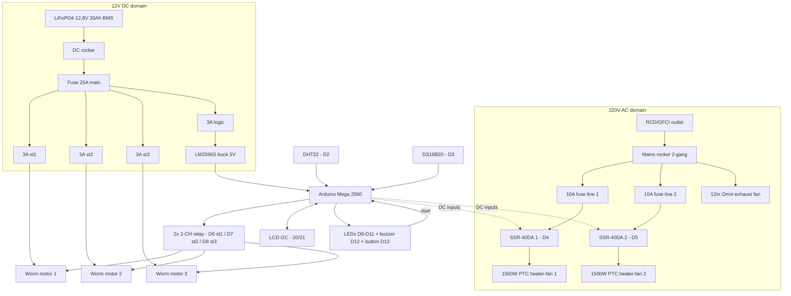

# Smart Umbrella Dryer — Component & Material Validation (Rev 5)

**Revision 5 — design changes from Rev 4:** heating moves to **220V AC mains** — **2× 1500W PTC heater-fans** switched by **2× Fotek SSR-40DA**, and the 120mm DC fan is replaced by a **12-inch Omni industrial exhaust fan (220V)** · the 12V LiFePO4 battery now powers **motors + control only** · the DC heater relay and 100W PTC are removed · a **mains safety layer** is added (RCD/GFCI, 10A branch fuses, earthing, separate mains kill switch) · still **3 independent worm-motor stations**, DHT22 + DS18B20 control, gravity drain.

## Study Overview

**Title:** Smart Umbrella Dryer: Design and Development of a Multi-Umbrella Drying System with Energy Efficient Control

**Key Requirements:**
1. Dry **3 umbrellas** simultaneously (any 1–3 mix per cycle)
2. Energy-efficient operation (sensor-based control; battery-backed control and rotation)
3. Smart/automated control via sensors
4. Safe operating temperatures for umbrella materials

---

## 0. Change Summary (v4 → v5)

| Change | Rev 4 | Rev 5 | Reason |
|---|---|---|---|
| Heaters | 1× 12V 100W PTC (battery) | **2× 220V 1500W PTC heater-fans (mains)** | 30× the heat: cycle time drops from ~1–2.5 h to ~15–45 min; battery cannot supply 3000W (would be 250A at 12V) |
| Heater switching | 1-CH 30A DC relay module | **2× Fotek SSR-40DA (AC output, heatsinked)** | Silent, no contact wear, fast zero-cross switching of AC; 5.9× current margin per heater |
| Circulation | 120mm 12V fan | **12" Omni industrial exhaust fan (220V)** | High-volume air exchange pulls humid air out — drying accelerates; runs on the mains rocker |
| Battery role | All loads (heater + motors) | **Motors + control only (~14W)** | BMS margin becomes huge; runtime limited by mains availability, not battery |
| Kill switches | 1 (DC rocker) | **2 (mains rocker + DC rocker), labeled** | Separate domains need separate kills |
| New safety layer | extra-low voltage only | **RCD/GFCI outlet, 10A branch fuses, grounded metal box, earthed frame + chassis** | Mains voltage now present — life-safety first |
| Unchanged | 3× worm stations, DHT22 + DS18B20, LCD/LEDs/buzzer/button, buck, gravity drain, 25A/3A fusing | — | — |

---

## 1. Microcontroller — Arduino Mega 2560 — UNCHANGED

| Parameter | Value |
|---|---|
| Processor | ATmega2560 |
| Digital I/O | 54 (15 PWM) |
| Flash / SRAM | 256 KB / 8 KB |
| I2C | SDA=20, SCL=21 |

**v5 pin audit:** 2 SSR inputs (D4/D5) + 3 motor relay channels (D6/D7/D8) + 3 LEDs + buzzer + button + LCD I2C + 2 sensors ≈ **10 digital + 2 I2C** — far inside capacity. The exhaust fan has **no** Mega channel (mains rocker). COMPATIBLE

**Powering the Mega:** buck 5V → 5V pin only (never the DC jack; never mains anything).

Listing: `makerlab.ph/products/mega-2560-r3-with-usb-cable-compatible-with-arduino-do-not-supply-with-12v-on-dc-jack` — ₱1,199

---

## 2. Power — two sources, three domains

### 2a. 12V battery — motors + control only

PowMr LiFePO4 12.8V 30Ah (384Wh, BMS 30A). Worst-case DC draw: 3 motors at stall 10.5A + logic ~0.8A ≈ **11.3A peak → BMS 5.7× margin**. Steady running ≈ **4.4A**. Battery runtime for control + rotation ≈ 384Wh ÷ 14W ≈ 27 h — the battery is no longer the cycle limiter.

**DC fuse plan (v5):** 25A main · 3A ×3 station branches · 3A logic. Wire: 16 AWG main/logic feed, 18 AWG stations, 22 AWG logic.

### 2b. 220V AC — heat + exhaust fan (NEW domain)

Wall outlet → **RCD/GFCI** → mains rocker (2-gang) → per-branch **10A fuses**:

| Branch | Load | Current @220V | Switch |
|---|---|---|---|
| Heater 1 | 1500W PTC heater-fan | 6.8A | SSR-40DA #1 (D4) |
| Heater 2 | 1500W PTC heater-fan | 6.8A | SSR-40DA #2 (D5) |
| Exhaust | 12" Omni fan | ~1.5–2.5A | mains rocker gang (no SSR) |

---

## 3. Heating — 2× 1500W PTC heater-fans (220V) via Fotek SSR-40DA

### 3a. Why the SSR-40DA (AC type) is now the CORRECT Fotek part

Rev 2–4 banned the DA type because a TRIAC cannot turn off a **DC** load. The new heaters are **AC** loads — exactly what the DA type is built for: current crosses zero 100×/second, so the SSR switches off cleanly. Never use the DD type here.

| Parameter | Value | Design check |
|---|---|---|
| Output | 24–380VAC, 40A | 220V heaters — correct type |
| Rated current | 40A | 5.9× the 6.8A heater |
| Surge | 600A-class | PTC inrush covered |
| Input | 3–32VDC, ~12mA | direct Mega pin (D4/D5), 10kΩ pull-down to hold OFF at boot |
| Dissipation | ≈ 1.0–1.6V × 6.8A ≈ **7–10W each** | **heatsink mandatory** — mount inside the grounded metal box with thermal paste |
| Control | slow time-proportional (2–5s period) | zero-cross DA switches at mains zero-crossings; do not fast-PWM |

### 3b. Staged heater control (the energy-efficient scheme)

| Stage | State | Use |
|---|---|---|
| Stage 0 | both OFF | idle / complete |
| Stage 1 | heater 1 duty-cycled (2–5s period) from humidity error | normal drying, holds 40–60C |
| Stage 2 | heater 1 steady ON + heater 2 duty-cycled | wet 3-umbrella load / pull-down |
| Cutoff | both OFF (latched) | DS18B20 > 65C, or humidity target met |

Appliances keep their **built-in thermostats + thermal cutoffs** — a fourth protection layer behind DS18B20, the RCD, and the branch fuses.

### 3c. Thermal verification (3000W staged)

| Quantity | Value |
|---|---|
| Water for 3 umbrellas | 90–300g typical (450g soaked worst case) |
| Evaporation energy | 57–188Wh (283Wh worst) |
| Effective delivered heat | ~2100–2500W (two blowers + exhaust exchange) |
| **Cycle time** | **≈ 15–25 min typical · ~30–45 min soaked** (humidity auto-stop) |
| Chamber air temp | 40–60C held by staging; DS18B20 cutoff 65C |

30× the heat plus forced air exchange is far beyond the old 100W loop — cycle time is now limited by moisture transport, not energy. The energy-efficiency claim shifts to **control efficiency**: heaters never run dry (humidity staging + auto-shutoff), which is where duty cycling still saves real power.

---

## 4. Sensors — DHT22 + DS18B20 — UNCHANGED

| Sensor | Role | Interface | Status |
|---|---|---|---|
| DHT22 (AM2302) | Chamber humidity — stage control + auto-shutoff | 1-wire, D2 | Required — ₱69 |
| DS18B20 waterproof | Heater-zone air temp — over-temp cutoff | 1-Wire, D3 + 4.7kΩ | Required — ₱105 |

I2C carries only the LCD. MLX90614 remains removed.

---

## 5. Motor & Drive — 3× worm stations — UNCHANGED (channel pins shift)

3× SGM-A58SW31ZY 12V 16RPM (60 kg·cm, 1.2A rated / 3.5A stall, 8mm shaft, self-locking) — one per umbrella, ≥20× torque margin per station, per-station 3A fuse isolation. Driven by **2× 2-CH relay modules** (3 of 4 channels used): coils from the buck 5V rail, Mega drives only the optocoupler LEDs.

Mechanical: 3× 8mm × 300mm 304 SS shafts · 6× KP08 · 3× 8×8 rigid couplings · fabricated holders.

Listings unchanged (makerlab.ph motors ×3 in one order; JGY370 not acceptable).

---

## 6. Voltage Regulation — LM2596S — UNCHANGED

Logic load: Mega 0.2A + sensors + LCD + LEDs + buzzer + 3 relay coils (0.21A) ≈ **0.7A** — 4.3× margin on 3A.

---

## 7. Water Management — PASSIVE — UNCHANGED

Sloped floor (3–5°) → drain tube → drip tray (100–300mL/cycle; 500mL tray). With fast drying, condensate arrives sooner — check the tray fill after the first cycles and size up if needed.

---

## 8. User Interface

- LCD 16×2 I2C (0x27/0x3F) — status, humidity, stage
- LEDs green/yellow/red; buzzer; start button (INPUT_PULLUP)
- **Two labeled rockers: MAINS (AC domain) and DC (battery domain)** — the mains rocker is the manual kill for a fail-short SSR

---

## 9. THREE-UMBRELLA CAPACITY VERIFICATION (Rev 5)

### 9a. Mechanical — per-station torque — PASS (unchanged)
≤3 kg·cm per station vs 60 kg·cm → ≥20× margin; KP08 >90× load margin; 16 RPM gentle; self-locking hold.

### 9b. Thermal — PASS (see 3c)
15–45 min cycles; staged 1500W heaters; 40–60C held; quadruple over-temp protection (appliance thermostat, DS18B20 cutoff, branch fuse, RCD).

### 9c. Electrical — split domains — PASS

| Domain | Worst case | Protection | Margin |
|---|---|---|---|
| AC | 6.8A ×2 heaters + ~2A fan ≈ **15.6A** on the outlet | RCD 30mA + 10A branch fuses + 20A-class breaker upstream | branch fuses sized to wire |
| 12V | 11.3A peak (3 stalls + logic) | 25A main + 3A branches, BMS 30A | 5.7× BMS |
| 5V | ~0.7A | 3A branch, buck 3A | 4.3× |

---

## 10. Energy & Runtime (Rev 5 story)

| Item | Value |
|---|---|
| Energy per 3-umbrella cycle (mains) | ≈ **0.6–1.0 kWh** (staged control; auto-shutoff prevents dry running) |
| Cost per cycle | ≈ ₱7–12 at ₱12/kWh |
| Battery | powers ~27 h of control + rotation; 25+ cycles per charge (motors only) |
| Cycle rate | limited by mains presence + operator, not battery |

**Honest framing for the paper:** absolute energy per cycle is higher than the 12V design (bigger heaters dry much faster); the efficiency contribution of the controller is **eliminating idle/dry heating** via humidity staging and auto-shutoff, plus battery-backed low-power control.

---

## 11. System Block Diagram

---

## 12. Compatibility Matrix (v5)

| Component | Domain | Margin | Interface | Verdict |
|---|---|---|---|---|
| Arduino Mega 2560 | 5V buck | pin fit 10+2 | SSR inputs + opto LEDs + sensors | PASS |
| Fotek SSR-40DA ×2 | 220VAC out / 3–32VDC in | 5.9× per heater | Mega D4/D5, 10kΩ pull-downs, heatsinked | PASS |
| 1500W PTC heater-fans ×2 | 220VAC | 6.8A each | SSR output + plug/socket | PASS |
| Omni 12" exhaust fan | 220VAC | ~2A on 10A branch | mains rocker (no SSR) | PASS |
| RCD/GFCI + mains kit | 220VAC | life-safety | — | PASS (mandatory) |
| 3× worm motors | 12V | ≥20× torque | relay channels D6–D8 | PASS |
| 2× 2-CH relay boards | 12V contacts | 2.9× at stall | opto LEDs, coils on 5V rail | PASS |
| LiFePO4 30Ah BMS | 12V | 5.7× peak | — | PASS |
| LM2596S | 12.8→5V | 4.3× | — | PASS |
| DHT22 / DS18B20 | 5V | mA | D2 / D3 | PASS |
| LCD + LEDs + buzzer + button | 5V | — | I2C + digital | PASS |
| Gravity drain + tray | — | — | passive | PASS |

---

## 13. Safety Validation (v5) — mains era

| Hazard | Mitigation | Status |
|---|---|---|
| **Electric shock (new)** | RCD/GFCI 30mA + grounded metal box + earthed frame and chassis + plugs accessible | primary control |
| **SSR fail-short (heater stuck ON, AC)** | Mains rocker kill + 10A branch fuse + appliance thermostat + DS18B20 cutoff + RCD | five layers |
| Over-temperature | Appliance thermostat → DS18B20 65C latched cutoff → PTC self-regulation | triple |
| SSR overheating | 7–10W each on heatsink, thermal paste, closed box | managed |
| Overcurrent | 10A branches (AC), 25A main + 3A branches (DC) | fused everywhere |
| Battery overdischarge | BMS | yes |
| Station jam | per-station 3A fuse + self-locking worm | isolated |
| Fire | PTC elements (no open coil) + RCD + fuses | low |
| Water | gravity drain + tray; liquids away from the electrical box | managed |
| Mains in chamber | **No mains terminals or joints inside the chamber** — only the appliances' factory cords pass through grommets to accessible plugs outside; appliance zone on the floor, away from the drain/drip path | by design |

---

## 14. Bill of Materials — Itemized (Rev 5)

> **Sourcing policy:** Makerlab PH first → trusted Lazada sellers. Motors + Fotek SSRs from makerlab.ph website; appliances and mains kit from Lazada/hardware. Prices verified 2026-09-12 unless marked EST (re-check at checkout). Backup listings and seller reasoning: `SOURCING-ANNEX.md`.

| Qty | Item | Spec | Price | Seller / Trust | URL |
|---|---|---|---|---|---|
| 1 | Arduino Mega 2560 R3 | ATmega2560 | ₱1,215 / ₱1,265 w/ USB | Makerlab PH, 4.8 (331), 2.4K sold | https://www.lazada.com.ph/products/pdp-i5989151.html |
| 2 | **Fotek SSR-40DA (AC output)** | 40A, 3–32VDC in, 24–380VAC out — NOT DD | ₱850 ea = ₱1,700 | Makerlab | https://makerlab.ph/products/original-solid-state-relay-ssr-40da-ssr-75da-ssr-25dd-4-32v-dc-input |
| 2 | **1500W PTC industrial heater-fan, 220V** | portable heater-fan w/ thermostat + thermal cutoff | ₱1,395.35 ea = ₱2,790.70 | Lazada listing | https://www.lazada.com.ph/products/portable-industrial-electric-heater-fan-commercial-thermostat-air-warm-heater-blower-radiator-office-garage-air-fan-i4902069326-s28572024789.html |
| 1 | **Omni industrial exhaust fan w/ grill, wall-mount** | **select 12-inch variant** (listing spans 12/14/16) | ~₱1,000–1,500 EST | Omni official Lazada | https://www.lazada.com.ph/products/omni-industrial-exhaust-fan-w-grill-wall-mounted-12-inch-14-inch-16-inch-i4020672066-s21738898500.html |
| 2 | 2-CH relay module 5V, optocoupler, low-level trigger | 10A@30VDC — 3 motor channels + spare | ₱89 ea = ₱178 | Bulacan, (330), 2.5K sold | https://www.lazada.com.ph/products/pdp-i100047444.html |
| 1 | DHT22 module | select "DHT22 Black" | ₱69 | FU-LABS 98% | https://www.lazada.com.ph/products/pdp-i4888079786.html |
| 1 | DS18B20 waterproof 3m | +4.7kΩ pull-up | ₱105 | Circuitrocks | https://www.lazada.com.ph/products/pdp-i111662523.html |
| 1 | LCD 16×2 w/ I2C | 0x27/0x3F | ₱165 | Makerlab PH | https://www.lazada.com.ph/products/pdp-i104139284.html |
| 1 | 5mm LED kit 10pc | G/Y/R status | ₱29 | (433), 3.0K sold | https://www.lazada.com.ph/products/pdp-i3105641040.html |
| 1 | Active buzzer module | cycle alert | ₱35 | Makerlab PH | https://www.lazada.com.ph/products/pdp-i3474748260.html |
| 1 | Tactile buttons 12mm ×10 | start/reset | ₱79 | Makerlab PH | https://www.lazada.com.ph/products/pdp-i118682689.html |
| 1 | Rocker switch 16A 4-pin (DC side) | battery control-side switching | ₱72 | Unnicoco | https://www.lazada.com.ph/products/pdp-i2272943066.html |
| 1 | Rocker/double-gang mains switch + plate (AC side) | 2-gang, 10A+, flush type | ~₱150–300 EST | hardware / Lazada | (add at checkout) |
| 1 | LM2596S buck w/ display | 12.8→5V 3A | ₱155 | Makerlab PH | https://www.lazada.com.ph/products/pdp-i127879071.html |
| 1 | RCD/GFCI outlet or breaker | 30mA class — MANDATORY | ~₱800–1,500 EST | hardware / Omni / Philex | (add at checkout) |
| 1 | Grounded metal electrical box + DIN/plate | houses SSRs, fuses, terminals | ~₱300–600 EST | hardware | (add at checkout) |
| 1 | Heatsink profile for SSRs (2 pc or 1 shared) | ≥100×100mm contact each | ~₱150–300 EST | Lazada "SSR heatsink" | (add at checkout) |
| 1 | 2.0mm² (14 AWG eq.) 3-core wire + plug/socket set | mains branches | ~₱400–700 EST | hardware / Lazada | (add at checkout) |
| 3 | Worm gear motor SGM-A58SW31ZY 12V 16RPM | 60 kg·cm, self-locking — one per station | ₱1,249 ea = ₱3,747 | makerlab.ph (site) | https://makerlab.ph/products/dc-worm-gear-motor-sgm-a58sw31zys-12v-16rpm-80rpm-sgm-370-12v-40rpm-160rpm-dc-motor |
| 3 | 304 SS shaft 8mm × 300mm | ground finish | ₱222.40 ea = ₱667.20 | (19), 77 sold | https://www.lazada.com.ph/products/pdp-i4473127402.html |
| 3 | KP08 pillow block 2-pc set | 8mm bore — select KP08 | ₱310/set = ₱930 | Bulacan | https://www.lazada.com.ph/products/pdp-i5039609084.html |
| 2 | Rigid coupling set (use 8×8) | 3 needed + spare | ₱82.84 ea = ₱165.68 | (185), 408 sold | https://www.lazada.com.ph/products/pdp-i2734273953.html |
| 1 | Silicone wire kit 6–18AWG | 16 main/logic, 18 stations, 22 logic | ₱218 | 6.2K sold | https://www.lazada.com.ph/products/pdp-i4880482146.html |
| 1 | Dupont jumper kit 40-pin | logic hookups | ₱45 | Circuitrocks | https://www.lazada.com.ph/products/pdp-i245055558.html |
| 1 | Terminal block 15A barrier | DC distribution | ₱106 | Laguna | https://www.lazada.com.ph/products/pdp-i2818578034.html |
| 1 | Heat-shrink kit | splices | ₱111 | Toolstar | https://www.lazada.com.ph/products/pdp-i1085866956.html |
| 1 | Resistor kit 300pc | 220Ω LED, 4.7kΩ DS18B20, 10kΩ pull-ups | ₱69 | (73) | https://www.lazada.com.ph/products/pdp-i4888115298.html |
| 1 | Nylon standoff kit | board mounting | ₱97 | (252) | https://www.lazada.com.ph/products/pdp-i2946710217.html |
| 1 | LiFePO4 12.8V 30Ah w/ BMS (PowMr) | control + rotation; ORDER FIRST (~60 days) | ~₱3,500–4,500 | PowMr, 152.9K sold | https://www.lazada.com.ph/products/pdp-i4660631878.html |
| 1 | FOXSUR 14.6V/6A LiFePO4 charger | never lead-acid | ₱945 | (615), 1.6K sold | https://www.lazada.com.ph/products/pdp-i2019767534.html |
| 1 | Blade fuse kit 100pc + 1 panel holder | 25A main, 3A ×4 | ₱122.53 + ₱25 | (5022) | https://www.lazada.com.ph/products/pdp-i4214903852.html + https://www.lazada.com.ph/products/pdp-i2502994973.html |
| 1 | Aluminum plate 6061 6mm | motor plate + mounts | ₱760 | (52) | https://www.lazada.com.ph/products/pdp-i4449859085.html |
| 1 | Zip ties, M3/M4 screws, sealant, drip tray, velcro, grommets | consumables | ~₱490 | hardware | (any order) |

### Cart totals (Rev 5)

| Group | Subtotal |
|---|---|
| Electronics (Mega, SSR ×2, relays, sensors, UI, buck) | ≈ ₱3,952 |
| Mains kit (RCD, box, heatsinks, 2.0mm² wire, plug/socket, AC rocker) | ≈ ₱2,600 EST |
| Appliances (2× heater-fan ₱2,791 + Omni 12" ~₱1,200 EST) | ≈ ₱3,990 |
| Drivetrain (3 stations) | ≈ ₱5,510 |
| Battery + charger | ≈ ₱4,445–5,445 |
| Wiring, fuses, chassis, consumables | ≈ ₱2,090 |
| **TOTAL** | **≈ ₱22,500–23,600** (≈ +₱8,000 vs Rev 4 — heaters, SSRs, mains kit, exhaust fan) |

## Rev-5 order notes

1. **SSR type: DA (AC output) only now.** The DD type cannot switch these AC heaters. Double-check the marking before wiring: SSR-40DA.
2. **Mains work must follow the RCD + grounded-box + earthing rules** in `wiring/README.md` — when in doubt, have a licensed electrician wire the AC side.
3. **Heaters and exhaust fan are appliances with plugs** — keep plugs accessible; unplug before chamber service.
4. The 12" Omni listing spans 12/14/16-inch variants — **select 12-inch**.
5. Battery still has the ~60-day lead time — order first, as always.
6. DHT22: select the "DHT22 Black" ₱69 variant.

---

## 15. Pin Map (v5 final)

| Pin | Connection |
|---|---|
| D2 | DHT22 data |
| D3 | DS18B20 data (+4.7kΩ pull-up) |
| D4 | SSR-40DA #1 input — heater-fan 1 (staged base) |
| D5 | SSR-40DA #2 input — heater-fan 2 (boost) |
| D6 | Relay #1 ch1 — station 1 motor |
| D7 | Relay #1 ch2 — station 2 motor |
| D8 | Relay #2 ch1 — station 3 motor |
| D9 / D10 / D11 | Green / Yellow / Red LED (220Ω) |
| D12 | Buzzer |
| D13 | Start button (INPUT_PULLUP) |
| 20 / 21 | LCD I2C |
| — | 10kΩ pull-downs on D4/D5 (SSR inputs, active-HIGH — hold OFF at boot); 10kΩ pull-ups on D6–D8 to relay VCC (active-LOW boards) |
| — | Mains rocker + RCD + 10A fuses: AC domain (no Mega channel) |
| — | DC rocker + 25A main: battery domain |

---

## 16. Final Verdict (Rev 5)

### THE v5 SYSTEM IS COMPATIBLE AND CAN DRY 3 UMBRELLAS PER CYCLE — IN 15–45 MINUTES ON MAINS HEAT, WITH BATTERY-BACKED CONTROL

- 2× 1500W mains heater-fans staged by humidity, switched by SSR-40DAs (correct AC Fotek type) with five over-temp/shock protection layers.
- 12" exhaust fan gives real air exchange; battery now carries only the 3 stations + control for ~27 h.
- Cycle time drops ~4×; energy-efficiency claim rests on staged control + auto-shutoff (no dry heating).
- All-12V inside the chamber; mains stays in a closed, earthed, RCD-protected box outside.

*Paper figure updates for Rev 5: Fig 11/12 (heater chain → 2× SSR-40DA + mains domain), block diagram (AC domain), safety chapter (RCD/earthing), energy chapter (staged control framing).*

---

# Appendix A — Printable Shopping Checklist (Rev 5)

### Order sequence
1. FIRST: PowMr battery (pre-order ~60 days)
2. SECOND: 3× motors + 2× SSR-40DA (makerlab.ph, one order)
3. Everything else (Lazada + hardware)

### Variant picking
| Item | Select |
|---|---|
| DHT22 | "DHT22 Black" (₱69) |
| Omni fan | 12-inch variant |
| Pillow blocks | KP08 |
| Steel shaft | 8mm × 300mm |
| SSR | **SSR-40DA** (AC) — never DD for these heaters |

### Cart A — makerlab.ph website
- [ ] 3× Worm gear motor SGM-A58SW31ZY 12V **16RPM** = ₱3,747
- [ ] 2× Fotek **SSR-40DA** = ₱1,700

### Cart B — Lazada PH
- [ ] Arduino Mega 2560 R3 — ₱1,215
- [ ] 2× PTC industrial heater-fan 1500W 220V — ₱2,790.70 — https://www.lazada.com.ph/products/portable-industrial-electric-heater-fan-commercial-thermostat-air-warm-heater-blower-radiator-office-garage-air-fan-i4902069326-s28572024789.html
- [ ] Omni 12" exhaust fan — ~₱1,000–1,500 (12-inch variant) — https://www.lazada.com.ph/products/omni-industrial-exhaust-fan-w-grill-wall-mounted-12-inch-14-inch-16-inch-i4020672066-s21738898500.html
- [ ] 2× 2-CH relay module — ₱178
- [ ] DHT22 Black — ₱69 · DS18B20 — ₱105 · LCD I2C — ₱165 · LEDs — ₱29 · buzzer — ₱35 · buttons — ₱79 · DC rocker — ₱72 · buck — ₱155
- [ ] 3× shaft 8×300 — ₱667.20 · 3× KP08 sets — ₱930 · 2× coupling sets — ₱165.68
- [ ] Silicone wire — ₱218 · dupont — ₱45 · terminal block — ₱106 · heat-shrink — ₱111 · resistors — ₱69 · standoffs — ₱97
- [ ] PowMr 30Ah — ORDER FIRST · FOXSUR charger — ₱945
- [ ] Blade fuse kit + holder — ₱147.53 · aluminum plate — ₱760

### Cart C — hardware (mains kit + consumables)
- [ ] RCD/GFCI outlet or breaker (30mA)
- [ ] Grounded metal electrical box + plate
- [ ] 2-gang mains rocker + plate
- [ ] 2.0mm² 3-core wire + plug/socket set
- [ ] 2× SSR heatsink profile
- [ ] Zip ties, M3/M4 screws, silicone sealant, drip tray, velcro, grommets (~₱490)

### Sign-off before checkout
- [ ] SSRs marked **DA**, not DD
- [ ] Omni fan is the 12-inch variant
- [ ] Battery pre-order confirmed, ordered first
- [ ] RCD + grounded box on the list (non-negotiable)
- [ ] DHT22 Black / KP08 / 8×300 variants picked
- [ ] Prices re-verified at checkout
