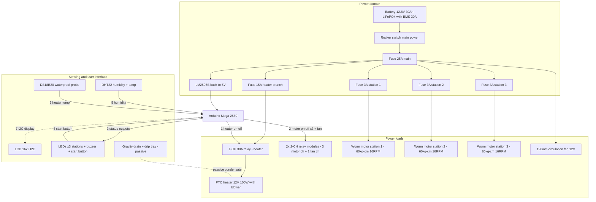

# Smart Umbrella Dryer — Component & Material Validation (Rev 4)

**Revision 4 — design changes from Rev 2:** Fotek SSR-25DD + BTS7960 **replaced by optocoupler relay modules** (heater and motors only need on/off switching — saves ~₱1,900) · water pump and MOSFET **removed** (gravity drain) · **MLX90614 IR sensor removed from the design** · **single-motor carousel replaced by 3 independent worm-gear-motor stations (one motor per umbrella)** · system re-verified for **3 umbrellas simultaneously**.

## Study Overview

**Title:** Smart Umbrella Dryer: Design and Development of a Multi-Umbrella Drying System with Energy Efficient Control

**Key Requirements:**
1. Dry **3 umbrellas** simultaneously (any 1–3 mix per cycle)
2. Energy-efficient operation (battery backup support)
3. Smart/automated control via sensors
4. Safe operating temperatures for umbrella materials

---

## 0. Change Summary (v2 → v4)

| Change | Rev 2 | Rev 4 | Reason |
|---|---|---|---|
| Heater switching | Fotek SSR-25DD (₱1,800) | **1-CH 30A relay module w/ optocoupler (₱113)** | On/off + slow duty cycling only — a relay contact does the job |
| Motor driver | BTS7960 43A (₱305) | **2× 2-CH relay modules w/ optocoupler (₱178)** | 16 RPM fixed is the design speed — no PWM needed |
| Rotation | 1 worm motor driving a shared carousel | **3× worm gear motors — one per umbrella station** | Independent stations: any 1–3 umbrellas, per-station control, no imbalance across a crossbar |
| Water pump | REMOVED | REMOVED — gravity drain + drip tray | Pump was the only flood-failure component |
| MLX90614 IR sensor | Optional (kept) | **REMOVED from the design** | Non-essential; DHT22 + DS18B20 fully cover the control loop |
| Main fuse | 20A | **25A** | 3-motor stall worst case exceeds 20A headroom at battery sag |
| Motor-branch fuses | 5A (shared) | **3A per station (×3)** | One jammed station cannot take down the others |
| Capacity target | 3 umbrellas (shared carousel) | 3 umbrellas — **independent stations** | Study requirement |

---

## 1. Microcontroller — Arduino Mega 2560 ✅ UNCHANGED

| Parameter | Value |
|---|---|
| Processor | ATmega2560 |
| Digital I/O | 54 (15 PWM) |
| Analog pins | 16 |
| Flash / SRAM | 256 KB / 8 KB |
| Clock | 16 MHz |
| I2C | SDA=20, SCL=21 |

**v4 pin audit:** heater relay (1) + 3 motor relays (3) + 3 station status LEDs (3) + buzzer + start button + LCD I2C + 2 sensors ≈ **11 digital + 2 I2C** — far inside the Mega's capacity. ✅ COMPATIBLE

**Powering the Mega:** Makerlab's Mega listing explicitly warns *"do not supply with 12V on DC jack"*. Feed the Mega from the **LM2596S 5V output → Mega 5V pin** (or USB), not the DC jack from battery voltage.

Listing: `makerlab.ph/products/mega-2560-r3-with-usb-cable-compatible-with-arduino-do-not-supply-with-12v-on-dc-jack` — ₱1,199

---

## 2. Power Supply — LiFePO4 12.8V 30Ah w/ BMS (PowMr) — REPLACED ExpertPower 35Ah

ExpertPower 35Ah (the paper's original pick) is not stocked on Lazada PH; the PowMr 12.8V 30Ah is the verified local equivalent: **384 Wh, BMS with 30A max continuous discharge** (per PowMr's published spec sheet), overcharge/over-discharge/short/over-temp protection.

**Worst-case draw check:** heater 8.3A + 3 motors at stall 10.5A + fan 0.25A + logic ~0.2A ≈ **13.1A peak** → BMS 30A = **2.3× margin**. ✅ (Stall is transient — seconds per start.)

**Fuse plan (v4):**

| Branch | Load | Fuse |
|---|---|---|
| Main battery line | 13.1A worst case | **25A** |
| Heater branch (through 30A relay) | 8.3A | 15A |
| Motor branch ×3 (one per station) | 1.2A rated / 3.5A stall each | **3A each** |
| Logic branch (LM2596S) | ~0.5A | 3A |

Wire gauge: **16 AWG** main + heater (8.3A), **18 AWG** motor branches (stall 3.5A), **22 AWG** sensors/logic.

---

## 3. Heating — PTC 12V 100W Air Heater Fan — switched by 30A relay module

Self-regulating ceramic PTC (auto-limits at Curie point), integrated blower, **8.3A @ 12V** (100W). Air at 40–60°C dries umbrella fabric (nylon/polyester) safely. Lazada's max 12V variant is 100W (no 120W exists — cycle runs ~20% longer than the Rev 2 math; see §9b). See §9 for 3-umbrella thermal verification.

**1-CH 30A relay module integration details**

| Parameter | Value | Design check |
|---|---|---|
| Contact rating | 30A @ 30VDC | 3.6× the 8.3A heater ✅ |
| Coil | 5V, ~70mA, driven from LM2596S rail | NOT from a Mega pin ✅ |
| Input | optocoupler LED, low-level trigger, ~2–5mA | direct Mega pin (≤20mA source) ✅ |
| Flyback | built-in diode on coil + opto isolation | no transient paths to logic ✅ |

**Duty-cycle strategy:** **slow time-proportional control** (2–5s period) on a plain digital pin. Mechanical relays tolerate slow cycling; do NOT use fast PWM (490Hz+) — contact arcing and wear will destroy the relay.

---

## 4. Sensors — DHT22 + DS18B20 ✅ (MLX90614 REMOVED)

| Sensor | Role | Interface | Status |
|---|---|---|---|
| **DHT22 (AM2302)** | Chamber humidity — core feedback for duty cycling + auto-shutoff | 1-wire digital, D2 | Required — ₱69 (FU-LABS module) |
| **DS18B20 waterproof** | Heater-zone air temp — redundant over-temp cutoff | 1-Wire, D3 + 4.7kΩ pull-up | Required — ₱105 (Circuitrocks) |
| ~~MLX90614~~ | ~~Non-contact umbrella surface temp~~ | ~~I2C~~ | **REMOVED from the design** — surface temp is inferable from chamber air temp + cycle model; frees an I2C address and ~₱1,349 |

The I2C bus now carries only the LCD (0x27/0x3F). ✅ No conflicts.

---

## 5. Motor & Drive — 3× worm gear motors, one per station (Rev 4 core change)

### 5a. Motors: 3× DC Worm Gear Motor SGM-A58SW31ZY, 12V, 16RPM (makerlab.ph, ₱1,249 each)

| Parameter | Value |
|---|---|
| Voltage range / rated | 6–12V / 12V |
| No-load speed / current | 16 RPM / 240mA |
| **Rated load** | 11 RPM @ **1.2A**, **60 kg·cm torque** |
| Stall torque / stall current | **70 kg·cm** / 3.5A |
| Shaft | **8mm diameter × 15mm** |
| Body | 115×40×35.7mm, 357g |

Why one motor per umbrella (vs Rev 2/3's single shared-carousel motor):
- **Independent stations** — any 1–3 umbrellas can be dried per run; per-station start/stop as each umbrella dries.
- **Load per motor drops to ≤3 kg·cm** (one umbrella + holder, worst case) → **≥20× torque margin** (Rev 3 shared-carousel math needed 8–10 kg·cm against one 60 kg·cm motor).
- **Fault isolation** — a jammed umbrella stalls one motor only; the other stations keep running, each protected by its own 3A fuse.
- **No crossbar imbalance** — each station carries only its own umbrella; mounting positions no longer affect torque.
- **Self-locking** — the worm cannot be back-driven, so each station holds position when off.
- 16 RPM direct = gentle rotation (no centrifugal water loss); no external reduction.

Variant notes: 80RPM variant (₱1,299) available; dual-shaft +₱50. Recommended: **Single Shaft 16RPM (₱1,249) ×3 — order all three from makerlab.ph in one order.** The Lazada JGY370 (~25 kg·cm, different shaft) is NOT an acceptable substitute.

Listing: `makerlab.ph/products/dc-worm-gear-motor-sgm-a58sw31zys-12v-16rpm-80rpm-sgm-370-12v-40rpm-160rpm-dc-motor`

### 5b. Drivers: 2× 2-CH relay modules w/ optocoupler (₱89 each) — REPLACED BTS7960

- 3 of the 4 channels drive the motors (1.2A rated / 3.5A stall vs 10A@30VDC contacts → **2.9× margin at stall** per channel). ✅
- 4th channel drives the 120mm circulation fan (0.25A). ✅
- Relay coils from the LM2596S 5V rail; Mega drives only the optocoupler LEDs (~2–5mA per channel). ✅
- Each motor channel sits in its own 3A-fused station branch — a stalled motor pops only its own fuse. ✅
- Lost vs BTS7960: PWM speed control (not needed — 16 RPM is the design speed) and current-sense telemetry (replaced by per-station fuse + relay-state logic: a drawn 3A fuse with the relay commanded on = jam indication at the UI).

### 5c. Mechanical transmission — 3 independent stations

| Component | v4 spec | Note |
|---|---|---|
| Steel shaft | **3× 8mm × 300mm** (304 SS, ground) | one per station; 8mm system-wide matches motor shaft & KP08 bore |
| Pillow block bearing | **6× KP08** (2 per station) | radial rating ≫ single-umbrella load; >30× margin |
| Shaft coupling | **3× 8×8 rigid** (2 sets cover it + spare) | motor 8mm shaft × station 8mm shaft |
| Umbrella holder | **3× holders, one per station shaft** | aluminum plate fabrication |

---

## 6. Voltage Regulation — LM2596S ✅ UNCHANGED

12.8V → 5V @ 3A. v4 logic load: Mega (~0.2A) + DHT22 + DS18B20 + LCD (~0.04A) + LEDs + buzzer + **4 relay coils (~70mA each = 0.28A)** ≈ **0.7–0.8A** — still only ~27% of the 3A rating. Power the Mega via its **5V pin**, not the DC jack. ✅ (Rev 3 estimate was 0.45A; the added relay coils are the difference — still comfortable.)

---

## 7. Water Management — PASSIVE (pump removed) ✅ UNCHANGED

1. **Chamber floor sloped ~3–5°** toward one corner.
2. **Slotted drain hole + silicone drain tube** exiting the chamber wall.
3. **Removable drip tray** outside the chamber base — emptied per use (3 umbrellas shed roughly 100–300mL per cycle; a 500mL tray covers it).
4. Optional: hydrophobic mesh liner on the floor so drips funnel to the drain.

Trade-off accepted: condensate removal is manual (empty the tray) in exchange for a simpler, cheaper, fault-free chamber. The humidity-based auto-shutoff logic is unaffected. ✅ COMPATIBLE

---

## 8. User Interface ✅ UNCHANGED (minus MLX90614)

- **LCD 16×2 I2C** (₱165, addr 0x27/0x3F) — sole I2C device now.
- **LEDs:** green = ready/complete, yellow = drying, red = error/over-temp (station status ×3 + system).
- **Piezo buzzer:** cycle-complete alert, direct from a Mega pin.
- **Momentary push button** (INPUT_PULLUP): start/reset cycle.
- **Rocker switch:** hardware main power battery→fuse — also the manual kill for a fail-short heater relay.

---

## 9. THREE-UMBRELLA CAPACITY VERIFICATION ⭐ (Rev 4: three stations)

### 9a. Mechanical — per-station torque ✅ PASS

| Quantity | Value | Check |
|---|---|---|
| Rotating mass per station | 1 umbrella (0.4–0.7kg) + holder ≈ **1.2–1.7kg** | KP08 dynamic load ≈ 160kgf → >90× margin ✅ |
| Bearing friction torque per station | ≈ μ·F·r ≈ 0.003 × 15N × 0.01m ≈ **0.05 kg·cm** | — |
| Design allowance per station (imbalance, seal drag, wet fabric, startup) | ≈ **≤3 kg·cm** | — |
| Motor rated torque (each station) | **60 kg·cm** | **≥20× margin** ✅ |
| Stall torque | 70 kg·cm | tolerates a jammed umbrella ✅ |
| Rotation speed | 16 RPM direct | gentle, no centrifugal water loss ✅ |
| Station independence | any 1–3 stations run per cycle | matches the multi-umbrella study claim ✅ |

### 9b. Thermal — heater sizing ✅ PASS (100W, realistic cycle time)

| Quantity | Value |
|---|---|
| Water retained per umbrella (after shaking, open in chamber) | ≈ 30–100g (folding) up to 150g (golf) |
| Water for 3 umbrellas | ≈ **90–300g typical** (worst case 450g soaked) |
| Latent heat of vaporization | ≈ 2,260 J/g |
| Evaporation energy needed | 90g → 57Wh · 300g → 188Wh · 450g → 283Wh |
| PTC heat delivered | 100W, chamber transfer ~70–85% → **≈ 70–85W effective** |
| Cycle time (all 3 simultaneously) | **≈ 50 min (light rain) → ~2.5 h (fully soaked)**, humidity sensor auto-stops at threshold |

**Verdict: 100W PTC dries 3 umbrellas simultaneously in ≈50–150 minutes** with per-station rotation + forced air at 40–60°C. Slower than commercial 400–1000W spinner dryers — by design: the study's core claim is **energy-efficient control**. Per-station motors add a small benefit: late-finishing umbrellas can stop rotating, trimming parasitic motor losses. **Recommendation: keep 1× 100W heater.**

### 9c. Electrical — simultaneous worst-case ✅ PASS

| Load | Current @12V | Notes |
|---|---|---|
| PTC heater (relay ON) | 8.3A | 100W |
| Worm motors | 3.6A rated (10.5A stall, seconds) | 3 × 1.2A |
| 120mm fan | 0.25A | 3W |
| Relay coils (4) | 0.28A | from 5V rail ≈ 0.06A reflected on 12V |
| Logic (via LM2596S, 5V ~0.5A) | ≈ 0.22A | 2.8W |
| **Total steady (heater ON, 3 motors running)** | **≈ 12.5A ≈ 155W** | BMS 30A → 2.4× margin ✅ |
| **Peak (3 motor stalls + heater on)** | ≈ 13.1A (≈15.6A at 10.5V sag) | < 25A main fuse ✅ |

---

## 10. Runtime on Battery (3-umbrella cycles)

Energy available: **384Wh** (30Ah × 12.8V). Typical 3-umbrella cycle ≈ 70 min at ~60% heater duty:

| Scenario | Avg power | Runtime |
|---|---|---|
| Everything full-on (155W) | 155W | ≈ **2.5 h** |
| Typical cycle (~60% duty) | ≈ 95W | ≈ **4.0 h → ~3–4 full cycles per charge** |
| Aggressive duty cycling (30%) | ≈ 52W | ≈ 7.4 h |

**Energy per 3-umbrella cycle ≈ 90–95Wh ≈ ₱0 equivalent from battery** — the headline number for the study's energy-efficiency chapter.

---

## 11. System Block Diagram

---

## 12. Compatibility Matrix (v4)

| Component | Voltage | Current margin | Interface | 3-umbrella fit | Verdict |
|---|---|---|---|---|---|
| Arduino Mega 2560 | 5V via buck | ✅ | 11 dig + 2 I2C | ✅ | ✅ PASS |
| LiFePO4 12.8V 30Ah (PowMr) | 12V native | 2.4× BMS margin | — | ✅ 3–4 cycles | ✅ PASS |
| PTC 100W heater | 12V | 8.3A | via 30A relay | ✅ 50–150min cycle | ✅ PASS |
| 1-CH 30A relay (heater) | 30VDC contacts | 3.6× (30A vs 8.3A) | optocoupler LED | ✅ | ✅ PASS |
| 2× 2-CH relays (motors + fan) | 30VDC contacts | 2.9× at stall per ch | optocoupler LED | ✅ 1 ch per motor | ✅ PASS |
| **3× worm motors 60kg·cm** | 12V | ≥20× torque margin per station | relay on/off | ✅ one per umbrella | ✅ PASS |
| LM2596S | 12.8→5V | 3.75× (3A vs 0.8A) | — | ✅ | ✅ PASS |
| DHT22 / DS18B20 | 3.3–5.5V | mA | 1-wire / 1-Wire | ✅ | ✅ PASS |
| LCD I2C + LEDs + buzzer + button | 5V | ✅ | I2C + digital | ✅ | ✅ PASS |
| 3× KP08 pairs + 8mm shafts + 8×8 couplings | N/A | >90× load per station | 8mm system | ✅ 3 stations | ✅ PASS |
| Gravity drain + drip tray (no pump) | N/A | N/A | passive | ✅ 100–300mL/cycle | ✅ PASS |

---

## 13. Safety Validation (v4)

| Hazard | Mitigation | Status |
|---|---|---|
| Overheating | PTC self-regulation + DS18B20 software cutoff | ✅ dual protection |
| **Heater relay fail-short** (heater stuck on) | Rocker switch (hard kill) + 15A branch fuse + PTC self-regulating | ✅ triple backup |
| Relay coil/transient noise | Optocoupler isolation + built-in flyback diodes | ✅ |
| Overcurrent | 25A main + branch fuses (15A heater, 3A ×3 stations, 3A logic) | ✅ |
| Battery overdischarge | PowMr BMS | ✅ |
| **Single-station jam** | Only that station's 3A fuse blows; other stations keep drying; worm drive stall-rated 70 kg·cm | ✅ fault isolation |
| Fire risk | PTC self-limiting (no open element) + all-extra-low-voltage 12VDC | ✅ low |
| Water accumulation | Gravity drain + drip tray (manual empty) | ✅ managed |
| Electrical shock | 12V DC system (extra-low voltage) | ✅ safe |
| Relay contacts on AC | 30VDC-rated contacts — mains use prohibited by design | ✅ documented |

---

## 14. Bill of Materials (v4 summary)

Full verified listings in `BOM.md` / `docs/PROCUREMENT.md`. Key figures:

| Group | Est. cost |
|---|---|
| Electronics (Mega, 3 relay modules, sensors, UI, buck, heater, fan) | ≈ ₱2,816 |
| Wiring, fuses, interconnect | ≈ ₱819 |
| Drivetrain — 3 stations (3× motor + 3× shaft + 6× KP08 + couplings) | ≈ ₱5,510 |
| Battery + charger (PowMr 30Ah + FOXSUR) | ≈ ₱4,445–5,445 |
| Chassis + consumables | ≈ ₱1,300 |
| **TOTAL (core)** | **≈ ₱14,890–15,890** (battery ≈ a third) |

---

## 15. Pin Map (v4 final)

| Pin | Connection |
|---|---|
| D2 | DHT22 data |
| D3 | DS18B20 data (+4.7kΩ pull-up to 5V) |
| D4 | Heater 30A relay input (optocoupler LED) — time-proportional duty (2–5s period) |
| D5 | Motor relay ch1 — station 1 |
| D6 | Motor relay ch2 — station 2 |
| D7 | Motor relay ch3 — station 3 |
| D8 | Fan relay ch4 (2nd 2-CH module) |
| D9 / D10 / D11 | Green / Yellow / Red LEDs (station 1; replicate pattern on D22–D27 for stations 2–3) |
| D12 | Piezo buzzer |
| D13 | Start/Reset push button (INPUT_PULLUP) |
| 20 / 21 (SDA/SCL) | LCD 16×2 I2C (sole I2C device) |
| GND | common ground rail (all relay inputs, sensors) |
| — | Rocker switch + 25A main fuse: battery → distribution |

---

## 16. Final Verdict (Rev 4)

### ✅ THE v4 SYSTEM IS COMPATIBLE AND CAN DRY 3 UMBRELLAS PER CYCLE — ON THREE INDEPENDENT STATIONS

- **Relay architecture** (1× 30A heater relay + 2× 2-CH motor/fan relays, all optocoupler-isolated) safely switches every load; slow duty cycling only.
- **3× worm gear motors (60 kg·cm each)** — one per umbrella — give ≥20× torque margin per station, fault isolation via per-station 3A fuses, and self-locking position hold.
- **MLX90614 removed** — the DHT22 + DS18B20 pair fully covers the control loop; I2C carries only the LCD.
- **25A main fuse** sized for the 3-motor stall worst case; BMS 30A has 2.4× margin.
- **3-umbrella cycle:** ≈50–150 min (humidity auto-shutoff), ≈90–95Wh per cycle, **3–4 cycles per battery charge**.
- All-12V extra-low-voltage safety, triple heater-failure backup, passive condensate handling.

---

*Related: `../references/FINALFINAL_SUD_CHAPTER-1-3.docx` (paper chapters 1–3). Figures affected by Rev 4 for the paper's next revision: Fig 11 (single motor → 3× worm gear motor stations), Fig 12 caption (BTS7960 → relay modules), **Fig 19 (DC water pump — remove)**, add new figure for the 30A relay module, **remove MLX90614 from Fig 10 and the I2C diagram**, update block diagram to 3 stations + 25A main fuse.*
