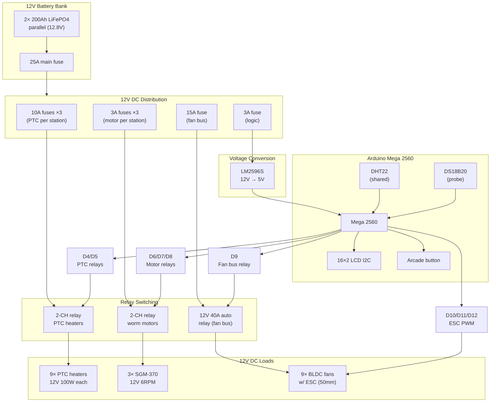

# Firmware Guide (Rev 7 — 12V DC + BLDC Fans)

> This is the Arduino sketch reference for the Umbrella Dryer V2 running on a **12V DC-only** system. BLDC fans are controlled via ESC PWM signals. PTC heaters and worm motors are relay-switched.

---

## 1. Overview

### 1a. What the sketch does

1. **Boot** → arms 3 ESCs (BLDC fan controllers) via PWM signals on D10/D11/D12.
2. **Idle** → reads DHT22 (humidity) + DS18B20 (temperature), displays on LCD. Button waits.
3. **Button press** → starts 4-phase drying cycle:
   - **Phase 1 — Preheat** (DHT22 < 45°C): PTC relays ON → heaters warm chamber, fans circulate air.
   - **Phase 2 — Dry** (DHT22 ≥ 45°C): Motor relays ON → umbrella spins. PTC + fans stay on. Timer runs (default 15 min).
   - **Phase 3 — Cool** (timer done): PTC OFF, motor OFF. Fans stay ON for 2 min cooling.
   - **Phase 4 — Done**: Everything OFF. Buzzer beeps. LCD shows "DONE". LED → GREEN.
4. **Safety at any point**: DS18B20 > 65°C → everything OFF (PTC relays + motor relays + ESCs).
5. **Button repress** at any point → emergency stop, back to idle.

### 1b. Key differences from Rev 6

| Feature | Rev 6 (old) | Rev 7 (new) |
|---|---|---|
| Heating | SSR-40DA switching 220V PTC | Relay switching 12V PTC (direct DC) |
| Fan control | None (passive convection) | 3× BLDC fans via ESC PWM (Servo library) |
| Power | 220V mains + inverter | Pure 12V DC battery |
| Motor control | Relay (same) | Relay (same) |
| Safety | RCD + thermal fuse | Thermal fuse + PTC self-regulation (no mains = no RCD needed) |

---

## 2. Pin map

| Pin | Net | Mode | Default | Notes |
|---|---|---|---|---|
| D2 | DHT22_DATA | input | — | 10kΩ pull-up to 5V; one shared sensor |
| D3 | DS18B20_DATA | input | — | 4.7kΩ pull-up to 5V; OneWire bus |
| D4 | RELAY_PTC_A | output | HIGH (OFF) | PTC heaters group A — active-LOW, 10kΩ pull-up to 5V |
| D5 | RELAY_PTC_B | output | HIGH (OFF) | PTC heaters group B — active-LOW, 10kΩ pull-up to 5V |
| D6 | RELAY_MOTOR_1 | output | HIGH (OFF) | Worm motor station 1 — active-LOW |
| D7 | RELAY_MOTOR_2 | output | HIGH (OFF) | Worm motor station 2 — active-LOW |
| D8 | RELAY_MOTOR_3 | output | HIGH (OFF) | Worm motor station 3 — active-LOW |
| D9 | RELAY_FAN_BUS | output | HIGH (OFF) | BLDC fan power bus — active-LOW (automotive relay) |
| D10 | ESC_1 | output (PWM) | 0 | ESC signal station 1 — Servo library, 50Hz |
| D11 | ESC_2 | output (PWM) | 0 | ESC signal station 2 — Servo library, 50Hz |
| D12 | ESC_3 | output (PWM) | 0 | ESC signal station 3 — Servo library, 50Hz |
| D13 | BTN_START | input | HIGH | Arcade button — internal pull-up, active-LOW |
| A4 | SDA | I2C | — | LCD data |
| A5 | SCL | I2C | — | LCD clock |

> All relay pins: boot-safe HIGH (OFF). PTC relays have 10kΩ pull-ups to 5V for extra boot safety. Active-LOW means `digitalWrite(pin, LOW)` = relay ON.

---

## 3. Timing and thresholds

| Parameter | Value | Notes |
|---|---|---|
| Loop delay | 500 ms | Sensor read interval |
| Preheat threshold | DHT22 < 45°C | Fans + PTC ON, motor OFF |
| Dry timer | 15 min (configurable) | Motor spins umbrella while fans + PTC run |
| Cool duration | 2 min | Fans ON only (PTC + motor OFF) |
| Thermal cutoff | DS18B20 > 65°C | Emergency: ALL OFF |
| Button debounce | 200 ms | Prevent re-trigger |
| ESC arm time | 2 s at 0 | On boot, write 0 to all ESCs for 2 seconds |
| Buzzer | 500 ms beep × 3 | On cycle complete |
| LCD refresh | Every loop (500 ms) | Phase, humidity, temperature, timer |

---

## 4. Complete Arduino sketch

```cpp
// ============================================================
// Umbrella Dryer V2 — Rev 7 (12V DC + BLDC Fans via ESC)
// Board: Arduino Mega 2560
// Dependencies: DHT, OneWire, DallasTemperature, Servo, LiquidCrystal_I2C
// ============================================================

#include <DHT.h>
#include <OneWire.h>
#include <DallasTemperature.h>
#include <Servo.h>
#include <LiquidCrystal_I2C.h>

// ---- Pin definitions ----
#define PIN_DHT22       2
#define PIN_DS18B20     3
#define PIN_RELAY_PTC_A 4    // PTC heaters group A
#define PIN_RELAY_PTC_B 5    // PTC heaters group B
#define PIN_RELAY_MOTOR_1 6  // Worm motor station 1
#define PIN_RELAY_MOTOR_2 7  // Worm motor station 2
#define PIN_RELAY_MOTOR_3 8  // Worm motor station 3
#define PIN_RELAY_FAN_BUS 9  // BLDC fan power bus (automotive relay)
#define PIN_ESC_1       10   // ESC PWM station 1
#define PIN_ESC_2       11   // ESC PWM station 2
#define PIN_ESC_3       12   // ESC PWM station 3
#define PIN_BTN_START   13   // Arcade button (active-LOW)

// ---- Sensor objects ----
DHT dht(PIN_DHT22, DHT22);
OneWire oneWire(PIN_DS18B20);
DallasTemperature ds18b20(&oneWire);
LiquidCrystal_I2C lcd(0x27, 16, 2);  // Try 0x3F if 0x27 doesn't work

// ---- ESC objects (Servo library generates 50Hz PWM) ----
Servo esc1;
Servo esc2;
Servo esc3;

// ---- Constants ----
const float PREHEAT_TEMP = 45.0;   // °C — start drying phase
const float CUTOFF_TEMP  = 65.0;   // °C — emergency shutdown
const unsigned long DRY_TIME_MS   = 15UL * 60 * 1000;  // 15 minutes
const unsigned long COOL_TIME_MS  = 2UL * 60 * 1000;   // 2 minutes
const unsigned long ESC_ARM_MS    = 2000;               // 2 seconds
const int ESC_OFF  = 0;    // Throttle position: stopped
const int ESC_FULL = 180;  // Throttle position: full speed

// ---- State machine ----
enum Phase { IDLE, PREHEAT, DRY, COOL, DONE };
Phase currentPhase = IDLE;

unsigned long phaseStart = 0;
unsigned long lastLoop  = 0;
float humidity    = 0;
float temperature = 0;

// ---- Relay helpers (active-LOW) ----
void relayOn(int pin)  { digitalWrite(pin, LOW);  }
void relayOff(int pin) { digitalWrite(pin, HIGH); }

// ---- All outputs OFF ----
void allOff() {
  relayOff(PIN_RELAY_PTC_A);
  relayOff(PIN_RELAY_PTC_B);
  relayOff(PIN_RELAY_MOTOR_1);
  relayOff(PIN_RELAY_MOTOR_2);
  relayOff(PIN_RELAY_MOTOR_3);
  relayOff(PIN_RELAY_FAN_BUS);
  esc1.write(ESC_OFF);
  esc2.write(ESC_OFF);
  esc3.write(ESC_OFF);
}

// ---- Arm ESCs (write 0 for 2 seconds on boot) ----
void armESCs() {
  esc1.attach(PIN_ESC_1);
  esc2.attach(PIN_ESC_2);
  esc3.attach(PIN_ESC_3);
  esc1.write(ESC_OFF);
  esc2.write(ESC_OFF);
  esc3.write(ESC_OFF);
  lcd.clear();
  lcd.setCursor(0, 0);
  lcd.print("Arming ESCs...");
  delay(ESC_ARM_MS);
  lcd.clear();
}

// ---- Start fans (enable fan bus relay + ESC throttle) ----
void fansOn() {
  relayOn(PIN_RELAY_FAN_BUS);
  delay(100);  // Let relay settle
  esc1.write(ESC_FULL);
  esc2.write(ESC_FULL);
  esc3.write(ESC_FULL);
}

// ---- Stop fans ----
void fansOff() {
  esc1.write(ESC_OFF);
  esc2.write(ESC_OFF);
  esc3.write(ESC_OFF);
  delay(100);
  relayOff(PIN_RELAY_FAN_BUS);
}

// ---- Read sensors ----
void readSensors() {
  humidity = dht.readHumidity();
  temperature = ds18b20.getTempCByIndex(0);
  ds18b20.requestTemperatures();  // Start next conversion
}

// ---- LCD update ----
void lcdUpdate(const char* phase, int timerMin, int timerSec) {
  lcd.setCursor(0, 0);
  lcd.print("H:");
  lcd.print((int)humidity);
  lcd.print("% T:");
  lcd.print((int)temperature);
  lcd.print("C  ");

  lcd.setCursor(0, 1);
  lcd.print(phase);
  lcd.print(" ");
  if (timerMin >= 0) {
    if (timerMin < 10) lcd.print("0");
    lcd.print(timerMin);
    lcd.print(":");
    if (timerSec < 10) lcd.print("0");
    lcd.print(timerSec);
  } else {
    lcd.print("      ");
  }
  lcd.print("  ");
}

// ---- Setup ----
void setup() {
  // Serial for debug
  Serial.begin(115200);
  Serial.println("Umbrella Dryer V2 — Rev 7 (12V DC + BLDC)");

  // Relay pins — default HIGH (OFF)
  pinMode(PIN_RELAY_PTC_A, OUTPUT);
  pinMode(PIN_RELAY_PTC_B, OUTPUT);
  pinMode(PIN_RELAY_MOTOR_1, OUTPUT);
  pinMode(PIN_RELAY_MOTOR_2, OUTPUT);
  pinMode(PIN_RELAY_MOTOR_3, OUTPUT);
  pinMode(PIN_RELAY_FAN_BUS, OUTPUT);
  allOff();

  // Button — internal pull-up
  pinMode(PIN_BTN_START, INPUT_PULLUP);

  // Sensors
  dht.begin();
  ds18b20.begin();
  ds18b20.requestTemperatures();

  // LCD
  lcd.init();
  lcd.backlight();
  lcd.clear();
  lcd.setCursor(0, 0);
  lcd.print("Umbrella Dryer");
  lcd.setCursor(0, 1);
  lcd.print("Rev 7 - 12V DC");
  delay(2000);

  // Arm ESCs
  armESCs();

  lcd.clear();
  lcd.setCursor(0, 0);
  lcd.print("READY");
  lcd.setCursor(0, 1);
  lcd.print("Press to start");
}

// ---- Main loop ----
void loop() {
  unsigned long now = millis();
  if (now - lastLoop < 500) return;  // 500ms loop interval
  lastLoop = now;

  // Read sensors every loop
  readSensors();

  // ---- Thermal safety check (all phases) ----
  if (temperature > CUTOFF_TEMP && currentPhase != IDLE && currentPhase != DONE) {
    Serial.print("THERMAL CUTOFF: ");
    Serial.println(temperature);
    allOff();
    currentPhase = DONE;
    lcd.clear();
    lcd.setCursor(0, 0);
    lcd.print("THERMAL CUTOFF!");
    lcd.setCursor(0, 1);
    lcd.print("T=");
    lcd.print(temperature);
    lcd.print("C > 65C");
    return;
  }

  // ---- Button: start or emergency stop ----
  bool btnPressed = (digitalRead(PIN_BTN_START) == LOW);

  switch (currentPhase) {

    // ========== IDLE ==========
    case IDLE:
      lcdUpdate("IDLE", -1, -1);
      if (btnPressed) {
        delay(200);  // Debounce
        Serial.println("CYCLE START");
        currentPhase = PREHEAT;
        phaseStart = now;
        // Turn on fans + PTC for preheat
        fansOn();
        relayOn(PIN_RELAY_PTC_A);
        relayOn(PIN_RELAY_PTC_B);
      }
      break;

    // ========== PREHEAT ==========
    case PREHEAT:
      {
        int elapsed = (int)((now - phaseStart) / 1000);
        lcdUpdate("PREHEAT", elapsed / 60, elapsed % 60);
        if (temperature >= PREHEAT_TEMP) {
          Serial.println("PREHEAT -> DRY (temp reached)");
          currentPhase = DRY;
          phaseStart = now;
          // Turn on all motors
          relayOn(PIN_RELAY_MOTOR_1);
          relayOn(PIN_RELAY_MOTOR_2);
          relayOn(PIN_RELAY_MOTOR_3);
        }
        if (btnPressed) {
          delay(200);
          allOff();
          currentPhase = IDLE;
          Serial.println("ABORT from PREHEAT");
        }
      }
      break;

    // ========== DRY ==========
    case DRY:
      {
        unsigned long elapsed = now - phaseStart;
        unsigned long remaining = 0;
        if (elapsed < DRY_TIME_MS) {
          remaining = (DRY_TIME_MS - elapsed) / 1000;
        }
        int rMin = (int)(remaining / 60);
        int rSec = (int)(remaining % 60);
        lcdUpdate("DRY", rMin, rSec);

        if (elapsed >= DRY_TIME_MS) {
          Serial.println("DRY -> COOL (timer done)");
          currentPhase = COOL;
          phaseStart = now;
          // PTC off, motor off — fans stay on
          relayOff(PIN_RELAY_PTC_A);
          relayOff(PIN_RELAY_PTC_B);
          relayOff(PIN_RELAY_MOTOR_1);
          relayOff(PIN_RELAY_MOTOR_2);
          relayOff(PIN_RELAY_MOTOR_3);
        }
        if (btnPressed) {
          delay(200);
          allOff();
          currentPhase = IDLE;
          Serial.println("ABORT from DRY");
        }
      }
      break;

    // ========== COOL ==========
    case COOL:
      {
        unsigned long elapsed = now - phaseStart;
        unsigned long remaining = 0;
        if (elapsed < COOL_TIME_MS) {
          remaining = (COOL_TIME_MS - elapsed) / 1000;
        }
        int rMin = (int)(remaining / 60);
        int rSec = (int)(remaining % 60);
        lcdUpdate("COOL", rMin, rSec);

        if (elapsed >= COOL_TIME_MS) {
          Serial.println("COOL -> DONE");
          currentPhase = DONE;
          fansOff();
          // Buzzer
          for (int i = 0; i < 3; i++) {
            lcd.setCursor(0, 1);
            lcd.print("** CYCLE DONE **");
            delay(500);
            lcd.setCursor(0, 1);
            lcd.print("                ");
            delay(500);
          }
        }
        if (btnPressed) {
          delay(200);
          allOff();
          currentPhase = IDLE;
          Serial.println("ABORT from COOL");
        }
      }
      break;

    // ========== DONE ==========
    case DONE:
      lcdUpdate("DONE", -1, -1);
      lcd.setCursor(0, 1);
      lcd.print("Press to reset   ");
      if (btnPressed) {
        delay(200);
        allOff();
        currentPhase = IDLE;
        Serial.println("Reset to IDLE");
      }
      break;
  }
}
```

---

## 5. Wiring table (all connections)

| From | To | Cable | Notes |
|---|---|---|---|
| LM2596S OUT+ | Mega Vin (or 5V pin) | 20 AWG red | Set to 5.0V before connecting |
| LM2596S OUT− | Mega GND | 20 AWG black | Common ground |
| LM2596S IN+ | 12V bus (after main fuse) | 18 AWG red | Input from battery |
| LM2596S IN− | 12V bus GND | 18 AWG black | Common ground |
| DHT22 VCC | 5V rail | 20 AWG red | — |
| DHT22 GND | GND rail | 20 AWG black | — |
| DHT22 DATA | D2 | jumper | 10kΩ pull-up to 5V |
| DS18B20 VCC | 5V rail | 20 AWG red | Red wire |
| DS18B20 GND | GND rail | 20 AWG black | Black wire |
| DS18B20 DATA | D3 | jumper | 4.7kΩ pull-up to 5V |
| Relay module VCC | 5V rail | 20 AWG red | Optocoupler side |
| Relay module GND | GND rail | 20 AWG black | Optocoupler side |
| Relay 1A IN | D4 | jumper | PTC group A |
| Relay 1B IN | D5 | jumper | PTC group B |
| Relay 2A IN | D6 | jumper | Motor station 1 |
| Relay 2B IN | D7 | jumper | Motor station 2 |
| Automotive relay coil+ | D9 (via NPN transistor) | jumper | Fan bus relay |
| Automotive relay coil− | GND | jumper | — |
| ESC 1 signal | D10 | jumper (orange/white) | Station 1 fans |
| ESC 2 signal | D11 | jumper (orange/white) | Station 2 fans |
| ESC 3 signal | D12 | jumper (orange/white) | Station 3 fans |
| ESC VCC (red) | 12V bus (via fan relay) | 18 AWG red | Switched by automotive relay |
| ESC GND (black) | 12V bus GND | 18 AWG black | Common ground |
| Button pin 1 | D13 | jumper | — |
| Button pin 2 | GND | jumper | Internal pull-up; active-LOW |
| LCD SDA | A4 | jumper | I2C |
| LCD SCL | A5 | jumper | I2C |
| LCD VCC | 5V rail | 20 AWG red | — |
| LCD GND | GND rail | 20 AWG black | — |
| LED (R) | D14 via 220Ω | 22 AWG | Red = heating/active |
| LED (Y) | D15 via 220Ω | 22 AWG | Yellow = drying/spinning |
| LED (G) | D16 via 220Ω | 22 AWG | Green = done |
| Buzzer + | D17 | 22 AWG | Active buzzer |
| Buzzer − | GND | 22 AWG | — |

> All GND points are common. Connect battery negative, Mega GND, buck GND, relay GND, and ESC GND together.

---

## 6. Library dependencies

Install via Arduino IDE Library Manager:

| Library | Author | Install name |
|---|---|---|
| DHT sensor library | Adafruit | `DHT sensor library` |
| OneWire | Paul Stoffregen | `OneWire` |
| DallasTemperature | Miles Burton | `DallasTemperature` |
| Servo | Arduino built-in | (included with IDE) |
| LiquidCrystal I2C | Frank de Brabander | `LiquidCrystal I2C` |

Also install Adafruit Unified Sensor (dependency of DHT library).

---

## 7. Wiring diagram (Mermaid)



---

## 8. Debugging tips

| Symptom | Check |
|---|---|
| ESC doesn't arm | Verify D10/D11/D12 wired correctly; check Servo library attached(); ensure fan bus relay ON before ESC write |
| Fans spin then stop | ESC lost signal — check jumper continuity; ensure `esc.write()` called in loop |
| No humidity reading | Verify DHT22 VCC→5V, GND→GND, DATA→D2 with 10kΩ pull-up; check `DHT22 Black` module (not bare probe) |
| No temperature reading | Check DS18B20 red→5V, black→GND, white→D3 with 4.7kΩ pull-up; run OneWire scanner |
| LCD blank / garbage | I2C address may be 0x3F not 0x27; try `lcd.init()` vs `lcd.begin()`; check SDA→A4, SCL→A5 |
| Relay clicks but load doesn't turn on | Check high-voltage wiring on relay COM/NO terminals; verify 12V bus connected to relay COM |
| Button not responding | Verify D13 → button pin 1, button pin 2 → GND; `INPUT_PULLUP` enabled; `digitalRead == LOW` = pressed |
| Thermal cutoff triggers immediately | DS18B20 may be reading ambient (normal 25–30°C) — verify probe is mounted in chamber near heaters |
| Buck output not 5V | Adjust potentiometer with multimeter BEFORE connecting to Mega; must be 5.0V ± 0.1V |
| Motors spin wrong direction | Swap any two motor leads (DC motor polarity determines direction) |

---

## 9. ESC calibration (first-time setup)

If BLDC fans don't respond to throttle commands:

1. **Power on** with ESC signal wire disconnected from Mega.
2. **Connect ESC signal** to a known PWM source (or Mega running calibration sketch).
3. **Send MAX throttle** (write 180) for 3 seconds — ESC beeps to confirm max.
4. **Send MIN throttle** (write 0) for 3 seconds — ESC beeps to confirm min.
5. ESC is now calibrated. Power cycle and test.

Some ESCs auto-calibrate on first power-up if they detect a valid signal range.

---

## 10. Safety notes

- The system runs on **12V DC only** — no mains voltage anywhere.
- Battery BMS protects against over-discharge, over-charge, and short circuit.
- DS18B20 thermal cutoff at 65°C is the primary software safety.
- Appliance thermal fuse (80°C) on each PTC cluster is the hardware backup.
- PTC heaters are self-regulating — they auto-limit current as temperature rises.
- Per-station fuses prevent one station's fault from affecting others.
- All relay pins boot HIGH (OFF) — no accidental heater activation on power-up.
- 10kΩ pull-ups on PTC relay pins provide extra boot-safety for heater lines.
