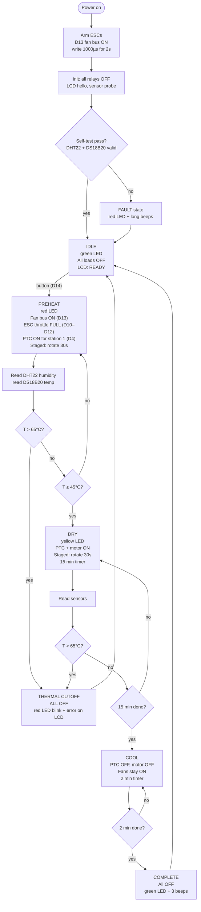
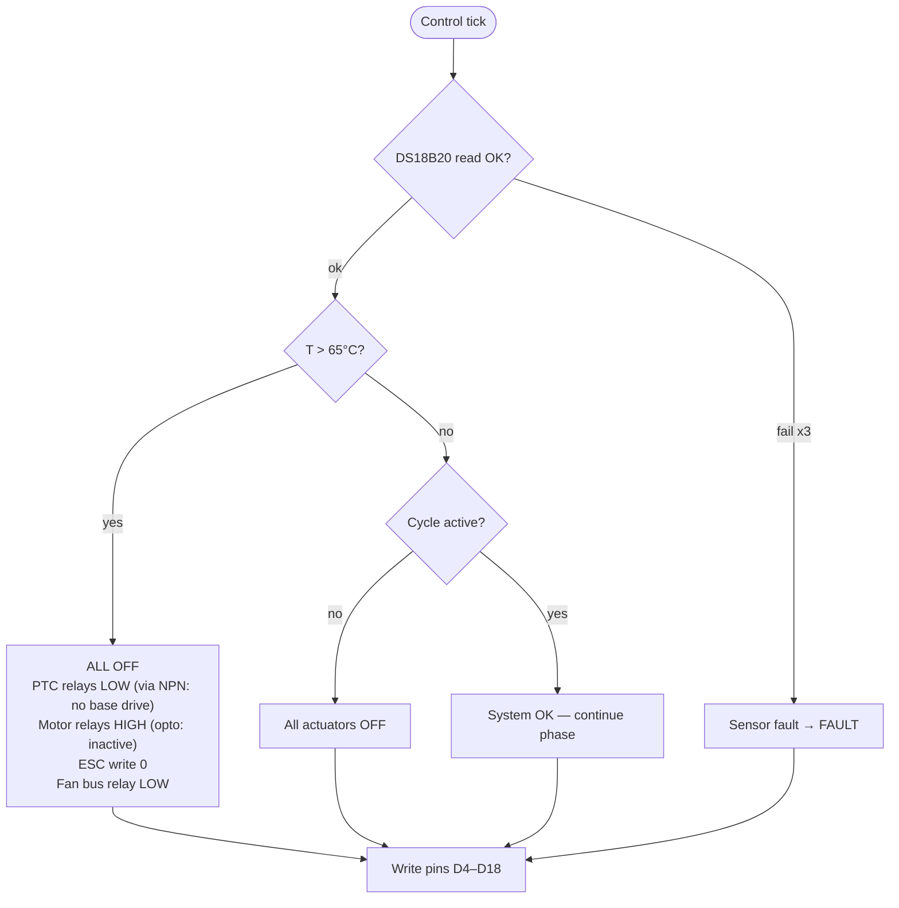
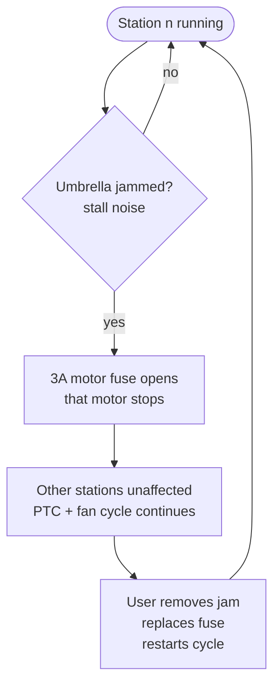
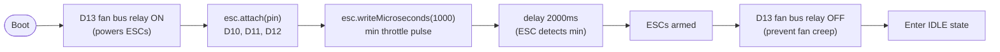

# Flowcharts — Control Loop & Safety Interlocks — 12V DC

> Firmware behavior reference. Pin assignments per `wiring/README.md` (canonical); state machine per `docs/FIRMWARE-GUIDE.md`.

---

## 1. Main control loop

---

## 2. Safety interlock (inner loop, runs every 500ms)

> **Defense in depth:** DS18B20 firmware cutoff (65°C) → PTC self-regulation → 130°C thermal fuse (per heater, 9×) → 30A branch fuses → BMS. Five independent layers.

---

## 3. Per-station fault handling

> **Design note:** stations are fuse-isolated, not sensor-monitored (no current-sense path). A blown 3A fuse is detected at UI as "station commanded ON but motion absent" — see `docs/TROUBLESHOOTING.md`.

---

## 4. ESC arming sequence

---

## 5. State summary

| State | PTC Relays | Motor Relays | Fan Bus + ESCs | LED | Buzzer |
|---|---|---|---|---|---|
| IDLE | OFF | OFF | OFF | Green | — |
| PREHEAT | Staged (1 at a time) | OFF | ON (full speed) | Red | — |
| DRY | Staged (1 at a time) | Staged (1 at a time) | ON (full speed) | Yellow | — |
| COOL | OFF | OFF | ON (full speed) | Yellow | — |
| COMPLETE | OFF | OFF | OFF | Green | 3 beeps |
| THERMAL CUTOFF | OFF | OFF | OFF | Red (blink) | 1 chirp (on failed reset) |
| FAULT | OFF | OFF | OFF | Red | long beeps |
