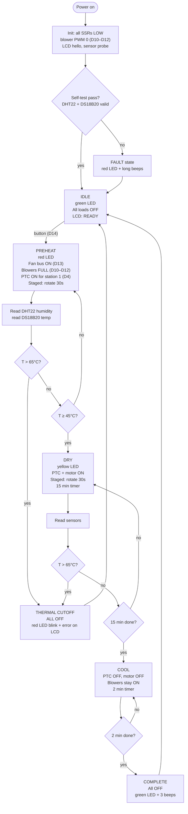
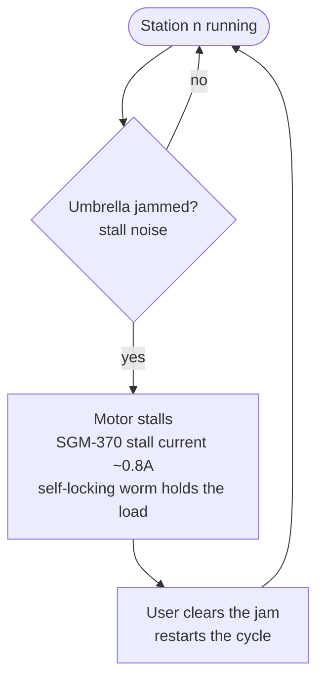
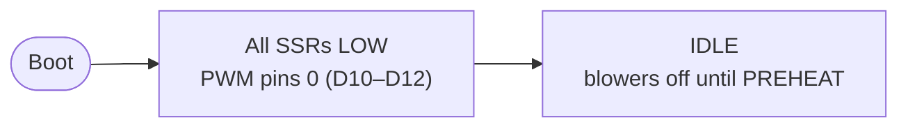

# Flowcharts — Control Loop & Safety Interlocks — 12V DC

> Firmware behavior reference. Pin assignments per `wiring/README.md`; state machine per `docs/FIRMWARE-GUIDE.md`.

---

## 1. Main control loop

---

## 2. Safety interlock (inner loop, runs every 500ms)

> **Defense in depth:** DS18B20 firmware cutoff (65°C) → PTC self-regulation → BMS 200A. Three independent layers.

---

## 3. Per-station fault handling

> **Design note:** stations are not sensor-monitored (no current-sense path). A stalled motor is detected by ear — hum without rotation — see `docs/TROUBLESHOOTING.md`.

---

## 4. Fan control on boot

No ESC arming needed — blowers take duty-cycle PWM directly from Mega pins.

---

## 5. State summary

| State | PTC SSRs | Motor SSRs | Fan Bus + Blower PWM | LED | Buzzer |
|---|---|---|---|---|---|
| IDLE | OFF | OFF | OFF | Green | — |
| PREHEAT | Staged (1 at a time) | OFF | ON (full speed) | Red | — |
| DRY | Staged (1 at a time) | Staged (1 at a time) | ON (full speed) | Yellow | — |
| COOL | OFF | OFF | ON (full speed) | Yellow | — |
| COMPLETE | OFF | OFF | OFF | Green | 3 beeps |
| THERMAL CUTOFF | OFF | OFF | OFF | Red (blink) | 1 chirp (on failed reset) |
| FAULT | OFF | OFF | OFF | Red | long beeps |
