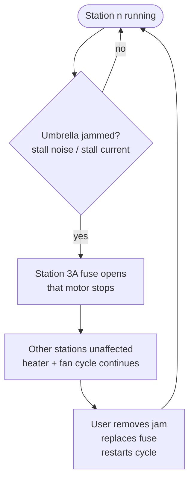
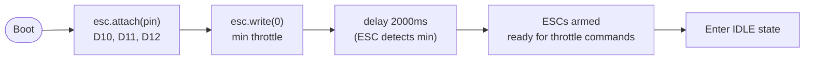

# Flowcharts — Control Loop & Safety Interlocks — 12V DC

> Firmware behavior reference. Pin assignments per `docs/BOM.md` §11; control constants per `docs/FIRMWARE-GUIDE.md`.

---

## 1. Main control loop

```mermaid
flowchart TD
    PWR([Power on]) --> ARM[Arm ESCs<br/>write 0 for 2s]
    ARM --> INIT[Init: relay OFF<br/>LCD hello, sensor probe]
    INIT --> SELF{Self-test pass?<br/>DHT22 + DS18B20 valid}
    SELF -- no --> FAULT[FAULT state<br/>red LED + long beeps]
    SELF -- yes --> IDLE[IDLE<br/>green LED<br/>PTC relays OFF<br/>motor relays OFF<br/>fans OFF<br/>LCD: READY]

    IDLE -- "button (D13)" --> PREHEAT[PREHEAT<br/>yellow LED<br/>fan bus ON (D9)<br/>ESC throttle FULL (D10-D12)<br/>PTC relays ON (D4/D5)<br/>motor relays OFF]

    PREHEAT --> READ[Read DHT22 humidity<br/>read DS18B20 temp]
    READ --> TOVER{T > 65°C?}
    TOVER -- yes --> CUTOFF[THERMAL CUTOFF<br/>ALL OFF (relays + ESCs)<br/>red LED + error on LCD]
    TOVER -- no --> TEMP_OK{T ≥ 45°C?}
    TEMP_OK -- no --> PREHEAT
    TEMP_OK -- yes --> DRY[DRY<br/>yellow LED<br/>PTC ON, fans ON<br/>motor relays ON (D6/D8)<br/>15 min timer]

    DRY --> READ2[Read sensors]
    READ2 --> TOVER2{T > 65°C?}
    TOVER2 -- yes --> CUTOFF
    TOVER2 -- no --> TIMER{15 min done?}
    TIMER -- no --> DRY
    TIMER -- yes --> COOL[COOL<br/>PTC relays OFF<br/>motor relays OFF<br/>fans stay ON<br/>2 min timer]

    COOL --> COOL_TIMER{2 min done?}
    COOL_TIMER -- no --> COOL
    COOL_TIMER -- yes --> DONE[COMPLETE<br/>ALL OFF<br/>fans OFF (ESC write 0 + relay OFF)<br/>green LED + 3 beeps]
    DONE --> IDLE

    FAULT --> IDLE
    CUTOFF --> IDLE
```

---

## 2. Safety interlock (inner loop, runs every 500ms)

```mermaid
flowchart TD
    TICK([Control tick]) --> T1{DS18B20 read OK?}
    T1 -- "fail x3" --> SERR[Sensor fault → FAULT]
    T1 -- ok --> T2{T > 65°C?}
    T2 -- yes --> OFF1[ALL OFF<br/>PTC relays HIGH (OFF)<br/>motor relays HIGH (OFF)<br/>ESC write 0<br/>fan relay HIGH (OFF)]
    T2 -- no --> T3{Cycle active?}
    T3 -- no --> OFF2[All actuators OFF]
    T3 -- yes --> OK[System OK — continue phase]

    OFF1 --> RELAY[Write pins D4-D12]
    OFF2 --> RELAY
    OK --> RELAY
    SERR --> RELAY
```

> **Defense in depth:** DS18B20 firmware cutoff (65°C) → PTC self-regulation → thermal fuse (80°C) → per-station fuses. Four independent layers.

---

## 3. Per-station fault handling



> **Design note:** stations are fuse-isolated, not sensor-monitored (no current-sense path). A blown 3A fuse is detected at UI as "station commanded ON but motion absent" — see `docs/TROUBLESHOOTING.md` §6.

---

## 4. ESC arming sequence



---

## 5. State summary

| State | PTC Relays | Motor Relays | Fan Bus + ESCs | LED | Buzzer |
|---|---|---|---|---|---|
| IDLE | OFF | OFF | OFF | Green | — |
| PREHEAT | ON | OFF | ON (full speed) | Yellow | — |
| DRY | ON | ON | ON (full speed) | Yellow | — |
| COOL | OFF | OFF | ON (full speed) | Yellow | — |
| COMPLETE | OFF | OFF | OFF | Green | 3 beeps |
| THERMAL CUTOFF | OFF | OFF | OFF | Red (blink) | 1 chirp |
| FAULT | OFF | OFF | OFF | Red | long beeps |
