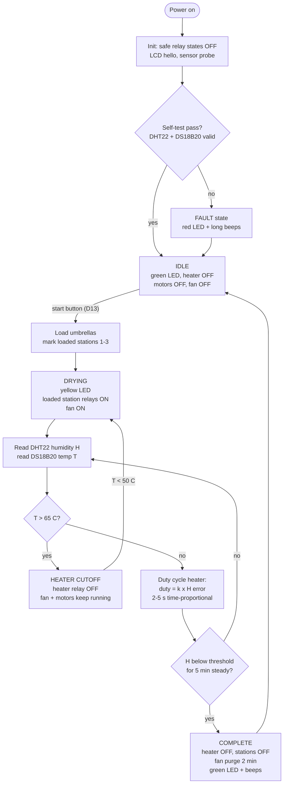
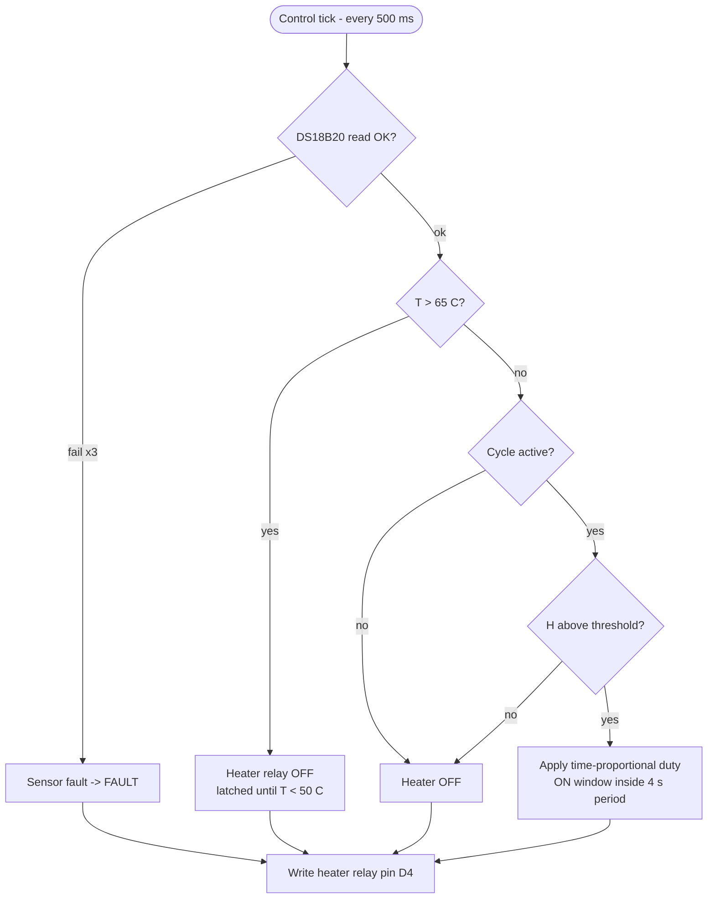
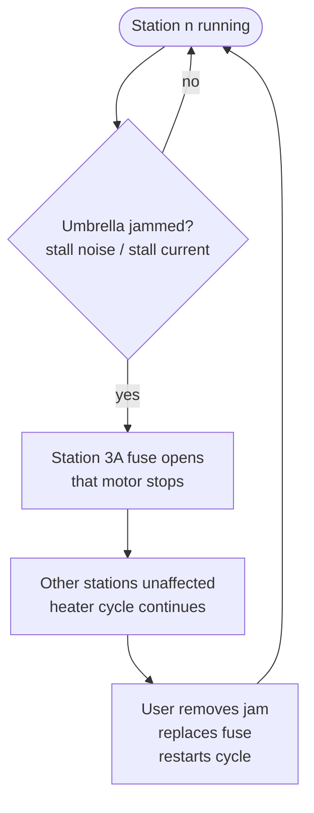

# Flowcharts — Control Loop & Safety Interlocks (Rev 4)

Firmware behavior reference. Pin assignments per `docs/BOM.md` §15; control constants per `docs/FIRMWARE-GUIDE.md`.

## 1. Main control loop

## 2. Heater safety interlock (inner loop, runs every cycle)

## 3. Per-station fault handling

> **Design note:** stations are fuse-isolated, not sensor-monitored (no current-sense path in Rev 4). A blown 3A fuse is detected at the UI as "station commanded ON but motion absent" — see `docs/TROUBLESHOOTING.md` §Motors.

## 4. State summary

| State | Heater | Stations | Fan / blower | LED | Buzzer |
|---|---|---|---|---|---|
| IDLE | OFF | OFF | OFF | Green | — |
| DRYING | duty-cycled | loaded ON | ON (heater branch) | Yellow | — |
| HEATER CUTOFF | OFF (latched) | ON | ON (purges heat) | Yellow (blink) | 1 chirp on entry |
| COMPLETE | OFF | OFF | 2-min purge (blower/heater branch) | Green | 3 beeps |
| FAULT | OFF | OFF | OFF | Red | long beeps until acknowledged |
