# Hardware Reference — 12V DC System

> **Major revision:** This version replaces the 220V mains + inverter architecture with an
> all-12V DC system. No mains voltage, no inverter, no RCD, no changeover switch, no SSR-40DA.
> All heating, fans, and motors run directly off the 12V LiFePO4 battery bank.

Spec sheets for what was actually bought (sources & prices: `docs/BOM.md` §14). Use this during
assembly and testing when you need a part's ratings, dimensions, or limits — not the store listing.

## 1. System block diagram

```mermaid
graph TB
    subgraph Power["12V DC Power System"]
        BAT["2× LiFePO4 200Ah<br/>(parallel → 400Ah, 12.8V nominal)"]
        FUSE_MAIN["25A main fuse"]
        FUSE_CTRL["3A logic fuse"]
        FUSE_FAN["15A fan bus fuse"]
        FUSE_HEAT["20A heater fuse ×2"]
    end

    subgraph Control["Control Layer"]
        MEGA["Arduino Mega 2560"]
        DHT["DHT22<br/>(mid-chamber)"]
        DS["DS18B20<br/>(heater airstream)"]
        LCD["LCD 16×2 I2C"]
        BTN["Button D13"]
        BUZ["Buzzer"]
        LED["Status LEDs"]
    end

    subgraph Station1["Station 1"]
        RELAY_M1["Relay ch — Motor 1"]
        MTR1["SGM-370 Motor"]
        RELAY_H1A["Relay ch — PTC×3<br/>(Station 1)"]
        PTC1A["PTC Heater 1"]
        PTC1B["PTC Heater 2"]
        PTC1C["PTC Heater 3"]
        ESC1["ESC #1<br/>(D10 PWM)"]
        FAN1A["BLDC Fan 1"]
        FAN1B["BLDC Fan 2"]
        FAN1C["BLDC Fan 3"]
    end

    subgraph Station2["Station 2"]
        RELAY_M2["Relay ch — Motor 2"]
        MTR2["SGM-370 Motor"]
        RELAY_H1B["Relay ch — PTC×3<br/>(Station 2)"]
        PTC2A["PTC Heater 4"]
        PTC2B["PTC Heater 5"]
        PTC2C["PTC Heater 6"]
        ESC2["ESC #2<br/>(D11 PWM)"]
        FAN2A["BLDC Fan 4"]
        FAN2B["BLDC Fan 5"]
        FAN2C["BLDC Fan 6"]
    end

    subgraph Station3["Station 3"]
        RELAY_M3["Relay ch — Motor 3"]
        MTR3["SGM-370 Motor"]
        RELAY_H2["Relay ch — PTC×3<br/>(Station 3)"]
        PTC3A["PTC Heater 7"]
        PTC3B["PTC Heater 8"]
        PTC3C["PTC Heater 9"]
        ESC3["ESC #3<br/>(D12 PWM)"]
        FAN3A["BLDC Fan 7"]
        FAN3B["BLDC Fan 8"]
        FAN3C["BLDC Fan 9"]
    end

    subgraph FanBus["BLDC Fan Power Bus"]
        FAN_RELAY["40A automotive relay<br/>(D9 gate)"]
    end

    BAT --> FUSE_MAIN
    FUSE_MAIN --> FUSE_CTRL
    FUSE_MAIN --> FUSE_FAN
    FUSE_MAIN --> FUSE_HEAT

    FUSE_CTRL --> MEGA
    MEGA --> DHT & DS & LCD & BTN & BUZ & LED

    FUSE_HEAT --> RELAY_H1A & RELAY_H1B & RELAY_H2
    RELAY_H1A --> PTC1A & PTC1B & PTC1C
    RELAY_H1B --> PTC2A & PTC2B & PTC2C
    RELAY_H2 --> PTC3A & PTC3B & PTC3C

    FUSE_MAIN --> RELAY_M1 & RELAY_M2 & RELAY_M3
    RELAY_M1 --> MTR1
    RELAY_M2 --> MTR2
    RELAY_M3 --> MTR3

    FUSE_FAN --> FAN_RELAY
    FAN_RELAY --> ESC1 & ESC2 & ESC3
    ESC1 --> FAN1A & FAN1B & FAN1C
    ESC2 --> FAN2A & FAN2B & FAN2C
    ESC3 --> FAN3A & FAN3B & FAN3C

    MEGA -->|"D10 PWM"| ESC1
    MEGA -->|"D11 PWM"| ESC2
    MEGA -->|"D12 PWM"| ESC3
```

## 2. Module spec sheets

### Controller — Arduino Mega 2560 R3

| Spec | Value | Design implication |
|---|---|---|
| MCU | ATmega2560, AVR 8-bit @ 16 MHz | Bare-metal firmware, no OS (`docs/STACKS.md`) |
| Digital I/O | 54 (15 PWM) | 13 used — headroom remains |
| Flash / SRAM / EEPROM | 256 KB / 8 KB / 4 KB | Watch SRAM with many string literals — use `F()` macro |
| Logic level | 5V | Relay board inputs 5V-trigger; ESC PWM logic 5V compatible |
| Power input | **5V pin from buck** | Never 12V on the barrel jack |
| Serial | USB + Serial0 (pins 0/1), 115200 debug | Keep 0/1 free while debugging |

### BLDC ducted fan modules — 9× 50 mm (3 per station)

| Spec | Value | Note |
|---|---|---|
| Type | 50 mm ducted fan with integrated ESC | One wire harness: red = 12V, black = GND, white/yellow = PWM |
| Rated voltage | 12V DC | Direct from the 12V fan power bus |
| Current draw | ~3.2A each @ full speed | ~0.6A idle/low-speed |
| PWM control | 1000–2000 µs pulse, 50 Hz | Arduino `Servo.writeMicroseconds()` via `Servo.h` |
| Speed range | 1000 µs = stop → 2000 µs = full RPM | Use 1100–1900 µs for safe operating window |
| Role | Forced convection — pushes heated air across the wet canopy | 3 fans per station for even airflow coverage |
| Mounting | Ducted into chamber wall or bracket, aimed at canopy underside | Keep wiring ≥ 5 cm from heater body |

> **ESC arming:** Most BLDC ESCs require a 1000 µs pulse on power-up to arm. Write
> `esc.writeMicroseconds(1000)` in `setup()` with a 2 s delay before allowing speed changes.

### PTC ceramic heaters — 9× 12V 100W (3 per station)

| Spec | Value | Note |
|---|---|---|
| Rated | 12V, 100W each (~8.3A) | Self-regulating — resistance rises with temperature |
| Self-regulation | PTC effect: power drops as surface temp rises | No thermostat needed for basic overheat protection |
| Mounting | Station bracket, aimed at canopy underside | ≥ 5 cm clearance to wiring, sensors, and plastic parts |
| Role | Provides 40–60 °C warm airflow for drying | 3 heaters per station = 300W per station |
| Protection | Built-in PTC self-limiting + external thermal fuse (115 °C) | Thermal fuse is the hard cutoff; PTC soft-limits naturally |

### Motors — 3× SGM-370 worm gear (one per station)

| Parameter | Value |
|---|---|
| Rated | 12 V, 6 RPM, **14 kg·cm**, ~0.2 A @ rated load |
| No-load | 6 RPM, ~80 mA |
| Stall | 28 kg·cm, ~0.8 A |
| Shaft | 6 mm Ø × 15 mm, single shaft |
| Body | ~95 × 32 × 28 mm, ~156 g |
| Behavior | **Self-locking** (worm not back-drivable); stall-tolerant |

### Mechanical drivetrain (per station ×3)

| Part | Spec |
|---|---|
| Shaft | 304 SS, 6 mm Ø × 300 mm, ground finish |
| Bearings | 2× KP08 pillow block, 6 mm bore insert, ~120 kgf dynamic — mount ≤ 40 mm from each shaft end |
| Coupling | 6×8 mm rigid clamp sleeve — grub screws on motor flat + shaft, thread-check after first run |
| Umbrella holder | Fabricated, one per station; canopy tip clearance ≥ 5 cm between stations and chamber walls |

### Battery bank + power distribution

| Spec | Value | Note |
|---|---|---|
| Battery | 2× LiFePO4 200Ah in parallel | 12.8V nominal, 400Ah total, 5,120 Wh |
| BMS | Built-in per pack (200A each) | Over-charge, over-discharge, over-current, short-circuit protection |
| Main fuse | 25A blade fuse | Primary circuit protection on the +12V bus |
| Heater fuses | 20A blade fuse ×2 | One per heater group (stations 1+2 and station 3) |
| Fan bus fuse | 15A blade fuse | Protects the BLDC fan ESC power bus |
| Logic fuse | 3A blade fuse | Feeds the 5V buck → Arduino and sensors |
| Wire gauge | 16 AWG battery main · 14 AWG heater branches · 18 AWG fan bus · 22 AWG logic | All stranded copper |

### Relay modules (optocoupler, low-level trigger) — 12V DC switching

| Spec | Value |
|---|---|
| Configuration | 2× 4-channel modules (8 channels total, 5 used) |
| Contact rating | 10A @ 30VDC per channel |
| Trigger | Optocoupler LED, active-LOW + 10 kΩ input pull-ups |
| Coil power | 5V, ~70 mA — from buck 5V rail, **not** Mega pins |
| Protection | Built-in flyback diode |
| Duty | PTC heaters (~8.3A each, 3 per group) + motors (~0.8A stall) |
| Channels used | CH1: PTC group A (stations 1+2, 6 heaters) · CH2: PTC group B (station 3, 3 heaters) · CH3: Motor 1 · CH4: Motor 2 · CH5: Motor 3 |
| Limits | DC only, 30VDC max contacts; minimum 2 s on/off period for thermal margin |

### BLDC fan power bus relay

| Spec | Value |
|---|---|
| Type | 40A automotive relay (Bosch-style, 5-pin) |
| Coil | 12V, ~150 mA — driven by Mega pin D9 via NPN transistor (2N2222) |
| Contact | 40A @ 14VDC — switches 12V to all 3 ESCs per station |
| Flyback | External 1N4007 diode across coil |
| Mounting | On power distribution board, close to battery bus |

> D9 cannot source enough current to drive a 12V relay coil directly. Use a 2N2222 NPN
> transistor: D9 → 1 kΩ resistor → base; collector to relay coil −; coil + to +12V;
> emitter to GND. Flyback diode across coil (cathode to +12V).

### Sensing & UI

| Part | Key specs |
|---|---|
| DHT22 | ±0.5 °C, ±2–5 %RH; **≥ 2 s between reads**; mount mid-chamber, away from air jets and drain |
| DS18B20 waterproof | ±0.5 °C, 1-Wire, 4.7 kΩ pull-up; probe in the heater air stream |
| LCD 16×2 I2C | 0x27 or 0x3F (scan), 5V |
| LEDs / buzzer / button | 220 Ω series on LEDs; active buzzer; button D13 INPUT_PULLUP |

## 3. Pin map

| Arduino Pin | Function | Direction | Notes |
|---|---|---|---|
| D0 / D1 | Serial TX/RX | Debug | Keep free during development |
| **D2** | **DHT22 data** | Input | 10 kΩ pull-up to 5V |
| **D3** | **DS18B20 data** | Input | 4.7 kΩ pull-up to 5V (1-Wire) |
| **D4** | **PTC relay group A** | Output (LOW) | Controls stations 1+2 heaters (6 PTCs) |
| **D5** | **PTC relay group B** | Output (LOW) | Controls station 3 heaters (3 PTCs) |
| **D6** | **Motor relay — Station 1** | Output (LOW) | SGM-370 worm gear motor 1 |
| **D7** | **Motor relay — Station 2** | Output (LOW) | SGM-370 worm gear motor 2 |
| **D8** | **Motor relay — Station 3** | Output (LOW) | SGM-370 worm gear motor 3 |
| **D9** | **Fan bus relay** | Output (HIGH) | Via 2N2222 transistor → 40A relay coil |
| **D10** | **ESC PWM — Station 1** | Output (PWM) | `Servo` library, 50 Hz, 1000–2000 µs |
| **D11** | **ESC PWM — Station 2** | Output (PWM) | `Servo` library, 50 Hz, 1000–2000 µs |
| **D12** | **ESC PWM — Station 3** | Output (PWM) | `Servo` library, 50 Hz, 1000–2000 µs |
| **D13** | **Button** | Input (PULLUP) | Active LOW — press = GND |
| A0 | LCD I2C SDA | I2C | 4.7 kΩ pull-up |
| A1 | LCD I2C SCL | I2C | 4.7 kΩ pull-up |

> Relay modules are **active-LOW**: writing `LOW` turns the relay ON (energizes the load).
> The fan bus relay is **active-HIGH** (transistor-driven): writing `HIGH` turns the relay ON.

## 4. Power budget

| Load | Per unit | Qty | Total | Fuse |
|---|---|---|---|---|
| PTC heater (12V 100W) | 8.3A | 9 | 74.7A (all on) | 20A ×2 (grouped) |
| BLDC fan + ESC (50 mm) | 3.2A | 9 | 28.8A (all on) | 15A fan bus |
| SGM-370 motor | 0.2A | 3 | 0.6A | shared main |
| Arduino Mega + sensors | 0.1A | 1 | 0.1A | 3A logic |
| **Worst-case total** | | | **~104A** | **25A main** |

> The 25A main fuse is the primary battery-side protection. Branch fuses (20A ×2 for
> heaters, 15A for fans, 3A for logic) provide downstream protection. At worst-case all-on
> draw (~104A), the main fuse will blow — this is intentional. The firmware limits operation
> to **one station at a time** in normal mode, drawing ≈ 25–35A per station (3 PTC heaters
> + 3 BLDC fans + 1 motor). Simultaneous multi-station is **boost mode only** with
> firmware-enforced reduced heater duty.

**Runtime estimates (400 Ah bank):**

| Mode | Draw | Estimated runtime |
|---|---|---|
| Single station full | ~25A | ~16 hours |
| Two stations | ~50A | ~8 hours |
| Three stations (boost) | ~75A (reduced duty) | ~5.3 hours |
| Standby (sensors + idle) | ~0.5A | ~800 hours |

## 5. Station layout

| Parameter | Decision |
|---|---|
| Canopy state when drying | **Half-open** — projected Ø ≈ 650 mm. A fully-open commuter canopy spans 950–1000 mm, and three in a row would need a ~3.2 m chamber; half-open exposes the full wet surface with airflow across it and keeps the box realistic |
| Chamber internal W × D × H | **2200 × 800 × 1300 mm** (walls +20 mm → cut panels 2240 × 840 × 1340) |
| Station layout | Single row of 3 stations on the long axis, pitch **700 mm** |
| Clearance check | Canopy edge at 700 + 325 = 1025 mm from center vs wall at 1100 mm → 75 mm each side; between adjacent canopies 700 − 650 = 50 mm — both pass the ≥50 mm rule |
| Hanging length | Umbrella hangs from the holder; PTC heaters and BLDC fans blow across the canopy underside |
| Services | **9× PTC ceramic heaters: 3 per station on brackets, aimed at canopy underside** · **9× BLDC ducted fans: 3 per station for forced convection** · **12V power bus runs along chamber ceiling** · DHT22 mid-chamber · DS18B20 probe in heater air stream |

## 6. Electrical build standards

| Item | Standard |
|---|---|
| Wire gauge | 16 AWG battery main + heater branches · 14 AWG battery-to-fuse bus · 18 AWG fan bus · 22 AWG logic |
| Fuse hierarchy | 25A main → 20A ×2 heater · 15A fan bus · 3A logic |
| Grounding | Single-point: all returns → battery − rail; chassis bonded to − at one bolt |
| Connector types | XT60 for battery-to-bus · Anderson SB50 for battery parallel link · JST-XH for sensor harnesses |
| Pass-throughs | Rubber grommets at every chamber wall penetration |
| Condensate zone | No bare copper below 5 cm above the floor; silicone-sealed seams; drain tube 6–8 mm ID |
| Environment | All-12V extra-low voltage (SELV); keep every connector ≥ 5 cm from the heater body |
| Thermal fuse | 115 °C inline thermal fuse on each heater group — hard cutoff if PTC self-regulation fails |

## 7. Safety provisions

### 12V DC — no mains hazard, but DC arcs are real

| Hazard | Mitigation |
|---|---|
| **Short circuit** | 25A main fuse + BMS over-current (200A each pack) + branch fuses |
| **Over-temperature (heaters)** | PTC self-regulating (power drops as temp rises) + inline 115 °C thermal fuse per heater group + DS18B20 firmware cutoff |
| **Over-temperature (chamber)** | DHT22 reads ambient; firmware shuts all heaters if T > 70 °C |
| **Battery over-discharge** | BMS low-voltage cutoff (typically 2.5V/cell → ~10V pack) |
| **Battery over-charge** | BMS high-voltage cutoff (3.65V/cell → ~14.6V pack) |
| **ESC / BLDC stall** | ESCs have built-in over-current and stall protection; fans auto-restart on removal of stall |
| **Motor stall** | SGM-370 worm gear is self-locking and stall-tolerant; stall current ~0.8A well within relay rating |
| **DC arc on relay contacts** | Flyback diodes on all relay coils; minimum 2 s switching period; 10A contacts rated for 30VDC |
| **Water ingress** | All sensors waterproof-rated; grommets on wall pass-throughs; silicone-sealed seams; no bare connections below 5 cm from floor |
| **RCD / GFCI** | **Not required** — system is SELV (≤ 50V DC), no mains connection. The 12V DC source cannot deliver a lethal shock under normal conditions |

### What was removed from previous revisions

| Removed component | Reason |
|---|---|
| 220V mains + changeover switch | Eliminated entirely — no mains voltage in the system |
| RCD/GFCI | Not needed — SELV 12V DC system cannot cause electric shock |
| SSR-40DA solid-state relays | Replaced by DC-rated relay modules (10A @ 30VDC) for heater switching |
| 3000W pure sine inverter | Eliminated — all loads run natively on 12V DC |
| 14.6V lead-acid charger | Replaced by LiFePO4-compatible charger (CC/CV to 14.6V, 20A) if external charging is needed |
| Mains rocker switches | Not needed — DC rocker or firmware control only |

## 8. Revision history of the hardware set

| Rev | Hardware change |
|---|---|
| Rev 2 | SSR-25DD + BTS7960 + single carousel motor + (optional) MLX90614 |
| Rev 3 | Relays replace SSR + driver; MLX90614 dropped |
| **Rev 4** | **3 independent stations** (3× motors, shafts, KP06 sets); 25A main fuse; per-station 3A fuses |
| **Rev 5** | **Mains heat: 2× 1500W PTC heater-fans via 2× SSR-40DA; 12" Omni exhaust fan; battery = motors + control only; RCD + earthing added** |
| **Rev 6** | **Dual source: wall outlet OR 3000W pure sine inverter via 2P changeover; 2× 200Ah LiFePO4 bank + 20A charger; firmware caps battery mode at stage 1 (D14)** |
| **Rev 7** | **Complete 12V DC redesign: 9× PTC ceramic heaters (12V 100W), 9× BLDC ducted fans with ESC (50 mm), 3× SGM-370 motors; no mains, no inverter, no RCD, no SSR-40DA; relay modules + ESC PWM control from Arduino Mega** |
