# Hardware Reference — 12V DC System (Rev 8)

> **Major revision:** This version replaces the 220V mains + inverter architecture with an
> all-12V DC system. No mains voltage, no inverter, no RCD, no changeover switch, no SSR-40DA.
> All heating, fans, and motors run directly off the 12V LiFePO4 battery bank.
>
> **Rev 8 changes (site-wide fix):** main fuse 25A→50A ANL; per-station PTC fuses 10A→30A;
> fan bus fuse 15A→30A; PTC relays upgraded from 10A PCB modules to 40A automotive (NPN-driven);
> thermal fuse clarified as 130°C per heater (9×); pin map reconciled across all docs; LCD
> I2C corrected to Mega pins 20/21 (not A4/A5); kill switch 10A rocker→50A disconnect;
> staged operation mandatory (≤1 station at a time).

---

## 1. System block diagram

```mermaid
graph TB
    subgraph Power["12V DC Power System"]
        BAT["2× LiFePO4 200Ah<br/>(parallel → 400Ah, 12.8V nominal)"]
        KILL["50A disconnect switch"]
        FUSE_MAIN["50A ANL main fuse"]
        FUSE_CTRL["3A logic fuse"]
        FUSE_FAN["30A fan bus fuse"]
        FUSE_MOT["3A motor fuse ×3"]
        FUSE_HEAT["30A heater fuse ×3"]
    end

    subgraph Control["Control Layer"]
        MEGA["Arduino Mega 2560<br/>5V from buck"]
        DHT["DHT22<br/>(mid-chamber)"]
        DS["DS18B20<br/>(heater airstream)"]
        LCD["LCD 16×2 I2C (20/21)"]
        BTN["Button D14"]
        BUZ["Buzzer D18"]
        LED["Status LEDs D15–D17"]
    end

    subgraph NPN["NPN driver stages ×4 (D4/D6/D8/D13)"]
        NPN1["2N2222 + 1kΩ base<br/>+10kΩ pull-down<br/>+1N4007 flyback"]
    end

    subgraph Station1["Station 1"]
        RELAY_H1["40A automotive relay<br/>(D4 via NPN)"]
        PTC1A["PTC Heater 1"]
        PTC1B["PTC Heater 2"]
        PTC1C["PTC Heater 3"]
        THF1["130°C thermal fuse<br/>(per heater)"]
        RELAY_M1["Opto relay ch1<br/>(D5 active-LOW)"]
        MTR1["SGM-370 Motor"]
        ESC1["ESC #1<br/>(D10 PWM)"]
        FAN1A["BLDC Fan 1"]
        FAN1B["BLDC Fan 2"]
        FAN1C["BLDC Fan 3"]
    end

    subgraph Station2["Station 2"]
        RELAY_H2["40A automotive relay<br/>(D6 via NPN)"]
        PTC2A["PTC Heater 4"]
        PTC2B["PTC Heater 5"]
        PTC2C["PTC Heater 6"]
        THF2["130°C thermal fuse<br/>(per heater)"]
        RELAY_M2["Opto relay ch2<br/>(D7 active-LOW)"]
        MTR2["SGM-370 Motor"]
        ESC2["ESC #2<br/>(D11 PWM)"]
        FAN2A["BLDC Fan 4"]
        FAN2B["BLDC Fan 5"]
        FAN2C["BLDC Fan 6"]
    end

    subgraph Station3["Station 3"]
        RELAY_H3["40A automotive relay<br/>(D8 via NPN)"]
        PTC3A["PTC Heater 7"]
        PTC3B["PTC Heater 8"]
        PTC3C["PTC Heater 9"]
        THF3["130°C thermal fuse<br/>(per heater)"]
        RELAY_M3["Opto relay ch3<br/>(D9 active-LOW)"]
        MTR3["SGM-370 Motor"]
        ESC3["ESC #3<br/>(D12 PWM)"]
        FAN3A["BLDC Fan 7"]
        FAN3B["BLDC Fan 8"]
        FAN3C["BLDC Fan 9"]
    end

    subgraph FanBus["BLDC Fan Power Bus"]
        FAN_RELAY["40A automotive relay<br/>(D13 via NPN)"]
    end

    subgraph BuckStage["Buck converter"]
        BUCK["LM2596S 12V→5V<br/>(feeds Mega 5V pin only)"]
    end

    BAT --> KILL --> FUSE_MAIN
    FUSE_MAIN --> FUSE_CTRL
    FUSE_MAIN --> FUSE_FAN
    FUSE_MAIN --> FUSE_HEAT
    FUSE_MAIN --> FUSE_MOT

    FUSE_CTRL --> BUCK --> MEGA
    MEGA --> DHT & DS & LCD & BTN & BUZ & LED

    NPN1 --> RELAY_H1 & RELAY_H2 & RELAY_H3 & FAN_RELAY

    FUSE_HEAT --> RELAY_H1 & RELAY_H2 & RELAY_H3
    RELAY_H1 --> THF1 --> PTC1A & PTC1B & PTC1C
    RELAY_H2 --> THF2 --> PTC2A & PTC2B & PTC2C
    RELAY_H3 --> THF3 --> PTC3A & PTC3B & PTC3C

    FUSE_MOT --> RELAY_M1 & RELAY_M2 & RELAY_M3
    RELAY_M1 --> MTR1
    RELAY_M2 --> MTR2
    RELAY_M3 --> MTR3

    FUSE_FAN --> FAN_RELAY --> ESC1 & ESC2 & ESC3
    ESC1 --> FAN1A & FAN1B & FAN1C
    ESC2 --> FAN2A & FAN2B & FAN2C
    ESC3 --> FAN3A & FAN3B & FAN3C

    MEGA -->|"D10 PWM"| ESC1
    MEGA -->|"D11 PWM"| ESC2
    MEGA -->|"D12 PWM"| ESC3
```

---

## 2. Module spec sheets

### Controller — Arduino Mega 2560 R3

| Spec | Value | Design implication |
|---|---|---|
| MCU | ATmega2560, AVR 8-bit @ 16 MHz | Bare-metal firmware, no OS |
| Digital I/O | 54 (15 PWM) | 18 used — headroom remains |
| Flash / SRAM / EEPROM | 256 KB / 8 KB / 4 KB | Use `F()` macro for string literals |
| Logic level | 5V | Relay module inputs, ESC PWM compatible |
| Power input | **5V pin from buck** | Never 12V on the barrel jack |
| Serial | USB + Serial0 (pins 0/1), 115200 debug | Keep 0/1 free during development |
| I2C | Hardware pins **20 (SDA) / 21 (SCL)** | NOT A4/A5 — those are ADC on the Mega |

### BLDC ducted fan modules — 9× 50 mm (3 per station)

| Spec | Value | Note |
|---|---|---|
| Type | 50 mm ducted fan with integrated ESC | One wire harness: red = 12V, black = GND, white = PWM |
| Rated voltage | 12V DC | Direct from the 12V fan power bus |
| Current draw | ~3.2A each @ full speed | ~0.6A idle/low-speed |
| PWM control | 1000–2000 µs pulse, 50 Hz | `Servo.writeMicroseconds()` via `Servo.h` |
| Speed range | 1000 µs = stop → 2000 µs = full RPM | Use 1100–1900 µs for safe operating window |
| Role | Forced convection — pushes heated air across the wet canopy | 3 fans per station for even airflow coverage |

> **ESC arming:** Write `esc.writeMicroseconds(1000)` in `setup()` with a 2 s delay before
> allowing speed changes. Fan bus relay (D13) must be ON during arming to power the ESCs.

### PTC ceramic heaters — 9× 12V 100W (3 per station)

| Spec | Value | Note |
|---|---|---|
| Rated | 12V, 100W each (~8.3A) | Self-regulating — resistance rises with temperature |
| Self-regulation | PTC effect: power drops as surface temp rises | No thermostat needed for basic overheat protection |
| Mounting | Station bracket, aimed at canopy underside | ≥ 5 cm clearance to wiring, sensors, and plastic parts |
| Role | Provides 40–60 °C warm airflow for drying | 3 heaters per station = 300W per station |
| Protection | PTC self-limiting + **130 °C one-shot thermal fuse per heater** (9 total) | Thermal fuse is non-resettable hard cutoff; PTC soft-limits naturally |

> **Why 130 °C:** PTC self-regulates around 150–200 °C element temperature. The 130 °C fuse
> on the chamber-side heatsink catches any runaway before the plastic housing melts. It is
> rated 10A — mounted in the + lead of each individual heater (not shared across 3).

### Motors — 3× SGM-370 worm gear (one per station)

| Parameter | Value |
|---|---|
| Rated | 12 V, 6 RPM, **14 kg·cm**, ~0.2 A @ rated load |
| Stall | 28 kg·cm, ~0.8 A |
| Shaft | 6 mm Ø × 15 mm, single shaft |
| Behavior | **Self-locking** (worm not back-drivable); stall-tolerant |

### Battery bank + power distribution

| Spec | Value | Note |
|---|---|---|
| Battery | 2× LiFePO4 12.8V 200Ah in parallel | 400Ah total, 5,120 Wh |
| BMS | Built-in per pack (200A each) | Over-charge, over-discharge, over-current, short-circuit |
| Main fuse | **50A ANL** | Primary protection on the +12V bus |
| Disconnect | **50A battery disconnect switch** | Manual kill; replaces the old 10A DC rocker |
| Heater fuses | **30A blade fuse ×3** | One per station (all 3 PTC heaters on that branch) |
| Fan bus fuse | **30A blade fuse** | 9 fans × 3.2A = 28.8A @ full speed |
| Motor fuses | 3A blade fuse ×3 | One per SGM-370 motor |
| Logic fuse | 3A blade fuse | Feeds the 5V buck → Arduino and sensors |
| Wire gauge | 8 AWG battery main · 10 AWG heater/fan branches · 18 AWG motor · 20 AWG logic | All stranded copper |

### Relay architecture

| Relay | Type | Rating | Driven by | Switches | Current |
|---|---|---|---|---|---|
| Station 1 PTC | 5-pin automotive SPDT | 40A @ 14VDC | D4 → 2N2222 NPN | 3× PTC heaters | ~25A |
| Station 2 PTC | 5-pin automotive SPDT | 40A @ 14VDC | D6 → 2N2222 NPN | 3× PTC heaters | ~25A |
| Station 3 PTC | 5-pin automotive SPDT | 40A @ 14VDC | D8 → 2N2222 NPN | 3× PTC heaters | ~25A |
| Fan bus | 5-pin automotive SPDT | 40A @ 14VDC | D13 → 2N2222 NPN | 9× ESCs | ~28.8A |
| Motor 1 | Optocoupler module ch | 10A @ 30VDC | D5 active-LOW | SGM-370 #1 | ~0.8A |
| Motor 2 | Optocoupler module ch | 10A @ 30VDC | D7 active-LOW | SGM-370 #2 | ~0.8A |
| Motor 3 | Optocoupler module ch | 10A @ 30VDC | D9 active-LOW | SGM-370 #3 | ~0.8A |

> **Why automotive relays for PTC:** 3× 100W PTC = 25A — over the 10A rating of PCB
> optocoupler modules. The 40A automotive relays handle this comfortably.
>
> **NPN driver stage** (4× total): Mega pin → 1 kΩ → 2N2222 base (base also has 10 kΩ
> pull-down to GND); emitter → GND; collector → relay coil − (85); coil + (86) → +12V;
> 1N4007 across coil (cathode to +12V).

---

## 3. Pin map

| Arduino Pin | Function | Direction | Active level | Notes |
|---|---|---|---|---|
| D0 / D1 | Serial TX/RX | Debug | — | Keep free during development |
| **D2** | **DHT22 data** | Input | — | 10 kΩ pull-up to 5V |
| **D3** | **DS18B20 data** | Input | — | 4.7 kΩ pull-up to 5V (1-Wire) |
| **D4** | **PTC relay — Station 1** | Output | HIGH = ON | 2N2222 NPN → 40A auto relay |
| **D5** | **Motor relay — Station 1** | Output | LOW = ON | Optocoupler module ch1 |
| **D6** | **PTC relay — Station 2** | Output | HIGH = ON | 2N2222 NPN → 40A auto relay |
| **D7** | **Motor relay — Station 2** | Output | LOW = ON | Optocoupler module ch2 |
| **D8** | **PTC relay — Station 3** | Output | HIGH = ON | 2N2222 NPN → 40A auto relay |
| **D9** | **Motor relay — Station 3** | Output | LOW = ON | Optocoupler module ch3 |
| **D10** | **ESC PWM — Station 1** | Output (PWM) | — | `Servo` library, 50 Hz, 1000–2000 µs |
| **D11** | **ESC PWM — Station 2** | Output (PWM) | — | `Servo` library, 50 Hz |
| **D12** | **ESC PWM — Station 3** | Output (PWM) | — | `Servo` library, 50 Hz |
| **D13** | **Fan bus relay** | Output | HIGH = ON | 2N2222 NPN → 40A auto relay |
| **D14** | **Start button** | Input | LOW = pressed | INPUT_PULLUP |
| **D15** | **Red LED** | Output | HIGH = ON | 220 Ω series |
| **D16** | **Yellow LED** | Output | HIGH = ON | 220 Ω series |
| **D17** | **Green LED** | Output | HIGH = ON | 220 Ω series |
| **D18** | **Buzzer** | Output | HIGH = ON | Active buzzer |
| **20 (SDA)** | **LCD I2C SDA** | I2C | — | addr 0x27 or 0x3F |
| **21 (SCL)** | **LCD I2C SCL** | I2C | — | Mega hardware I2C |

> NPN-driven pins (D4/D6/D8/D13) are active-HIGH: 10 kΩ base pull-downs keep them OFF at
> boot. Opto module pins (D5/D7/D9) are active-LOW with onboard pull-ups, also OFF at boot.
> The `allOff()` function in `setup()` enforces a safe state regardless.

---

## 4. Power budget

| Load | Per unit | Qty | Total | Fuse |
|---|---|---|---|---|
| PTC heater (12V 100W) | 8.3A | 9 | 74.7A (all on) | 30A ×3 (per station) |
| BLDC fan + ESC (50 mm) | 3.2A | 9 | 28.8A (all on) | 30A fan bus |
| SGM-370 motor | 0.2A / 0.8A stall | 3 | 0.6A / 2.4A | 3A ×3 |
| Arduino Mega + sensors | 0.1A | 1 | 0.1A | 3A logic |
| **Worst-case total** | | | **~104A** | **50A main** |

> **Staged operation is mandatory.** One station full load = ~36A (3 PTC + 3 fans + motor).
> The firmware rotates stations every 30 s so only one is active at a time. Two stations
> simultaneously = ~72A — main fuse blows. This is the design intent.

**Runtime estimates (400 Ah bank, 288 Ah usable @ 80% DoD × 90% EoL):**

| Mode | Draw | Estimated runtime |
|---|---|---|
| Single station (staged, 1 at a time) | ~35.5A | ~8.1 hours |
| Quick drying cycle (3 umbrellas) | 27 min | ≈ 19 cycles per charge |
| Standard drying cycle (fully soaked) | 57 min | ≈ 8.8 cycles per charge |
| Standby (sensors + idle) | ~0.5A | ~24 days |

> See `docs/BOM.md` §7d for the full capacity-requirement analysis.

---

## 5. Station layout

| Parameter | Decision |
|---|---|
| Canopy state when drying | **Half-open** — projected Ø ≈ 650 mm |
| Chamber internal W × D × H | **2200 × 800 × 1300 mm** |
| Station layout | Single row of 3 stations on the long axis, pitch **700 mm** |
| Clearance | 75 mm each side; 50 mm between adjacent canopies (passes ≥50 mm rule) |
| Services | 9× PTC heaters + 9× BLDC fans + 12V power bus + DHT22 + DS18B20 |

---

## 6. Electrical build standards

| Item | Standard |
|---|---|
| Wire gauge | 8 AWG battery main · 10 AWG heater/fan branches · 18 AWG motor · 20 AWG logic · 22 AWG signals |
| Fuse hierarchy | 50A ANL main → 30A ×3 PTC + 30A fan bus + 3A ×3 motor + 3A logic |
| Grounding | Single-point: all returns → battery − rail; chassis bonded at one bolt |
| Connectors | XT60 for battery-to-bus · Anderson SB50 for battery parallel link · JST-XH for sensor harnesses |
| Pass-throughs | Rubber grommets at every chamber wall penetration |
| Thermal fuse | 130 °C / 10A inline per heater in its + lead (9 total) |

---

## 7. Safety provisions

| Hazard | Mitigation |
|---|---|
| **Short circuit** | 50A ANL main fuse + BMS over-current (200A each pack) + branch fuses |
| **Over-temperature (heaters)** | PTC self-regulating + 130 °C thermal fuse per heater (9×) + DS18B20 firmware cutoff |
| **Over-temperature (chamber)** | DHT22 reads ambient; firmware shuts all loads if T > 65 °C |
| **Battery over-discharge** | BMS low-voltage cutoff (~10V pack) |
| **Battery over-charge** | BMS high-voltage cutoff (~14.6V pack) |
| **DC arc on relay contacts** | 1N4007 flyback diodes on all relay coils; 40A contacts rated for 30VDC |
| **Accidental heater on at boot** | NPN pull-downs keep PTC relays OFF; `allOff()` called first in `setup()` |
| **Water ingress** | Waterproof sensors; grommets; silicone-sealed seams; no bare connections below 5 cm |
| **RCD / GFCI** | **Not required** — SELV system, ≤ 50V DC |

### What was removed from previous revisions

| Removed component | Reason |
|---|---|
| 220V mains + changeover switch | Eliminated entirely |
| RCD/GFCI | Not needed — SELV 12V DC |
| SSR-40DA solid-state relays | Replaced by 40A automotive relays (PTC) + opto module (motors) |
| 3000W pure sine inverter | All loads run natively on 12V DC |
| 14.6V lead-acid charger | LiFePO4 charger only |
| Mains rocker switches | Not needed — 50A disconnect switch + firmware control |

---

## 8. Revision history

| Rev | Hardware change |
|---|---|
| Rev 2 | SSR-25DD + BTS7960 + single carousel motor + (optional) MLX90614 |
| Rev 3 | Relays replace SSR + driver; MLX90614 dropped |
| Rev 4 | 3 independent stations (3× motors, shafts, KP08 sets); 25A main fuse |
| Rev 5 | Mains heat: 2× 1500W PTC heater-fans via 2× SSR-40DA; RCD added |
| Rev 6 | Dual source: wall outlet OR 3000W inverter via changeover; 2× 200Ah LiFePO4 |
| Rev 7 | Complete 12V DC redesign: 9× PTC + 9× BLDC + 3× SGM-370; no mains, no inverter |
| **Rev 8** | **Fuse plan fixed (50A main, 30A PTC/fan, per-heater 130°C thermal fuse); PTC relays upgraded to 40A automotive; pin map reconciled; LCD I2C corrected to pins 20/21; staged operation mandatory** |
