# Hardware Reference — 12V DC System

> **Major revision:** This version replaces the 220V mains + inverter architecture with an
> all-12V DC system. No mains voltage, no inverter, no RCD, no changeover switch, no SSR-40DA.
> All heating, fans, and motors run directly off the 12V LiFePO4 battery.
>
> SSR-40DD DC-output solid-state relays for PTC heaters and fan bus (no automotive relays,
> no NPN driver stage); thermal fuses removed — over-temp relies on PTC self-regulation +
> DS18B20 firmware cutoff; pin map reconciled across all docs; LCD I2C corrected to Mega
> pins 20/21 (not A4/A5); staged operation mandatory (≤1 station at a time).

---

## 1. System block diagram

```mermaid
graph TB
    subgraph Power["12V DC Power System"]
        BAT["1× LiFePO4 200Ah<br/>(12.8V nominal)<br/>BMS 200A"]
    end

    subgraph Control["Control Layer"]
        MEGA["Arduino Mega 2560<br/>5V from buck"]
        DHT["DHT22<br/>(mid-chamber)"]
        DS["DS18B20<br/>(heater airstream)"]
        LCD["LCD 16×2 I2C (20/21)"]
        BTN["Button D14"]
        BUZ["Buzzer D18"]
        LED["Status LEDs D15–D17"]
    end

    subgraph SSR_BLOCK["SSR driver stages ×4 (D4/D6/D8/D13)"]
        SSR["SSR-40DD<br/>Input 3–32VDC<br/>DC output, 40A"]
    end

    subgraph Station1["Station 1"]
        SSR_H1["SSR-40DD<br/>(D4 direct)"]
        PTC1A["PTC Heater 1"]
        PTC1B["PTC Heater 2"]
        PTC1C["PTC Heater 3"]
        SSR_M1["SSR-10A<br/>(D5 HIGH=ON)"]
        MTR1["SGM-370 Motor"]
        FAN1A["AVC Blower 1"]
        FAN1B["AVC Blower 2"]
        FAN1C["AVC Blower 3"]
    end

    subgraph Station2["Station 2"]
        SSR_H2["SSR-40DD<br/>(D6 direct)"]
        PTC2A["PTC Heater 4"]
        PTC2B["PTC Heater 5"]
        PTC2C["PTC Heater 6"]
        SSR_M2["SSR-10A<br/>(D7 HIGH=ON)"]
        MTR2["SGM-370 Motor"]
        FAN2A["AVC Blower 4"]
        FAN2B["AVC Blower 5"]
        FAN2C["AVC Blower 6"]
    end

    subgraph Station3["Station 3"]
        SSR_H3["SSR-40DD<br/>(D8 direct)"]
        PTC3A["PTC Heater 7"]
        PTC3B["PTC Heater 8"]
        PTC3C["PTC Heater 9"]
        SSR_M3["SSR-10A<br/>(D9 HIGH=ON)"]
        MTR3["SGM-370 Motor"]
        FAN3A["AVC Blower 7"]
        FAN3B["AVC Blower 8"]
        FAN3C["AVC Blower 9"]
    end

    subgraph FanBus["AVC BLOWER POWER BUS"]
        FAN_SSR["SSR-40DD<br/>(D13 direct)"]
    end

    subgraph BuckStage["Buck converter"]
        BUCK["LM2596S 12V→5V<br/>(feeds Mega 5V pin only)"]
    end

    BAT --> BUS["12V Bus"]
    BUS --> SSR_H1 & SSR_H2 & SSR_H3 & FAN_SSR
    BUS --> RELAY_M1 & RELAY_M2 & RELAY_M3
    BUS --> BUCK --> MEGA
    MEGA --> DHT & DS & LCD & BTN & BUZ & LED

    SSR_BLOCK --> SSR_H1 & SSR_H2 & SSR_H3 & FAN_SSR

    SSR_H1 --> PTC1A & PTC1B & PTC1C
    SSR_H2 --> PTC2A & PTC2B & PTC2C
    SSR_H3 --> PTC3A & PTC3B & PTC3C

    RELAY_M1 --> MTR1
    RELAY_M2 --> MTR2
    RELAY_M3 --> MTR3

    FAN_SSR --> FAN1A & FAN1B & FAN1C
    MEGA -. "D10/D11/D12 PWM" .-> FAN1A & FAN2A & FAN3A
```

---

## 2. Module spec sheets

### Controller — Arduino Mega 2560 R3

| Spec | Value | Design implication |
|---|---|---|
| MCU | ATmega2560, AVR 8-bit @ 16 MHz | Bare-metal firmware, no OS |
| Digital I/O | 54 (15 PWM) | 18 used — headroom remains |
| Flash / SRAM / EEPROM | 256 KB / 8 KB / 4 KB | Use `F()` macro for string literals |
| Logic level | 5V | SSR inputs, PWM fan control compatible |
| Power input | **5V pin from buck** | Never 12V on the barrel jack |
| Serial | USB + Serial0 (pins 0/1), 115200 debug | Keep 0/1 free during development |
| I2C | Hardware pins **20 (SDA) / 21 (SCL)** | NOT A4/A5 — those are ADC on the Mega |

### AVC DC blower fans — 9× 80mm (3 per station)

| Spec | Value | Note |
|---|---|---|
| Type | AVC Super High Speed Blower DC, 12V, 4.5A | 80×80×38mm, 5 blades, ball bearing, PWM control |
| Rated voltage | 12V DC | Direct from the 12V fan power bus |
| Current draw | 4.5A each @ full speed | 3 per station = 13.5A per station |
| PWM control | `analogWrite()` 0–255 from Mega | 5V logic compatible; no ESC needed |
| Control pins | D10 (station 1), D11 (station 2), D12 (station 3) | 3 leads per pin (parallel signal wires) |
| Role | Forced convection — pushes heated air across the wet canopy | 3 blowers per station for even airflow coverage |

> **PWM control:** Use `analogWrite(pin, value)` where `value` is 0–255. No Servo library needed. The fan bus SSR (D13) must be ON for the blowers to receive power. Full speed = `analogWrite(D, 255)`.

### PTC ceramic heaters — 9× 12V 100W (3 per station)

| Spec | Value | Note |
|---|---|---|
| Rated | 12V, 100W each (~8.3A) | Self-regulating — resistance rises with temperature |
| Self-regulation | PTC effect: power drops as surface temp rises | No thermostat needed for basic overheat protection |
| Mounting | Station bracket, aimed at canopy underside | ≥ 5 cm clearance to wiring, sensors, and plastic parts |
| Role | Provides 40–60 °C warm airflow for drying | 3 heaters per station = 300W per station |
| Protection | PTC self-limiting + DS18B20 firmware 65 °C cutoff | No thermal fuse — BMS + firmware are the only protections |

### Motors — 3× SGM-370 worm gear (one per station)

| Parameter | Value |
|---|---|
| Rated | 12 V, 6 RPM, **14 kg·cm**, ~0.2 A @ rated load |
| Stall | 28 kg·cm, ~0.8 A |
| Shaft | 6 mm Ø output shaft, single shaft | Drivetrain per station: 6×8mm rigid coupling → 6mm × 300mm SS shaft (passes through a UCP06 pillow block mid-shaft) → 6mm-bore PETIYOUZA flange coupling → umbrella hub; motor + pillow block bolted to the 6mm aluminum plate |
| Behavior | **Self-locking** (worm not back-drivable); stall-tolerant |

### Battery bank + power distribution

| Spec | Value | Note |
|---|---|---|
| Battery | 1× LiFePO4 12.8V 200Ah battery | 200Ah total, 2,560 Wh |
| BMS | Built-in (200A) | Over-charge, over-discharge, over-current, short-circuit |
| Wire gauge | 8 AWG battery→bus · 10 AWG heater/fan branches · 18 AWG motor · 20 AWG logic | All stranded copper |
| Connectors | XT60 for battery-to-bus | — |

### SSR architecture

| SSR | Type | Rating | Driven by | Switches | Current |
|| Station 1 PTC | LCTC DC-DC SSR 40A (DC output) | 40A, input 3–32VDC | D4 direct | 3× PTC heaters | ~25A |
|| Station 2 PTC | LCTC DC-DC SSR 40A (DC output) | 40A, input 3–32VDC | D6 direct | 3× PTC heaters | ~25A |
|| Station 3 PTC | LCTC DC-DC SSR 40A (DC output) | 40A, input 3–32VDC | D8 direct | 3× PTC heaters | ~25A |
|| Fan bus | LCTC DC-DC SSR 40A (DC output) | 40A, input 3–32VDC | D13 direct | 9× AVC blowers | ~40.5A |
|| Motor 1 | LCTC DC-DC SSR 10A (DC output) | 10A @ 30VDC | D5 HIGH = ON | SGM-370 #1 | ~0.8A |
|| Motor 2 | LCTC DC-DC SSR 10A (DC output) | 10A @ 30VDC | D7 HIGH = ON | SGM-370 #2 | ~0.8A |
|| Motor 3 | LCTC DC-DC SSR 10A (DC output) | 10A @ 30VDC | D9 HIGH = ON | SGM-370 #3 | ~0.8A |
**Why LCTC DC-DC SSR for PTC:** 3× 100W PTC = 25A — over the 10A rating of PCB optocoupler modules. LCTC DC-DC SSR 40A handles DC output at 40A with no mechanical contacts. Driven directly from Mega digital pins (3–32VDC input); no NPN transistors, no base resistors, no flyback diodes required. Heatsink required (≈1 W/A → ~25 W at 25A). Motor SSRs (10A): minimal dissipation at 0.8A.

---

## 3. Pin map

| Arduino Pin | Function | Direction | Active level | Notes |
|---|---|---|---|---|
| D0 / D1 | Serial TX/RX | Debug | — | Keep free during development |
| **D2** | **DHT22 data** | Input | — | 10 kΩ pull-up to 5V |
| **D3** | **DS18B20 data** | Input | — | 4.7 kΩ pull-up to 5V (1-Wire) |
| **D4** | **PTC SSR — Station 1** | Output | HIGH = ON | SSR-40DD direct drive |
| **D5** | **Motor SSR — Station 1** | Output | HIGH = ON | SSR-10DD direct drive |
| **D6** | **PTC SSR — Station 2** | Output | HIGH = ON | SSR-40DD direct drive |
| **D7** | **Motor SSR — Station 2** | Output | HIGH = ON | SSR-10DD direct drive |
| **D8** | **PTC SSR — Station 3** | Output | HIGH = ON | SSR-40DD direct drive |
| **D9** | **Motor SSR — Station 3** | Output | HIGH = ON | SSR-10DD direct drive |
| **D10** | **PWM Fan — Station 1** | Output (PWM) | — | `analogWrite(D10, val)` 0–255 |
| **D11** | **PWM Fan — Station 2** | Output (PWM) | — | `analogWrite(D11, val)` 0–255 |
| **D12** | **PWM Fan — Station 3** | Output (PWM) | — | `analogWrite(D12, val)` 0–255 |
| **D13** | **Fan bus SSR** | Output | HIGH = ON | SSR-40DD direct drive |
| **D14** | **Start button** | Input | LOW = pressed | INPUT_PULLUP |
| **D15** | **Red LED** | Output | HIGH = ON | 220 Ω series |
| **D16** | **Yellow LED** | Output | HIGH = ON | 220 Ω series |
| **D17** | **Green LED** | Output | HIGH = ON | 220 Ω series |
| **D18** | **Buzzer** | Output | HIGH = ON | Active buzzer |
| **20 (SDA)** | **LCD I2C SDA** | I2C | — | addr 0x27 or 0x3F |
| **21 (SCL)** | **LCD I2C SCL** | I2C | — | Mega hardware I2C |

> SSR pins (D4/D6/D8/D13) are active-HIGH: no input current at boot keeps them OFF.
> Motor SSR pins (D5/D7/D9) are also active-HIGH with SSR-10DD, floating pin = OFF at boot.
> The `allOff()` function in `setup()` enforces a safe state regardless.

---

## 4. Power budget

| Load | Per unit | Qty | Total | Protection |
|---|---|---|---|---|
| PTC heater (12V 100W) | 8.3A | 9 | 74.7A (all on) | SSR-40DD per station |
|| AVC blower (12V 4.5A) | 4.5A | 9 | 40.5A (all on) | SSR-40DD fan bus |
| SGM-370 motor | 0.2A / 0.8A stall | 3 | 0.6A / 2.4A | SSR-10DD |
| Arduino Mega + sensors | 0.1A | 1 | 0.1A | Buck converter |
| **Worst-case total** | | | **~104A** | **BMS 200A** |

> **Staged operation is mandatory.** One station full load = ~38.8A (3 PTC + 3 blowers + motor).
> The firmware rotates stations every 30 s so only one is active at a time. Two stations
> simultaneously = ~77.6A — within the BMS 200A rating but staged operation preserves battery
> current budget and follows the study's energy-efficient control strategy. Firmware enforces this limit.

**Runtime estimates (1× 200 Ah battery, 144 Ah usable @ 80% DoD × 90% EoL):**

| Mode | Draw | Estimated runtime |
|---|---|---|
| Single station (staged, 1 at a time) | ~38.8A | ~3.7 hours |
| Quick drying cycle (3 umbrellas) | 27 min | ≈ 9.6 cycles per charge |
| Standard drying cycle (fully soaked) | 57 min | ≈ 4.4 cycles per charge |
| Standby (sensors + idle) | ~0.5A | ≈ 12 days |

> See `docs/BOM.md` §7d for the full capacity-requirement analysis.

---

## 5. Station layout

| Parameter | Decision |
|---|---|
| Canopy state when drying | **Half-open** — projected Ø ≈ 650 mm |
| Chamber internal W × D × H | **2200 × 800 × 1300 mm** |
| Station layout | Single row of 3 stations on the long axis, pitch **700 mm** |
| Clearance | 75 mm each side; 50 mm between adjacent canopies (passes ≥50 mm rule) |
| Services | 9× PTC heaters + 9× AVC blowers + 12V power bus + DHT22 + DS18B20 |

---

## 6. Electrical build standards

| Item | Standard |
|---|---|
| Wire gauge | 8 AWG battery main · 10 AWG heater/fan branches · 18 AWG motor · 20 AWG logic · 22 AWG signals |
| Grounding | Single-point: all returns → battery − rail; chassis bonded at one bolt |
| Connectors | XT60 for battery-to-bus · JST-XH for sensor harnesses |
| Pass-throughs | Rubber grommets at every chamber wall penetration |

---

## 7. Safety provisions

| Hazard | Mitigation |
|---|---|
| **Short circuit** | BMS over-current (200A) + PTC self-regulation |
| **Over-temperature (heaters)** | PTC self-regulating + DS18B20 firmware 65 °C cutoff |
| **Over-temperature (chamber)** | DHT22 reads ambient; firmware shuts all loads if T > 65 °C |
| **Battery over-discharge** | BMS low-voltage cutoff (~10V pack) |
| **Battery over-charge** | BMS high-voltage cutoff (~14.6V pack) |
| **Accidental heater on at boot** | SSR has no input current at boot = OFF; `allOff()` called first in `setup()` |
| **Water ingress** | Waterproof sensors; grommets; silicone-sealed seams; no bare connections below 5 cm |
| **RCD / GFCI** | **Not required** — SELV system, ≤ 50V DC |

> **No hardware fuse backstop.** This build intentionally omits all blade fuses, ANL fuses,
> and thermal fuses. Over-current protection is provided solely by the BMS (200A) and PTC
> self-regulation. Over-temperature protection is provided solely by PTC self-regulation and
> the DS18B20 firmware cutoff. The staged-operation firmware prevents sustained high-current
> draw by limiting the system to one station at a time (~36A vs 200A BMS capacity).

### What was removed from previous revisions

| Removed component | Reason |
|---|---|
| 220V mains + changeover switch | No mains voltage in the system |
| RCD/GFCI | Not needed — 12V DC SELV cannot cause electric shock |
| SSR-40DA solid-state relays | Replaced by SSR-40DD DC-output SSRs for PTC + SSR-10DD for motors |
| 3000W pure sine inverter | All loads run natively on 12V DC |
| 14.6V lead-acid charger | LiFePO4 charger only |
| Mains rocker switches | Not needed — 50A DC rocker switch for main power |
| 40A automotive relays (×4) | Replaced by SSR-40DD — no mechanical contacts, no NPN driver needed |
| NPN driver stage (2N2222 ×4) | SSR-40DD driven directly from Mega pins |
| 1kΩ base resistors ×4 | No longer needed — no NPN transistors |
| 10kΩ pull-down resistors ×4 | No longer needed — SSR has no input current at boot |
| 1N4007 flyback diodes ×4 | No longer needed — no relay coils |
| 50A ANL main fuse | BMS 200A is the sole over-current protection |
| 50A disconnect switch | Replaced by 50A DC rocker switch (main power disconnect) |
| 30A blade fuses ×3 (PTC branches) | Removed — SSR handles switching; BMS is backstop |
| 30A blade fuse (fan bus) | Removed — SSR handles switching; BMS is backstop |
| 3A blade fuses ×3 (motors) | Removed — BMS is backstop |
| 3A blade fuse (logic) | Removed — BMS is backstop |
| 130 °C thermal fuses ×9 | Removed — PTC self-regulation + DS18B20 firmware cutoff replaces them |

---

## 8. Revision history

| Rev | Hardware change |
|---|---|
| Rev 2 | SSR-25DD + BTS7960 + single carousel motor + (optional) MLX90614 |
| Rev 3 | Relays replace SSR + driver; MLX90614 dropped |
| Rev 4 | 3 independent stations (3× motors + flange couplings); 25A main fuse |
| Rev 5 | Mains heat: 2× 1500W PTC heater-fans via 2× SSR-40DA; RCD added |
| Rev 6 | Dual source: wall outlet OR 3000W inverter via changeover; 2× 200Ah LiFePO4 |
| Rev 7 | Complete 12V DC redesign: 9× PTC + 9× AVC blower + 3× SGM-370; no mains, no inverter |
| Rev 8 | Fuse plan fixed (50A main, 30A PTC/fan, per-heater 130°C thermal fuse); PTC relays upgraded to 40A automotive; pin map reconciled; LCD I2C corrected to pins 20/21; staged operation mandatory |
| **Rev 9** | **No-fuse SSR build: all fuses, NPN driver stages, and thermal fuses removed; 40A automotive relays replaced by SSR-40DD DC-output SSRs driven directly from Mega pins; protection = BMS 200A + PTC self-regulation + DS18B20 firmware cutoff; added 50A DC rocker switch for main power disconnect** |
