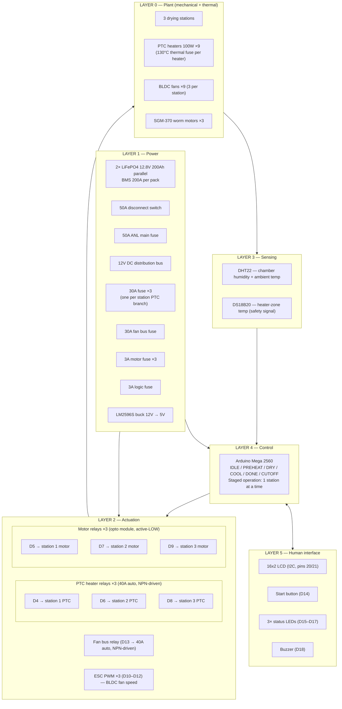
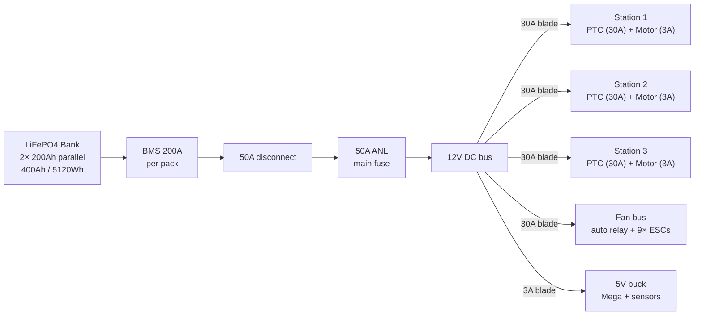
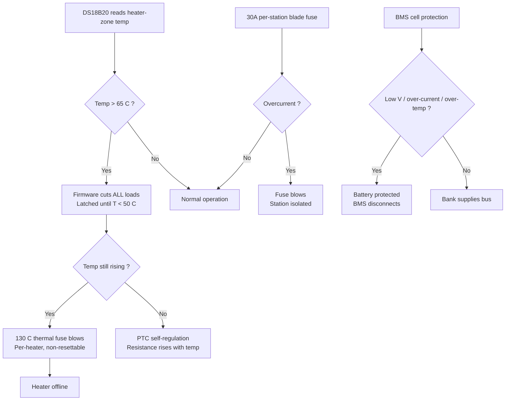
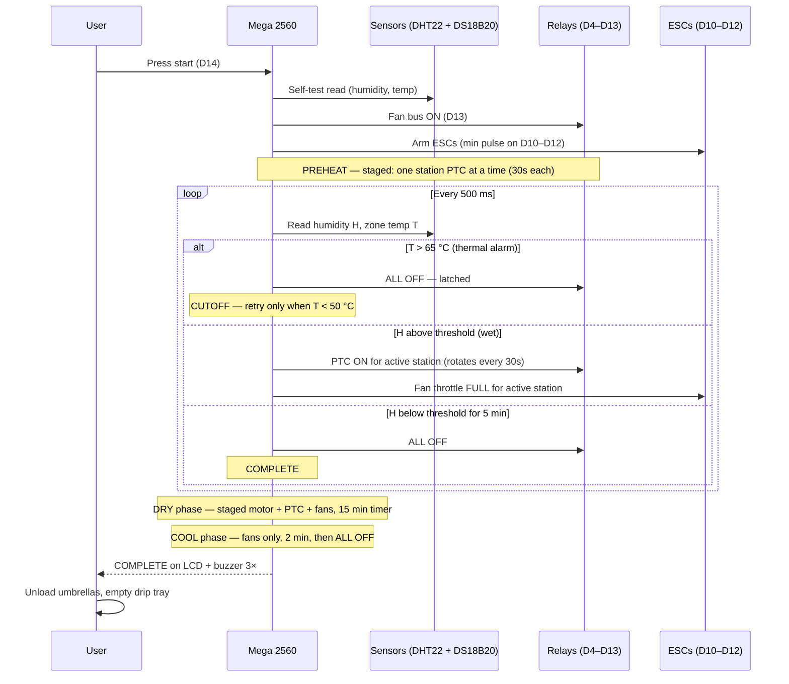

# System Architecture — 12V DC Umbrella Dryer

Pure 12V DC umbrella dryer. No mains, no inverter, no AC anywhere. Everything runs from a parallel LiFePO4 battery bank through fused DC distribution.

## 1. Layered architecture

## 2. Power architecture

Single domain: 12V DC throughout. The 50A main fuse allows one station at a time (~36A). Staged operation enforced by firmware.

### Per-station load budget

| Component | Qty | Voltage | Each | Total (station) |
|---|---|---|---|---|
| PTC heater | 3 | 12V | 100W / 8.3A | 300W / 25A |
| BLDC fan + ESC | 3 | 12V | ~30W / 3.2A | ~90W / 9.6A |
| SGM-370 motor | 1 | 12V | ~2.4W / 0.2A | ~2.4W / 0.2A |
| **Station total (peak)** | — | — | — | **~392W / ~35A** |

### System-wide fuse table

| Branch | Fuse | Consumers |
|---|---|---|
| Main | 50A ANL | Entire DC bus (one station at a time) |
| Station 1 PTC | 30A blade | 3× PTC heaters (~25A) |
| Station 2 PTC | 30A blade | 3× PTC heaters |
| Station 3 PTC | 30A blade | 3× PTC heaters |
| Motor 1 | 3A blade | 1× SGM-370 |
| Motor 2 | 3A blade | 1× SGM-370 |
| Motor 3 | 3A blade | 1× SGM-370 |
| Fan bus | 30A blade | 9× BLDC fans (28.8A) |
| Logic | 3A blade | Mega + LCD + DHT22 + DS18B20 via buck |

## 3. Control — pin mapping

| Arduino Pin | Function | Actuator | Drive | Active |
|---|---|---|---|---|
| D2 | DHT22 data | Chamber humidity sensor | 10kΩ pull-up | — |
| D3 | DS18B20 data | Temperature probe | 4.7kΩ pull-up | — |
| D4 | Station 1 PTC | 3× PTC (40A relay via NPN) | 2N2222 | HIGH |
| D5 | Station 1 motor | SGM-370 (opto module) | Optocoupler | LOW |
| D6 | Station 2 PTC | 3× PTC (40A relay via NPN) | 2N2222 | HIGH |
| D7 | Station 2 motor | SGM-370 (opto module) | Optocoupler | LOW |
| D8 | Station 3 PTC | 3× PTC (40A relay via NPN) | 2N2222 | HIGH |
| D9 | Station 3 motor | SGM-370 (opto module) | Optocoupler | LOW |
| D10 | Station 1 fan | ESC-1 PWM | Servo lib, 50 Hz | — |
| D11 | Station 2 fan | ESC-2 PWM | Servo lib, 50 Hz | — |
| D12 | Station 3 fan | ESC-3 PWM | Servo lib, 50 Hz | — |
| D13 | Fan bus enable | 40A auto relay via NPN | 2N2222 | HIGH |
| D14 | Start button | Push-button | INPUT_PULLUP | LOW |
| D15 | Red LED | Heating active | 220Ω | HIGH |
| D16 | Yellow LED | Cycle running / cooling | 220Ω | HIGH |
| D17 | Green LED | Ready / done | 220Ω | HIGH |
| D18 | Buzzer | Active buzzer | — | HIGH |
| 20 (SDA) | LCD I2C | 16×2 LCD | I2C | — |
| 21 (SCL) | LCD I2C | 16×2 LCD | I2C | — |

> **NPN driver stages (D4/D6/D8/D13):** 10kΩ base pull-downs hold relays OFF at boot.
> **Opto module (D5/D7/D9):** onboard pull-ups hold relays OFF (active-LOW) at boot.
> Firmware calls `allOff()` in `setup()` for an extra safety layer.

## 4. Safety layers

### Defense-in-depth thermal protection

| Layer | Mechanism | Trip point | Response time | Resettable? |
|---|---|---|---|---|
| **Firmware interlock** | DS18B20 + software cutoff | > 65 °C | < 1 s | Yes (auto when T < 50 °C) |
| **PTC self-regulation** | Resistance rises with temperature | ~150–200 °C | Passive / instant | Yes |
| **Thermal fuse** | One-shot bimetal (per heater) | 130 °C | Physical melt | **No** |
| **Branch blade fuse** | Overcurrent protection | 30A (PTC) / 30A (fan) / 3A (motor) | Current-dependent | Replace fuse |
| **BMS protection** | Cell-level hardware cutoff | Per-pack thresholds | Hardware | Auto (some conditions) |

> **Five independent thermal/electrical layers** protect against heater runaway.

## 5. One drying cycle — sequence

## 6. Design principles

| Principle | Realization |
|---|---|
| **No mains anywhere** | Entire system 12V DC — no RCD, no changeover, no AC wiring |
| **Defense in depth on heat** | DS18B20 → PTC self-regulation → 130°C thermal fuse (per heater) → branch fuses → BMS: five layers |
| **Staged operation** | Firmware rotates stations every 30s; only one station's heaters active at a time; keeps draw ~35.5A at 71% of the 50A main fuse |
| **Fault isolation** | Per-branch fuses: one station's fault doesn't affect the others |
| **ESC for fan speed** | BLDC fans with ESC PWM give variable speed; automotive relay on D13 gives instant all-fan kill |
| **Worm drive self-locking** | SGM-370 motors hold position when de-energized — no brake, no holding current |
| **Boot-safe relay states** | NPN pull-downs + opto pull-ups + firmware `allOff()` in `setup()` — triple guarantee |

## 7. Deliberate non-features

- **No mains connection** — Eliminates RCD, changeover switch, AC wiring
- **No per-station humidity sensor** — Single DHT22 is the shared control variable
- **No motor speed control** — 6 RPM fixed; ESC only for BLDC fans
- **No current sensing** — Jam detection via fuse + observation
- **No PID temperature control** — PTC self-regulation + firmware on/off hysteresis
