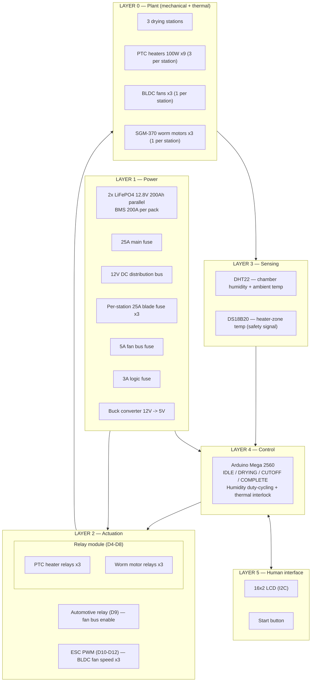
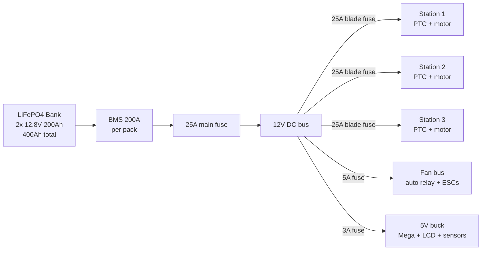
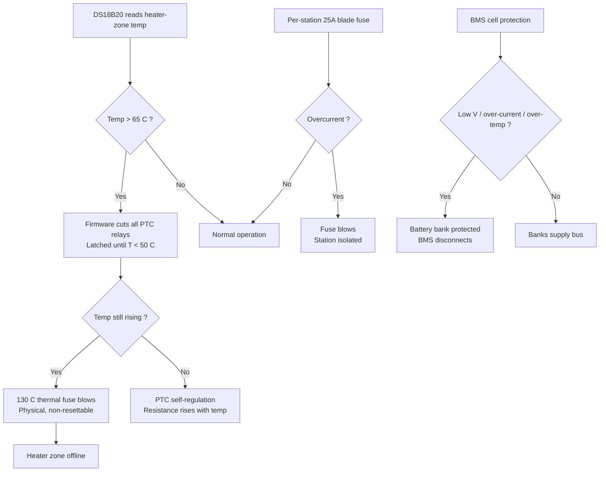
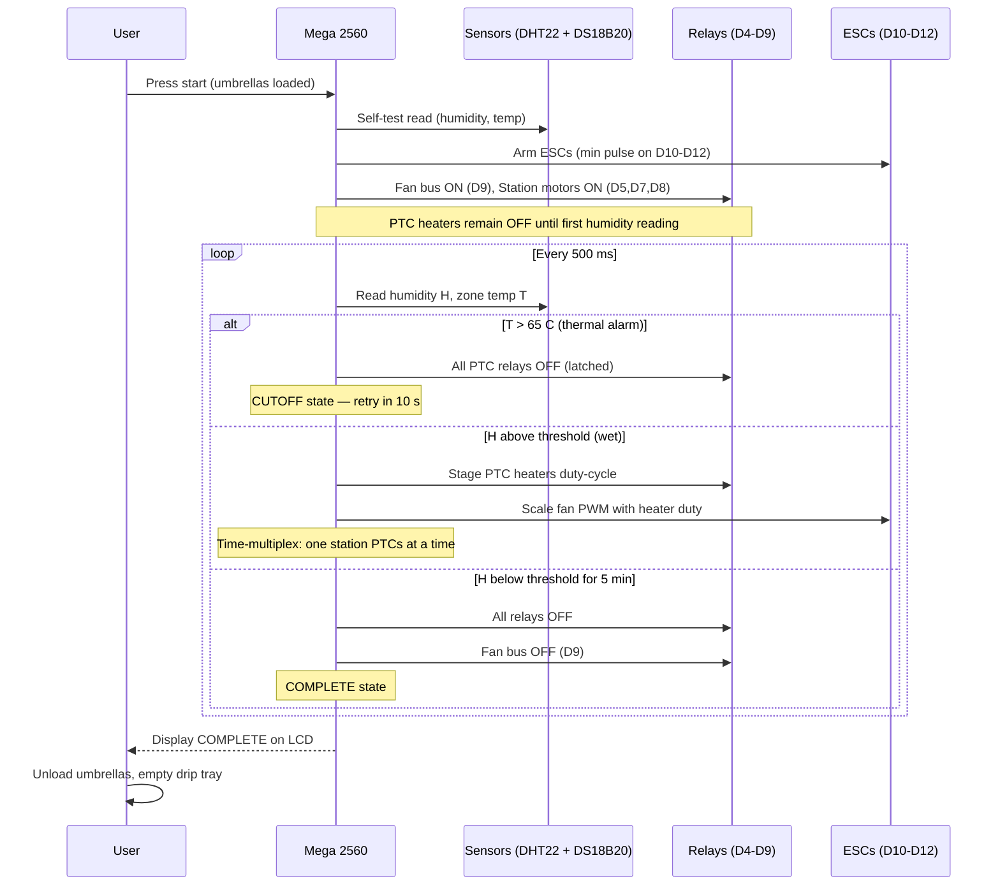

# System Architecture — 12V DC Umbrella Dryer

Pure 12V DC umbrella dryer. No mains, no inverter, no AC anywhere. Everything runs from a parallel LiFePO4 battery bank through fused DC distribution.

## 1. Layered architecture

## 2. Power architecture

Single domain: 12V DC throughout. No AC anywhere. The 25A main fuse caps total system draw; stations are time-multiplexed so only one station runs its PTC heaters at a time.

### Per-station load budget

| Component | Qty (per station) | Voltage | Each | Total (station) |
|---|---|---|---|---|
| PTC heater | 3 | 12V | 100W / 8.3A | 300W / 25A |
| BLDC fan | 1 | 12V | ~30W / 2.5A | ~30W / ~2.5A |
| SGM-370 worm motor | 1 | 12V | ~43W / 3.6A | ~43W / 3.6A |
| **Station total (peak)** | — | — | — | **~373W / ~31A** |

> **Fuse constraint:** The 25A main fuse allows one station's PTC heaters (25A) plus one fan (2.5A) plus one motor (3.6A) ≈ 31A momentarily but the firmware time-multiplexes heater activation across stations to stay within continuous rating. Motor and fan draw is always well under budget.

### System-wide power budget

| Rail | Fuse | Consumers |
|---|---|---|
| Station 1 | 25A blade | 3x PTC heaters + 1x worm motor |
| Station 2 | 25A blade | 3x PTC heaters + 1x worm motor |
| Station 3 | 25A blade | 3x PTC heaters + 1x worm motor |
| Fan bus | 5A blade | 3x BLDC fans (via automotive relay D9) |
| Logic | 3A blade | Mega + LCD + DHT22 + DS18B20 via buck to 5V |

## 3. Control — pin mapping

| Arduino Pin | Function | Actuator | Drive |
|---|---|---|---|
| D4 | Station 1 PTC heaters | 3x PTC parallel (one relay) | Active-LOW relay |
| D5 | Station 1 worm motor | SGM-370 | Active-LOW relay |
| D6 | Station 2 PTC heaters | 3x PTC parallel (one relay) | Active-LOW relay |
| D7 | Station 2 worm motor | SGM-370 | Active-LOW relay |
| D8 | Station 3 heater + motor | PTC + motor combined | Active-LOW relay |
| D9 | Fan bus enable | Automotive relay (12V switching) | Active-HIGH |
| D10 | Station 1 BLDC fan | ESC-1 | PWM 1000-2000 us |
| D11 | Station 2 BLDC fan | ESC-2 | PWM 1000-2000 us |
| D12 | Station 3 BLDC fan | ESC-3 | PWM 1000-2000 us |
| D2 (INT0) | DS18B20 bus | OneWire temp sensors | Data |
| D20 (SDA) | LCD I2C | 16x2 LCD | I2C |
| D21 (SCL) | LCD I2C | 16x2 LCD | I2C |
| A0 | DHT22 data | Humidity + temperature | Digital |
| A1 | Start button | Push-button | INPUT_PULLUP |

> **D9 fan bus logic:** The automotive relay on D9 switches the 12V rail to all three ESCs. Killing D9 shuts down every fan instantly (emergency/complete). During normal operation D9 stays HIGH and individual fan speed is controlled via ESC PWM on D10-D12.

## 4. Safety layers

### Defense-in-depth thermal protection

| Layer | Mechanism | Trip point | Response time | Resettable? |
|---|---|---|---|---|
| **Firmware interlock** | DS18B20 + software cutoff | > 65 C | < 1 s | Yes (auto when T < 50 C) |
| **PTC self-regulation** | Resistance rises with temperature | ~120 C (material limit) | Passive / instant | Yes |
| **Thermal fuse** | One-shot bimetal device | 130 C | Physical melt | No |
| **Per-station blade fuse** | Overcurrent protection | 25 A | Current-dependent | Replace fuse |
| **BMS protection** | Cell-level hardware cutoff | Per-pack thresholds | Hardware | Auto (some conditions) |

> **Four independent thermal layers** protect against heater runaway. Even if the firmware freezes, the PTC self-limits; if the PTC fails, the thermal fuse blows; if both fail, the blade fuse opens from overcurrent draw.

## 5. One drying cycle — sequence

## 6. Design principles

| Principle | Realization |
|---|---|
| **No mains anywhere** | Entire system is 12V DC. Eliminates shock hazard, RCD, changeover switch, and AC wiring complexity. |
| **Defense in depth on heat** | DS18B20 firmware cutoff, PTC self-regulation, 130C thermal fuse, 25A blade fuse — four independent layers. |
| **Battery-first energy model** | PTC duty-cycling and ESC speed scaling keep draw within the 25A fuse. 400Ah bank yields 8-12 cycles per charge at 30-40 min each. |
| **Fault isolation** | Per-station 25A fuses: a heater short or motor jam kills one station, not the machine. |
| **ESC for fan speed** | BLDC fans with ESC PWM give variable speed for noise and power optimization. Automotive relay on D9 gives instant all-fan kill. |
| **Worm drive self-locking** | SGM-370 worm motors hold umbrella position when de-energized. No brake, no freewheel, no holding current. |
| **Simplicity over parts** | Relay-switched PTC heaters (no PID, no SSR). ESC only on fans (not motors). Gravity drain (no pump). |

## 7. Deliberate non-features

- **No mains connection** — Deliberate. Removes RCD, changeover switch, and AC wiring entirely.
- **No per-station humidity sensor** — Chamber humidity (single DHT22) is the shared control variable. Per-station sensors triple cost for marginal gain.
- **No motor speed control** — 6 RPM fixed via worm gear. ESC is only for BLDC fan speed.
- **No current sensing** — Jam detection is fuse + observation per `docs/TROUBLESHOOTING.md`.
- **No PID temperature control** — PTC self-regulation plus firmware on/off hysteresis is sufficient for 40-60C target.
- **No solar charging (yet)** — Documented as a future expansion path, not in V2 scope.
