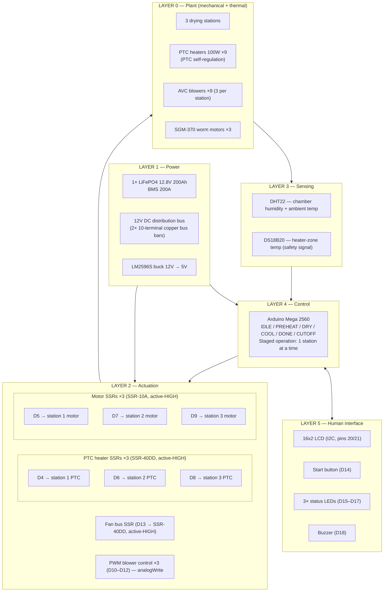
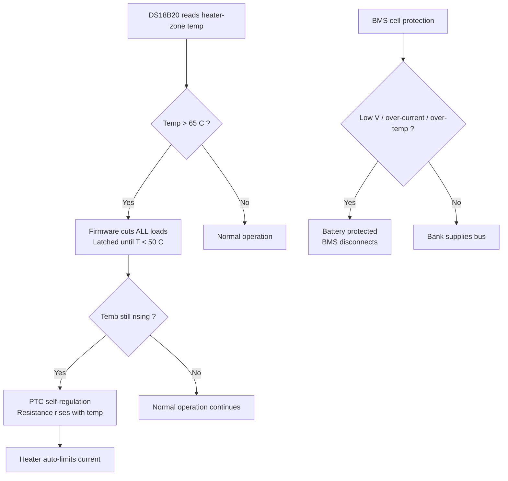

# System Architecture — 12V DC Umbrella Dryer

Pure 12V DC umbrella dryer. No mains, no inverter, no AC anywhere. Everything runs from a single LiFePO4 battery through direct DC distribution. AVC blowers are PWM-controlled directly from the Mega (no ESCs). SSR-40DD switches PTC heaters and fan bus; SSR-10A switches worm motors.

## 1. Layered architecture



## 2. Power architecture

Single domain: 12V DC throughout. Staged operation keeps one station active at a time (~39.3A). BMS 200A provides over-current protection.

```mermaid
flowchart LR
    BANK["LiFePO4 Battery<br/>1× 200Ah<br/>2560 Wh"]
    BMS["BMS 200A<br/>per pack"]
    BUS["12V DC bus<br/>(2× 10-terminal copper bar)"]

    BANK --> BMS --> BUS

    BUS -->|Station 1 PTC (~25A)| S1["Station 1<br/>PTC + Motor + Blower"]
    BUS -->|Station 2 PTC (~25A)| S2["Station 2<br/>PTC + Motor + Blower"]
    BUS -->|Station 3 PTC (~25A)| S3["Station 3<br/>PTC + Motor + Blower"]
    BUS -->|Fan bus (~40.5A)| FANS["Fan bus<br/>9× AVC blowers"]
    BUS -->|Logic (~0.1A)| LOGIC["5V buck<br/>Mega + sensors"]
```

### Per-station load budget

| Component | Qty | Voltage | Each | Total (station) |
|---|---|---|---|---|
| PTC heater | 3 | 12V | 100W / 8.3A | 300W / 25A |
| AVC blower | 3 | 12V | ~54W / 4.5A | ~162W / 13.5A |
| SGM-370 motor | 1 | 12V | ~2.4W / 0.2A | ~2.4W / 0.8A stall |
| **Station total (peak)** | — | — | — | **~464W / ~39.3A** |

### System-wide fuse table

No fuses in the circuit. BMS 200A is the sole over-current protection.

| Branch | Load | Protection |
|---|---|---|
| Main | 12V DC bus (one station at a time) | BMS 200A |
| Station 1 PTC | ~25A | BMS 200A + PTC self-regulation |
| Station 2 PTC | ~25A | BMS 200A + PTC self-regulation |
| Station 3 PTC | ~25A | BMS 200A + PTC self-regulation |
| Motor 1/2/3 | ~0.8A each | BMS 200A |
| Fan bus | ~40.5A | BMS 200A |
| Logic | ~0.1A | BMS 200A + LM2596S |

## 3. Control — pin mapping

| Arduino Pin | Function | Actuator | Drive | Active |
|---|---|---|---|---|
| D2 | DHT22 data | Chamber humidity sensor | 10kΩ pull-up | — |
| D3 | DS18B20 data | Temperature probe | 4.7kΩ pull-up | — |
| D4 | Station 1 PTC | 3× PTC (SSR-40DD) | Direct drive | HIGH |
| D5 | Station 1 motor | SGM-370 (SSR-10A) | Direct drive | HIGH |
| D6 | Station 2 PTC | 3× PTC (SSR-40DD) | Direct drive | HIGH |
| D7 | Station 2 motor | SGM-370 (SSR-10A) | Direct drive | HIGH |
| D8 | Station 3 PTC | 3× PTC (SSR-40DD) | Direct drive | HIGH |
| D9 | Station 3 motor | SGM-370 (SSR-10A) | Direct drive | HIGH |
| D10 | Station 1 blower | AVC blower PWM | `analogWrite` 0–255 | — |
| D11 | Station 2 blower | AVC blower PWM | `analogWrite` 0–255 | — |
| D12 | Station 3 blower | AVC blower PWM | `analogWrite` 0–255 | — |
| D13 | Fan bus enable | SSR-40DD → 9 blowers | Direct drive | HIGH |
| D14 | Start button | Push-button | INPUT_PULLUP | LOW |
| D15 | Red LED | Heating active | 220Ω | HIGH |
| D16 | Yellow LED | Cycle running / cooling | 220Ω | HIGH |
| D17 | Green LED | Ready / done | 220Ω | HIGH |
| D18 | Buzzer | Active buzzer | — | HIGH |
| 20 (SDA) | LCD I2C | 16×2 LCD | I2C | — |
| 21 (SCL) | LCD I2C | 16×2 LCD | I2C | — |

> **All SSRs are active-HIGH.** Floating pins at boot = SSR OFF. `allOff()` in `setup()` enforces safe state.
> **PWM fans** use `analogWrite()` — no Servo library needed. 5V logic compatible with AVC blowers.

## 4. Safety layers



### Defense-in-depth thermal protection

| Layer | Mechanism | Trip point | Response time | Resettable? |
|---|---|---|---|---|
| **Firmware interlock** | DS18B20 + software cutoff | > 65 °C | < 1 s | Yes (auto when T < 50 °C) |
| **PTC self-regulation** | Resistance rises with temperature | ~150–200 °C | Passive / instant | Yes |
| **BMS protection** | Cell-level hardware cutoff | Per-pack thresholds | Hardware | Auto (some conditions) |

> **Three independent thermal/electrical layers** protect against heater runaway. No thermal fuses.

## 5. One drying cycle — sequence

```mermaid
sequenceDiagram
    participant U as User
    participant FW as Mega 2560
    participant S as Sensors (DHT22 + DS18B20)
    participant R as SSRs (D4–D13)
    participant P as PWM Fans (D10–D12)

    U->>FW: Press start (D14)
    FW->>S: Self-test read (humidity, temp)
    FW->>R: Fan bus ON (D13)
    FW->>P: Blowers FULL (analogWrite(D, 255))

    Note over FW,R,P: PREHEAT — staged: one station PTC at a time (30s each)

    loop Every 500 ms
        FW->>S: Read humidity H, zone temp T
        alt T > 65 °C (thermal alarm)
            FW->>R: ALL OFF — latched
            Note over FW: CUTOFF — retry only when T < 50 °C
        else H above threshold (wet)
            FW->>R: PTC ON for active station (rotates every 30s)
            FW->>P: Blower PWM FULL for active station
        else H below threshold for 5 min
            FW->>R: ALL OFF
            Note over FW: COMPLETE
        end
    end

    Note over FW: DRY phase — staged motor + PTC + blowers, max 15 min (auto-stop at ≤ 60% RH)
    Note over FW: COOL phase — blowers only, 2 min, then ALL OFF

    FW-->>U: COMPLETE on LCD + buzzer 3×
    U->>U: Unload umbrellas, empty drip tray
```

## 6. Design principles

| Principle | Realization |
|---|---|
| **No mains anywhere** | Entire system 12V DC — no RCD, no changeover, no AC wiring |
| **Defense in depth on heat** | DS18B20 → PTC self-regulation → BMS: three layers |
| **Staged operation** | Firmware rotates stations every 30s; only one station's heaters active at a time; keeps draw ~39.3A |
| **Direct-drive SSRs** | All SSRs active-HIGH, driven directly from Mega pins — no NPN transistors, no optocoupler modules |
| **PWM blower control** | AVC blowers accept 5V PWM directly from Mega — no ESC needed |
| **Worm drive self-locking** | SGM-370 motors hold position when de-energized — no brake, no holding current |
| **No fuses** | BMS 200A is the sole over-current protection; no blade fuses, ANL fuses, or thermal fuses |

## 7. Deliberate non-features

- **No mains connection** — Eliminates RCD, changeover switch, AC wiring
- **No per-station humidity sensor** — Single DHT22 is the shared control variable
- **No motor speed control** — 6 RPM fixed
- **No current sensing** — Jam detection via observation
- **No PID temperature control** — PTC self-regulation + firmware on/off hysteresis
- **No ESCs** — AVC blowers use direct PWM, no brushless motor controllers needed
- **No thermal fuses** — Relies on PTC self-regulation + firmware cutoff + BMS
- **No fuses** — BMS 200A is the sole over-current protection
