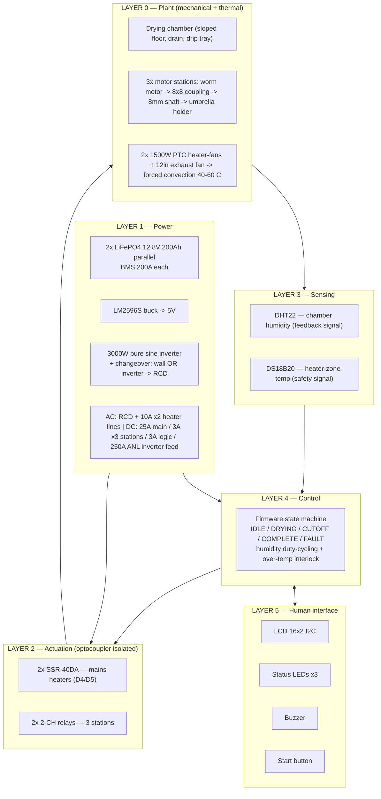
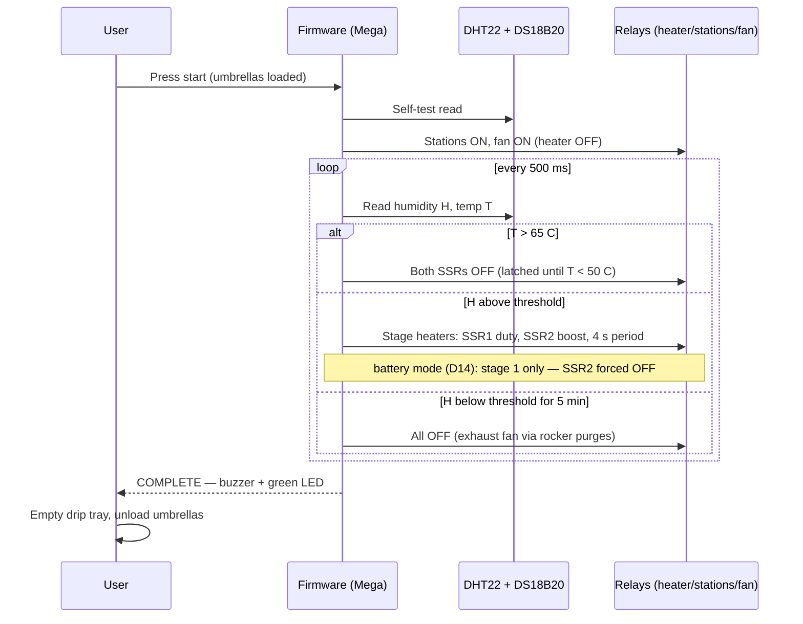

# System Architecture (Rev 6)

Big-picture view: layers, power domains, timing of one drying cycle, and the principles that shaped the design.

## 1. Layered architecture

## 2. Power domains (Rev 6: dual source, three power domains)

| Domain | Source | Consumers | Protection |
|---|---|---|---|
| **220V AC heat** | Wall outlet OR 3000W pure sine inverter — selected by the changeover, never both | 2× 1500W heater-fans (6.8A each) + 12" exhaust fan (~2A) | RCD 30mA + 10A branch fuses + grounded box + earthing |
| 12V DC stations | 2× LiFePO4 200Ah parallel (BMS 200A each) | 3 motors 3.6A rated + inverter DC feed (188A steady at the stage-1 cap) | 250A ANL (inverter feed) + 25A main + 3A per station |
| 5V logic | LM2596S buck | Mega · sensors · LCD · relay coils (~0.7A) | 3A branch |
| Signal | Mega pins | SSR DC inputs (~12 mA) + D14 mode sense + optocoupler LEDs (2–5 mA) | Isolation barrier to both power domains |

**Isolation philosophy:** the Mega touches no power domain — it only drives SSR inputs, reads D14, and drives optocoupler LEDs. Mains lives in a closed earthed box; the changeover is the single point where the two AC sources meet, and they never meet electrically (the inverter remote pin is grounded in wall mode).

## 3. One cycle — sequence

## 4. Design principles (why it is built this way)

| Principle | Realization |
|---|---|
| **Energy efficiency is the thesis** | Staged heaters run only on humidity demand and never idle-heating: auto-shutoff + staging (wall mode ≈0.6–1.0 kWh/cycle; battery mode stage-1 ≈0.4–0.6 kWh, 6–8 cycles/charge) |
| **Defense in depth on heat** | appliance thermostat → DS18B20 software cutoff → PTC self-regulation → 10A branch fuses → mains rocker kill → RCD |
| **Fault isolation** | Per-station 3A fuses + one motor per umbrella: a jam stops one station, not the machine |
| **Simplicity over parts** | On/off relays replace SSR + motor driver (no speed control needed at 16 RPM); pump removed for gravity drain |
| **Domain separation** | No mains inside the chamber; SSRs in a closed earthed RCD-protected box; two labeled kill switches |
| **Self-locking mechanics** | Worm drives hold position when off; no freewheel, no brake needed |

## 5. Deliberate non-features

- **No per-station humidity sensor** — chamber air humidity is the shared control variable (per-station sensors would triple sensor cost for marginal gain; unload-dry umbrellas early by observation).
- **No motor speed control** — 16 RPM fixed is the design speed; PWM would add a driver stage for no drying benefit.
- **No SSR control of the exhaust fan** — it is an appliance on the mains rocker; staging heaters is what saves energy.
- **No current sensing** — jam detection is fuse + observation, per `docs/TROUBLESHOOTING.md`.
