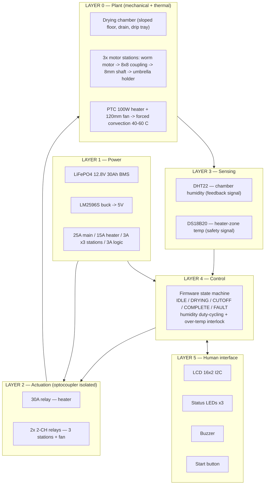
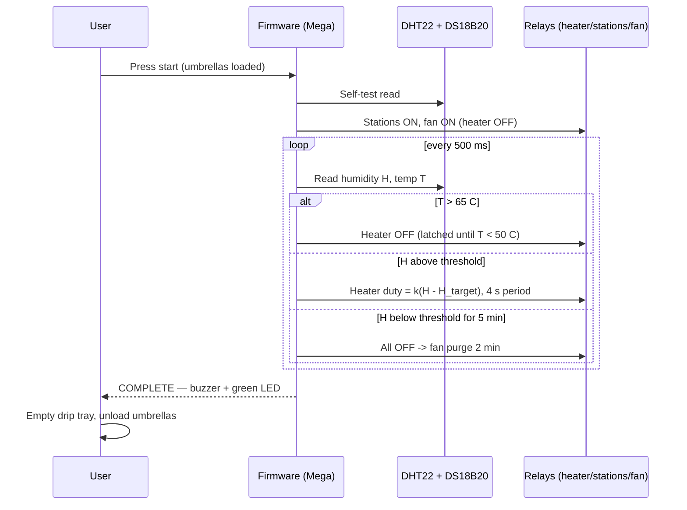

# System Architecture (Rev 4)

Big-picture view: layers, power domains, timing of one drying cycle, and the principles that shaped the design.

## 1. Layered architecture

## 2. Power domains

| Domain | Source | Consumers | Protection |
|---|---|---|---|
| 12V power | Battery (BMS 30A) | Heater 8.3A · 3 motors 3.6A · fan 0.25A | 25A main + 15A heater + 3A per station |
| 5V logic | LM2596S from 12V | Mega · sensors · LCD · relay coils (~0.8A) | 3A branch |
| Signal | Mega pins | Optocoupler LEDs only (2–5 mA each) | Isolation barrier to 12V side |

**Isolation philosophy:** the Mega never touches 12V. Relays' optocouplers + flyback diodes keep inductive/heater transients off the logic rail; the buck keeps the Mega off the battery directly (Makerlab warning: no 12V on the DC jack).

## 3. One cycle — sequence

## 4. Design principles (why it is built this way)

| Principle | Realization |
|---|---|
| **Energy efficiency is the thesis** | Heater runs only on humidity demand (≈90–95 Wh/cycle → 3–4 cycles/charge) |
| **Defense in depth on heat** | PTC self-regulation → DS18B20 software cutoff → 15A fuse → rocker kill |
| **Fault isolation** | Per-station 3A fuses + one motor per umbrella: a jam stops one station, not the machine |
| **Simplicity over parts** | On/off relays replace SSR + motor driver (no speed control needed at 16 RPM); pump removed for gravity drain |
| **Extra-low voltage safety** | All-12V; 30VDC-rated contacts; mains prohibited by design |
| **Self-locking mechanics** | Worm drives hold position when off; no freewheel, no brake needed |

## 5. Deliberate non-features

- **No per-station humidity sensor** — chamber air humidity is the shared control variable (per-station sensors would triple sensor cost for marginal gain; unload-dry umbrellas early by observation).
- **No motor speed control** — 16 RPM fixed is the design speed; PWM would add a driver stage for no drying benefit.
- **No current sensing** — jam detection is fuse + observation, per `docs/TROUBLESHOOTING.md`.
